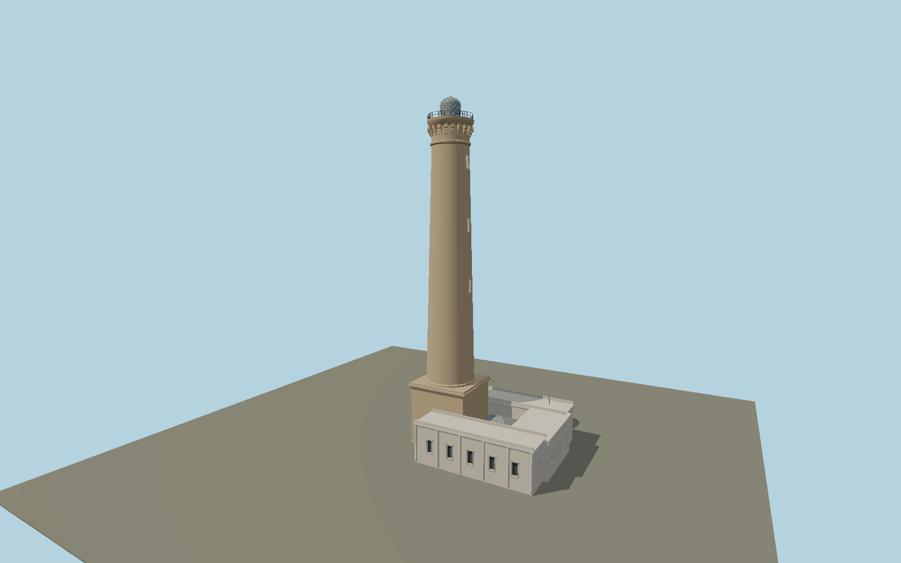

# Chipiona Lighthouse — N0655

Ochre stone commemorative-column shaft with four tall arched windows; square rusticated plinth, deeply bracketed capital and circular iron gallery, glass aero-maritime dome with crossing white astragals, and the asymmetric cream keeper complex with central pyramidal roof light.

## Identity and evidence

Exact catalog identity **Q1190267**. Source facts: `{"heightMeters":62.6,"seaElevationMeters":69,"lanternDiameterMeters":3.5,"year":1867,"basis":"IAPH primary heritage study explicitly distinguishes62.6m above ground from69m above mean sea level, and describes four shaft openings. Port of Seville2013 report gives3.5m lantern diameter. OSM tower part841109947 and mapped base153047246 establish shaft center and stepped plan; other elevations are municipal-photo proportions."}`. The source specification keeps published dimensions separate from reconstructed details.

- https://www.iaph.es/revistaph/index.php/revistaph/article/download/1952/1952
- https://www.turismodechipiona.com/destinations/faro
- https://www.turismodechipiona.com/wp-content/uploads/2018/05/faro-2.jpg
- https://www.turismodechipiona.com/wp-content/uploads/2018/04/aolfaro01.jpg
- https://www.puertos.es/sites/default/files/2025-02/Memoria%20AP%20Sevilla%202013.pdf
- https://www.openstreetmap.org/way/841109947
- https://www.openstreetmap.org/way/153047246

Original geometry and shared procedural materials. Official photographs are research references only; no reference imagery or third-party mesh is embedded or redistributed.

## Authored geometry and materials

42,596 triangles, 75,580 vertices, 7 surface groups; 3,236,224 source bytes. SHA-256: `sha256:a026590a151d4f3b4966e17a95698388ceced52d9b6ca163585a4c2bedd109c9`. Actual bounds: -5.700, 0.000, -10.760 to 20.800, 62.600, 10.770 m.

Shared canonical material graphs with metric UV repeats in extras.molenSurface; portable glTF PBR factors and vertex colors remain. Dark recesses/lantern panels retain local fallback materials. Shared references: `matgraph:molen.worldgen.material.plaster_lime` (2 × 2 m), `matgraph:molen.worldgen.material.stone_ashlar` (2.4 × 1.5 m), `matgraph:molen.worldgen.material.stone_limestone` (2.4 × 1.6 m), `matgraph:molen.worldgen.material.metal_painted` (2 × 2 m), `matgraph:molen.worldgen.material.stone_granite` (2 × 2 m), `matgraph:molen.worldgen.material.wood_plain` (2 × 0.25 m). Model-native axes: {"up":"+Y","front":"+Z","origin":"Authored main tower center at local base level; attached ensembles are offset from this origin."}.

## Placement proposal

Origin is the exact mapped round tower centroid. Mapped keeper complex extends authored+X east-southeast, fixing the quadrant. Shaft window azimuth is photo reconstructed on the keeper side. Host terrain supplies coastal ground;69m sea elevation is not applied as tower height. Proposed anchor -6.442194584211, 36.737914042105 (longitude, latitude), heading -0.183905284578 radians. Elevation policy: **terrain-contact**. This is a reviewable proposal, not a completed site-fit certification. Ground models require terrain contact; offshore models also require water-datum and base-height checks.

## Limitations and review

- The modeled exterior follows the cited published facts and inspected photographs. Unpublished dimensions and local fittings are explicitly photo-proportioned; no claim of engineering survey accuracy is made.
- Portable PBR and shared metric surfaces are provided. Surface weathering, material color under local lighting and fine facade relief require close render review before maximum-detail acceptance.
- Keeper block heights and window rhythm are reconstructed from municipal exterior photographs over the mapped plan; the simplified OSM12m whole-base tag is not imposed on the lower wings. Neighboring restaurant, palms and coastal embankment are separate features. Glazing is a static optical envelope.

Near/far fixtures are in `spec.qaCameras`. Float32 finite geometry, triangle degeneracy and winding are checked by the generator. Current rendering, shared-material, maximum-fidelity and geographic review results are recorded in `qa.json` and the readiness ledger; source generation alone does not approve a model.

Regenerate with `node packages/worldgen/scripts/generate-lighthouse-models.mjs --ids=N0655`; add `--check` for reproducibility. Editable component recipes are in `packages/worldgen/scripts/lighthouse-atlantic-models.mjs`. The generator protects artist-edited master hashes and preserves import/capture/shared-capture/QA documents.
