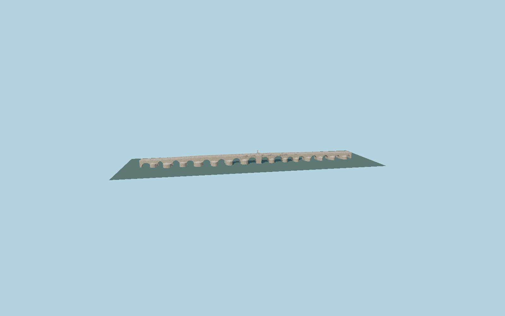

# Roman Bridge of Córdoba

Sixteen unequal stone vaults on a gently bent pedestrian deck, individually mapped pointed upstream and rounded downstream cutwaters, radial voussoirs and archivolts, restored masonry parapets, granite paving and low lamps, San Rafael with carved pedestal and the reconstructed opposite shrine.

## Evidence

- [Primary reference](https://www.turismodecordoba.org/puente-romano)
- [Primary reference](https://www.arqueocordoba.com/monumentos/#puente-romano)
- [Primary reference](https://static.arteinformado.com/resources/app/docs/evento/23/127123/1_cat__logo_juan_cuenca_del_plano_al_espacio__baja_resoluci__n_.pdf)
- [Primary reference](https://gruporesa.com/puente-romano-de-cordoba/)
- [Primary reference](https://www.openstreetmap.org/way/403272673)
- [Primary reference](https://api-features.ign.es/collections/red_nap/items/526058)
- [Primary reference](https://datos-geodesia.ign.es/REDNAP/Lin00526/526057.pdf)

Published dimensions and reconstruction assumptions are separated in spec.json. Source photos were consulted; no photos or third-party geometry are embedded. Map plan attribution: © OpenStreetMap contributors, ODbL-1.0.

## Source

420888 triangles; 35285492 bytes; 4 material groups. SHA256: sha256:f6350ea48ea13e0cf316a378c2f0201c4db98845e2a7732fe120fd00c3db2769.

Shared surfaces (stone_travertine, metal_painted, stone_granite) are loaded through the central library; any transparent materials use local PBR parameters. Axis and provisional vertical datum are in spec.json.

Regenerate with node packages/worldgen/scripts/generate-researched-bridges.mjs --ids=N0009; append --check to verify. Import and capture through the standard next-1000 scripts. Geometry validation does not substitute for current-frame visual review.

## Reconstruction limits

- Exterior reconstruction, with individually mapped unequal pier plans and photo-scaled vault profiles, heights and masonry. It is not a construction survey.
- Nearby Calahorra tower, Puerta gate, riverside mills and bank paths are separate structures. Buried former arches and foundations are not reconstructed.
- The contemporary painted artwork inside the curved shrine is represented by a dark surface; no source photograph or painting is embedded. San Rafael is an original sculptural interpretation, not a scanned reproduction.
- Published total lengths differ; the model follows the289.809m mapped structure envelope and its16openings. Provisional vertical datum89m requires local host water/shore agreement.
