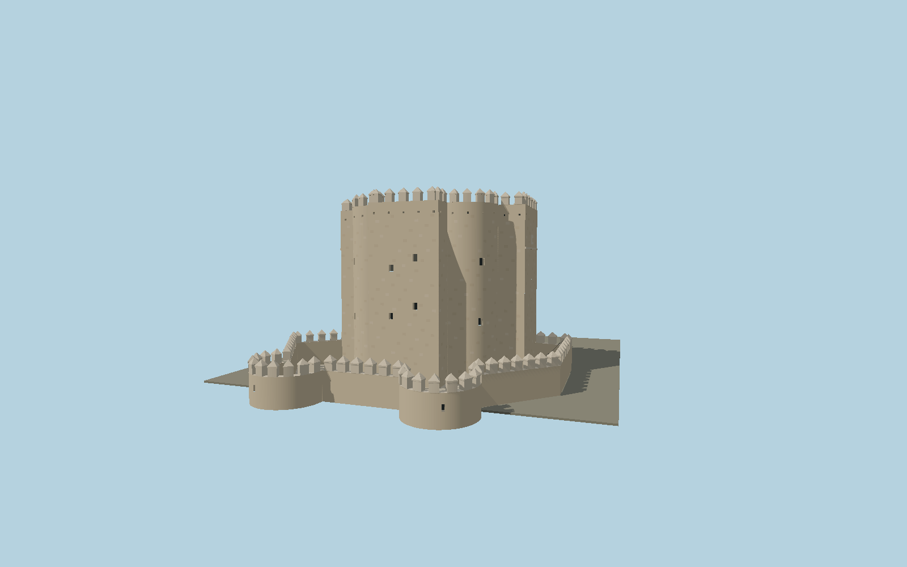

# Torre de la Calahorra

The complete Córdoba fortified gate and lower barbican: asymmetric three-arm castle, two rounded connecting walls, restored horseshoe portal trace, sparse gun loops, pointed merlons, roof terrace and two round lower bastions.

## Identity and geometry

Catalog N0603, [Q97625199](https://www.wikidata.org/wiki/Q97625199). Original geometry follows the municipal floor/roof plans and three sections, with primary restoration photographs establishing the surviving front portal, irregular openings, stone phases and pointed battlements. A similarity fit to the exact mapped entrance and two lower bastion centers supplies 0.05253 m per inspection-raster unit and heading 0.856639 radians; the approximate map/plan discrepancy is up to 1.5 m. Vertical dimensions are proportional readings of the municipal section, with a separate raised entry and lower courtyard datum, not a claimed surveyed absolute elevation.

Mapped museum entrance in XZ; Y=0 is the reconstructed lower courtyard floor, with the entrance at Y=3.3 m. Native -Z faces the Roman Bridge and the restored entry; +Z extends into the southern courtyard; +Y is up. The geographic proposal identifies its anchor and orientation evidence separately from remaining terrain and azimuth uncertainty.

Source facts and measured references are recorded in spec.json. References: [1](https://www.arquitecturacontemporanea.org/plataformaplan/download/6.pdf), [2](https://static.arteinformado.com/resources/app/docs/evento/23/127123/1_cat__logo_juan_cuenca_del_plano_al_espacio__baja_resoluci__n_.pdf), [3](https://www.torrecalahorra.es/), [4](https://institutoandaluzdeloscastillos.es/torre-de-la-calahorra), [5](https://www.gmucordoba.es/component/content/article?id=1595), [6](https://www.openstreetmap.org/way/94126687), [7](https://www.openstreetmap.org/node/5523459708). Reference pages and images are not redistributed.

## Original source and shared materials

Geometry is authored in `packages/worldgen/scripts/calahorra-tower-model.mjs`. Shared material graphs with metric repeat UV0 and original vertex tints; GLB PBR fallback remains self-contained. No per-model texture duplication. No third-party mesh or photograph is embedded.

24,827 triangles; 49,957 vertices; 6 material groups; 2,050,036 source bytes. Source hash: `sha256:4ca75a56648b3e1c24a43c86a9db9cd8138c9fb377a9c647f42e4f8e715c6e7c`. Geometry validation checks finite Float32 coordinates, indices, triangle area and winding before export.

Regenerate with `node packages/worldgen/scripts/generate-heritage-towers.mjs N0603`; add `--check` for reproducibility. The generator refuses to overwrite a master whose hash differs from source.json. Import uses `--no-optimize` to preserve facade recesses.

## Remaining detail and review

- The monumental castle and complete low barbican are included. The Roman Bridge, outer moat terrain and surrounding urban paving are separate assets.
- Small ashlar repair edges, individual shot holes and roof services are original photographic reconstructions. The coats of arms use simplified geometric relief; no photograph or third-party mesh is embedded.
- Municipal section readings provide relative elevations. Current absolute entrance elevation and the surrounding lower courtyard/bridge ground fit remain separate geographic review requirements.
- Near/far visual QA, shared-material inspection and maximum-fidelity approval remain pending.

Named near/far cameras are included for lit visual review. A valid export is not maximum-fidelity certification.
