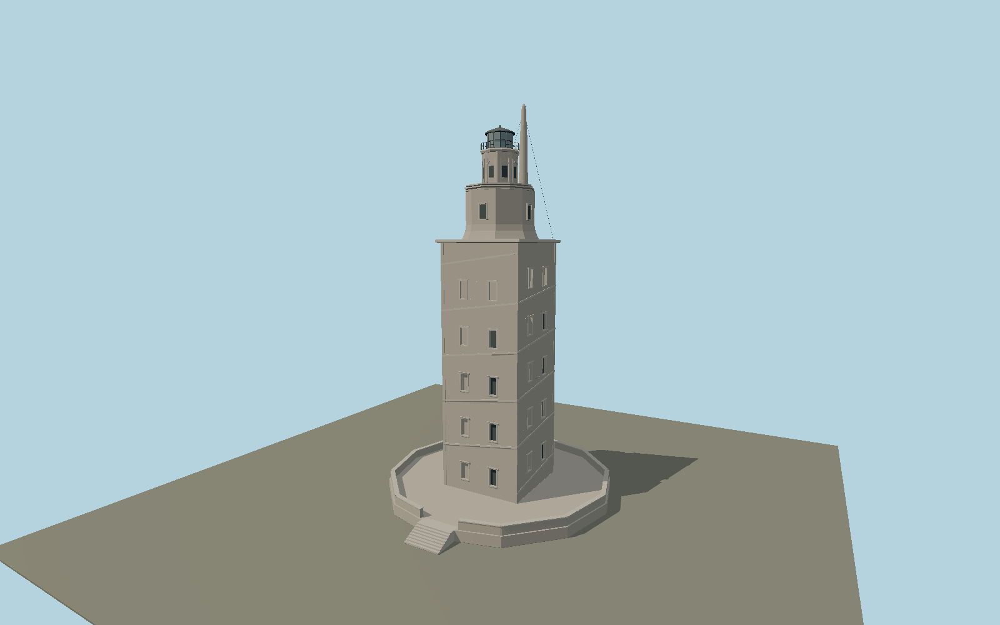

# Tower of Hercules — N0637

Granite Roman-core lighthouse with paired recessed facade niches, ascending perimeter band, heavy cornices, two octagonal upper stages, dark lantern and prominent offset stone lightning spine on a polygonal podium.

## Identity and evidence

Exact catalog identity **Q245151**. Source facts: `{"heightMeters":55,"squareCoreSideMeters":11.75,"visibleRomanBodyMeters":34.38,"platformWidthMeters":32.4,"basis":"A Coruña municipal Tower in Numbers page; 2024 original photo confirms current external geometry."}`. The source specification keeps published dimensions separate from reconstructed details.

- https://www.coruna.gal/the-tower/en/discover-the-tower/curiosities-of-the-tower?argIdioma=en
- https://whc.unesco.org/en/list/1312/
- https://www.ingenieria-civil.org/GOING/obra.php?id=120
- https://commons.wikimedia.org/wiki/File:Torre_de_Hercules,_A_Coruna,_Spain_06-2024.jpg

Municipal/UNESCO references retain their own rights. Original2024 photo by Wolfgang Fricke, CC BY3.0, consulted only; no reference image is embedded or redistributed.

## Authored geometry and materials

13,060 triangles, 23,664 vertices, 4 surface groups; 987,736 source bytes. SHA-256: `sha256:bc20fa063dd7f6c400fc31b08c6ab8a3210d4210f38fcf8bb745fa55d7e4cd40`. Actual bounds: -16.200, 0.000, -16.200 to 16.200, 55.000, 18.800 m.

Shared canonical material graphs with metric UV repeats in extras.molenSurface; portable glTF PBR factors and vertex colors remain. Dark recesses/lantern panels retain local fallback materials. Shared references: `matgraph:molen.worldgen.material.stone_ashlar` (2.4 × 1.5 m), `matgraph:molen.worldgen.material.metal_painted` (2 × 2 m), `matgraph:molen.worldgen.material.stone_granite` (2 × 2 m). Model-native axes: {"up":"+Y","front":"+Z","origin":"Ground contact beneath the polygonal platform. +X/+Z parallel the principal square shaft faces."}.

## Placement proposal

Exact-QID footprint supplies position and undirected face axes. Square symmetry leaves90-degree ambiguity for the front and offset service spine; facade facing remains to be reviewed. Published11.75m shaft versus12.725m mapped envelope retained separately; no forced XY scaling. Proposed anchor -8.406524144, 43.385941653 (longitude, latitude), heading -1.028578798746 radians. Elevation policy: **terrain-contact**. This is a reviewable proposal, not a completed site-fit certification. Ordinary ground models use terrain contact; Kiipsaare requires an offshore water/base-height check.

## Limitations and review

- Original exterior reconstruction from documented main dimensions and inspected references. Individual moldings, sections, weathering, openings and fittings are photo-proportioned estimates.
- No interior visitor route, surveyed collision model, operating navigation-light simulation or exact optical assembly is included. Lantern glazing is a restrained opaque PBR approximation.
- Shared material references use metric UVs with portable vertex-color PBR fallback. Maximum-fidelity, lit shared-surface and geographic fit reviews remain separate pending gates.
- Total55m includes the modeled platform and lightning spine; the allocation among upper tiers and the spine position is photo-estimated. Museum interior, adjacent service structures, terrain, historic excavations and exact lighting installations are omitted.

Near/far fixtures are in `spec.qaCameras`. Float32 finite geometry, triangle degeneracy and winding are checked by the generator. Rendering, shared-material alignment, maximum-fidelity and geographic reviews remain pending until their hash-bound reports exist.

Regenerate with `node packages/worldgen/scripts/generate-lighthouse-models.mjs --ids=N0637`; add `--check` for reproducibility. Editable component recipes are in `packages/worldgen/scripts/lighthouse-models.mjs`. The generator protects artist-edited master hashes and preserves import/capture/shared-capture/QA documents.
