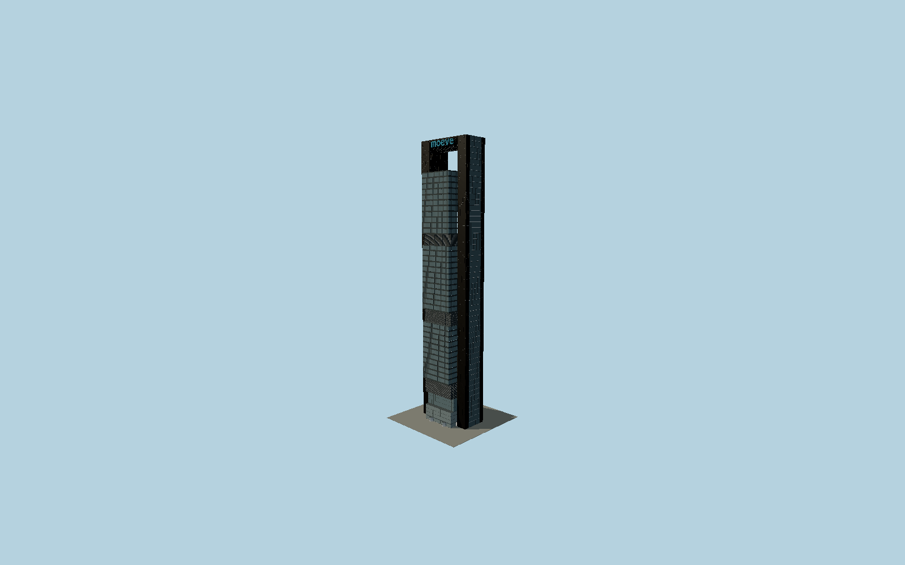

# Torre Moeve

Foster twin stainless-clad cores bracket three suspended black-framed glass office blocks, with recessed louver belts, panoramic end lifts, a13.85m glazed lobby and an open20m crown below a curved metal bridge bearing current blue Moeve lettering.

## Evidence and reconstruction

Published dimensions and reconstructed details are separated in spec.json. Primary references:

- [Reference](http://e-ache.com/modules/ache/ficheros/Realizaciones/Obra125.pdf)
- [Reference](https://www.gmsllp.com/portfolio/torre-caja-madrid/)
- [Reference](https://www.moeveglobal.com/stfls/corporativo/FICHEROS/informe-gestion-consolidado2025.pdf)
- [Reference](https://www.multivu.com/players/uk/7703451-cepsa-new-headquarters-new-company/docs/cepsa-headquarters-cepsa-tower-1046753785.pdf)
- [Reference](https://www.esmadrid.com/en/tourist-information/torre-moeve)
- [Reference](https://www.skyscrapercenter.com/building/wd/878)
- [Reference](https://www.openstreetmap.org/way/188396764)

No third-party geometry, photograph or bitmap texture is embedded. Shared surface graphs come from the central library; vertex tints carry model colors. Glass is an opaque PBR approximation.

## Model and axes

421,986 triangles; 1,192,922 vertices; 6 material groups; 46,819,644 bytes. Native bounds: -26.565, 0.000, -21.350 to 26.565, 248.315, 21.350. Source hash: `sha256:2569c2fac4bd9d1bbfaee547a11f93cabef7f8edeb3a05dbbf85236b3a140edb`.

{"up":"+Y","longAxis":"+X east-southeast between cores","shortAxis":"+Z south-southwest glass office frontage"}

The geographic proposal uses exact-QID OpenStreetMap evidence. Map-derived orientation and estimated architectural details require real-site visual review; preview eligibility is distinct from geographic/fidelity approval. Map attribution: © OpenStreetMap contributors, ODbL-1.0.

## Reproduce

Run `node packages/worldgen/scripts/generate-signature-towers.mjs --ids=N0203` (or add `--check`). The generator preserves manually edited masters by checking their baseline hashes. Import through the standard authored-model workflow with optimization disabled; then capture all QA cameras, including shared-surface views.

## Pending work

- Exterior geometry uses published overall dimensions and map evidence; panel subdivision, connection dimensions and local entrance details are reconstructed. Glazing uses opaque PBR with explicit geometry; no copied facade photograph is embedded.
- Exact stainless sheet schedule, louver pitch, fine glazing divisions, curved crown section and original lowercase letter strokes are exterior photographic reconstruction. Early250m/215m roof figures differ from current248.3m and the later construction elevations, explicitly retained in sourceFacts. Office floors, core circulation and the underground garage are excluded; surrounding plaza, neighboring towers and active lifts are not modeled.

This bundle contains source geometry, not a claim of maximum-fidelity completion. Hash-bound visual acceptance is recorded separately after capture inspection.
