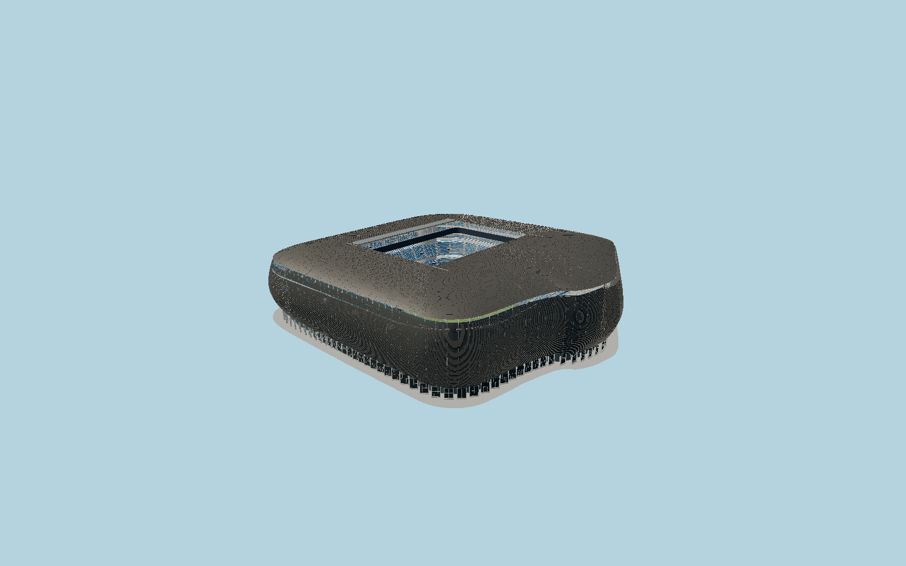

# Santiago Bernabéu Stadium — N0682

Current rebuilt Bernabéu: asymmetrical stainless-steel horizontal louvres wrapped around the old bowl, east-side bulge, recessed museum/entry level, relocated western circulation towers, elevated open skywalk slit, sculpted fixed metal roof with open75×110m center, folded textile roof stacks,44radial roof units, V supports and box-truss ring, suspended360degree monitor, four blue seating tiers, west VIP enclosure and marked lower-level football field.

## Identity and evidence

Exact catalog identity **Q164027**. Source facts: `{"envelopeMeters":[220,240],"roofOpeningMeters":[75,110],"fixedRoofAreaSquareMeters":29000,"facadeAreaSquareMeters":35000,"radialRoofUnits":44,"pitchBelowStreetReconstructedMeters":9.2,"roofAboveStreetReconstructedMeters":56.8,"basis":"sbp publishes overall220×240m dimensions,75×110m opening,44radial roof units and roof construction. gmp publishes current exterior photographs, ground/terrace plans and a scaled cross section; the latter gives the approximate9.2m pitch depression and57m roof elevation relative to the street. Exact OSM pitch and current facade outline resolve the asymmetric plan and map axis. Louvre section, bowing, opening variations, seat distribution and small members are photograph-based reconstruction, not shop drawings."}`. The source specification keeps published dimensions separate from reconstructed details.

- https://www.sbp.de/en/project/santiago-bernabeu-stadium/
- https://www.gmp.de/en/16240/a-legend-santiago-bernabeu-stadium
- https://www.gmp.de/images/2795_Bernabeu_Schnitt_3000x2000.jpg?w=1600
- https://www.gmp.de/images/2795_Estadio_Bernabeu_EG_mit_Umgebung_schwarzrot_3000x2000.jpg?w=1600
- https://www.gmp.de/images/2795_Estadio_Bernabeu_Terassenebene_schwarzrot_3000x2000.jpg?w=1600
- https://www.gmp.de/images/gmp_2795_2795_240623_MB_9262.jpg?w=1600
- https://www.gmp.de/images/gmp_2795_2795_240622_MB_8164.jpg?w=1600
- https://www.sbp.de/app/uploads/2025/07/Miguel-de-Guzman_MAX.jpg
- https://bernabeu.realmadrid.com/en-US/news/bernabeu-documentary
- https://www.openstreetmap.org/way/1507411898
- https://www.openstreetmap.org/way/1446479375

Primary published photos and drawings are used only for dimensional and visual analysis; no reference image, drawing, texture or third-party mesh is embedded. Original authored geometry uses shared procedural materials. OpenStreetMap-derived outline and alignment retain contributor attribution under ODbL1.0.

## Authored geometry and materials

1,262,386 triangles, 2,440,764 vertices, 7 surface groups; 103,020,184 source bytes. SHA-256: `sha256:c5eca8a8ba3f33c7de628b27920d1aa60e7a0bf68a24a954c292a12542ae8ef1`. Actual bounds: -108.069, -9.200, -111.032 to 134.275, 56.820, 109.540 m.

Shared canonical material graphs with metric UV repeats in extras.molenSurface; portable glTF PBR factors and vertex colors remain. Dark recesses/lantern panels retain local fallback materials. Shared references: `matgraph:molen.worldgen.material.metal_stainless` (1 × 1 m), `matgraph:molen.worldgen.material.membrane` (4 × 4 m), `matgraph:molen.worldgen.material.metal_painted` (2 × 2 m), `matgraph:molen.worldgen.material.concrete_plain` (2 × 2 m). Model-native axes: {"up":"+Y","front":"+Z","origin":"Mapped pitch center projected to street gradeY=0. Native+Z south-slightlywest, +X east-slightlysouth; playing surface isY=-9.2m, reconstructed from the architect section scale."}.

## Placement proposal

Pitch-derived heading fixes +Zsouth-slightlywest and +Xeast-slightlysouth. Current facade polygon rather than an old symmetric bowl controls the eastern bulge. Western museum/relocated circulation towers face Castellana. NativeY0street, lower pitchY-9.2 require the supplied full-envelope terrain cutout; geography must not be approved against filled flat terrain. Proposed anchor -3.688354759398062, 40.45305269079727 (longitude, latitude), heading -0.07332041354862007 radians. Elevation policy: **terrain-contact**. See qa.json for the geographic review status and scope; this placement proposal does not claim surveyed site accuracy. Native ground and pitch datums follow the individual geographic proposal; depressed bowls require their declared terrain cutout.

## Limitations and review

- Static match-day open-roof exterior; underground grass-storage mechanics and private rooms are not visible architecture. Folded roof membrane sections and small louvre support members are reconstructed from public roof photos. Individual ticket-seat counts and advertising/video content are not reproduced. Primary scaled section sets approximate grade relationships; no geodetic survey is claimed. Exterior wall height/bowing and facade section are photo reconstructions constrained by the mapped footprint and published overall dimensions.

Portable preview intentionally has no ground primitive: asset-only geometry review exposes the complete depressed bowl. Shared world-viewer geographic review must render the actual terrain cutout, not a raised or low flat substitute.

Near/far fixtures are in `spec.qaCameras`. Float32 finite geometry, triangle degeneracy and winding are checked by the generator. The hash-bound qa.json and capture reports record the scope and status of rendering, shared-material, exterior-fidelity and geographic reviews.

Regenerate with `node packages/worldgen/scripts/generate-stadium-models.mjs --ids=N0682`; add `--check` for reproducibility. Editable component recipes are registered by the imports and study list in `packages/worldgen/scripts/generate-stadium-models.mjs`. The generator protects artist-edited master hashes and preserves import/capture/shared-capture/QA documents.
