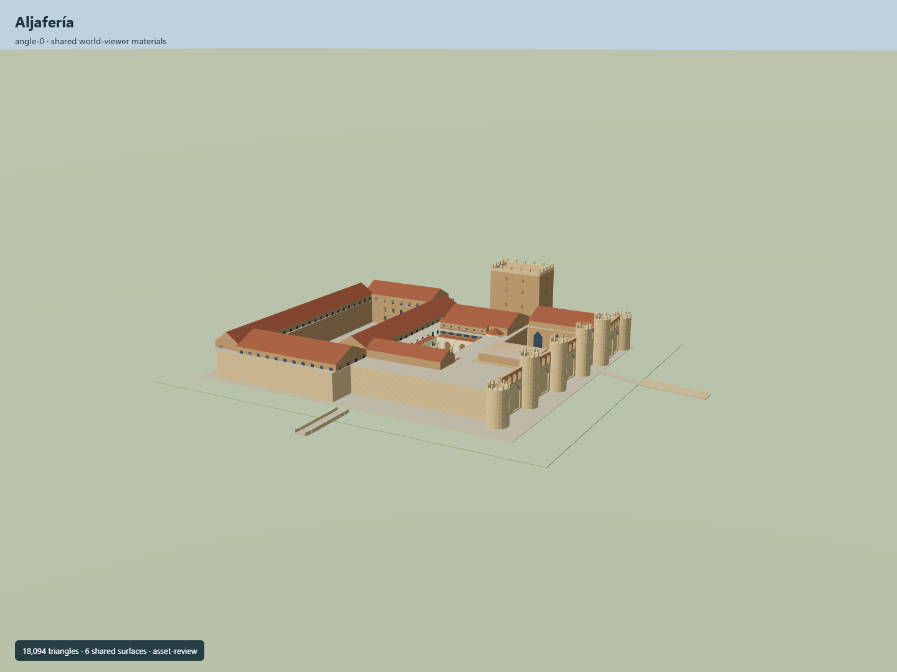

# Aljafería

Six round east towers and26m rectangular Trovador, three physically open roof courts, selected lobed Taifa colonnades and formal garden, tiled barracks and throne-gallery wings, distinct flat contemporary hemiciclo, chapel glazing and mapped access bridges over an estimated moat.

## Evidence and reconstruction

Published dimensions and reconstructed details are separated in spec.json. Primary references:

- [Reference](https://api.openstreetmap.org/api/0.6/map?bbox=-0.899,41.6554,-0.8954,41.6575)
- [Reference](https://patrimonioculturaldearagon.es/patrimonio/palacio-de-la-aljaferia/)
- [Reference](https://www.zaragoza.es/sede/portal/turismo/ver-y-hacer/servicio/monumento/7)
- [Reference](https://www.sipca.es/censo/1-INM-ZAR-017-297-629/.html)
- [Reference](https://islamicart.museumwnf.org/database_item.php?id=monument%3BISL%3Bes%3BMon01%3B4%3Bes)
- [Reference](https://www.pemanyfranco.com/corts-de-aragn)
- [Reference](https://www.pemanyfranco.com/biblioteca-c-san-martn)
- [Reference](https://patrimonioculturaldearagon.es/wp-content/uploads/2022/12/JCG0785.jpg)
- [Reference](https://patrimonioculturaldearagon.es/wp-content/uploads/2022/12/JCG0573b-scaled.jpg)
- [Reference](https://patrimonioculturaldearagon.es/wp-content/uploads/2022/12/JCG0772.jpg)
- [Reference](https://images.museumwnf.org/zoom/monuments/isl/es/1/4/4.jpg)
- [Reference](https://images.museumwnf.org/zoom/monuments/isl/es/1/4/plans/1.jpg)
- [Reference](https://static.wixstatic.com/media/f949b7_ee19a6dcc04f45feb34d806e903555d9~mv2_d_4724_6980_s_4_2.jpg)
- [Reference](https://static.wixstatic.com/media/f949b7_4aa16172c663421e9adee9e58e49c035~mv2_d_6996_4716_s_4_2.jpg)
- [Reference](https://static.wixstatic.com/media/f949b7_c11880355cec400980919a2b236e37d5.jpg)
- [Reference](https://bibliotecavirtual.aragon.es/es/catalogo_imagenes/grupo.do?path=3717944)

Six existing shared material graphs, linear palette and metric UVs; no new or embedded textures or imported meshes. Three mapped courtyards remain roof holes at every level. Estimated moat requires real host terrain cutout.

## Model and axes

18,094 triangles; 54,282 vertices; 8 material groups; 2,175,792 bytes. Native bounds: -68.140, -4.500, -63.909 to 86.112, 26.000, 69.842. Source hash: `sha256:81270adc954535bfe938f16e1edecbf39cc0e674ebbf12f5ca5ba4a05d4f41be`.

{"up":"+Y","front":"+X east, mapped main entrance","longitudinal":"+Z south","origin":"Exact-QID map anchor; palace platformY0 is attachment plane. Moat extends below it and needs host terrain cutout."}

Native East/South coordinates determine orientation including the mapped east entry. Internal plan rotation never becomes placement heading. Estimated moat descends below attachmentY0; current dimensions and real site fit require review before activation.

## Reproduce

Run `node packages/worldgen/scripts/generate-signature-towers.mjs --ids=N0294` (or add `--check`). The generator preserves manually edited masters by checking their baseline hashes. Import through the standard authored-model workflow with optimization disabled; then capture all QA cameras, including shared-surface views.

## Pending work

- The mapped Trovador edge is18.317m while the published width is16.5m. Model uses current map span, published12m depth and26m height; exact exterior measure and reconstruction state remain pending.
- Only source plan coordinates are measured here. Other heights, round-tower radii fits, apertures, columns, roof partitioning, moat/scarp and bridge widths are original estimates.
- Selected external and courtyard identity features are authored; full interior rooms, ornate inscriptions, ceilings, exhibits, contemporary fixtures and walkable collision are not complete.
- Moat extends below nativeY0. Real terrain cutout, ground datum, bridges/approaches and site fit are unverified; do not activate or replace procedural footprint yet.
- Private research photos/plans/sections are not distributed or used as textures. Six existing shared graphs supply surfaces with linear tints and metric UVs.
- Synthetic portable/shared/Earth captures, four LODs and source determinism do not establish geographic fidelity, physical laptop/phone timing or continuous streaming acceptance.
- Selected north/south portico backing doors and modern hall facade are original photographic interpretations. Door count, recess depths and interior room layout are approximate; detailed historic ornament and exact restoration fixture geometry remain pending.

This bundle follows the medium-fi standard. Medium-fi appearance and geographic fit are reviewed separately. Hash-bound visual acceptance is recorded separately after capture inspection.

## Additional geographic data

© OpenStreetMap contributors; Gobierno de Aragón; Ayuntamiento de Zaragoza; SIPCA; Museum With No Frontiers; Pemán y Franco; Pedro I.Sobradiel Valenzuela.
