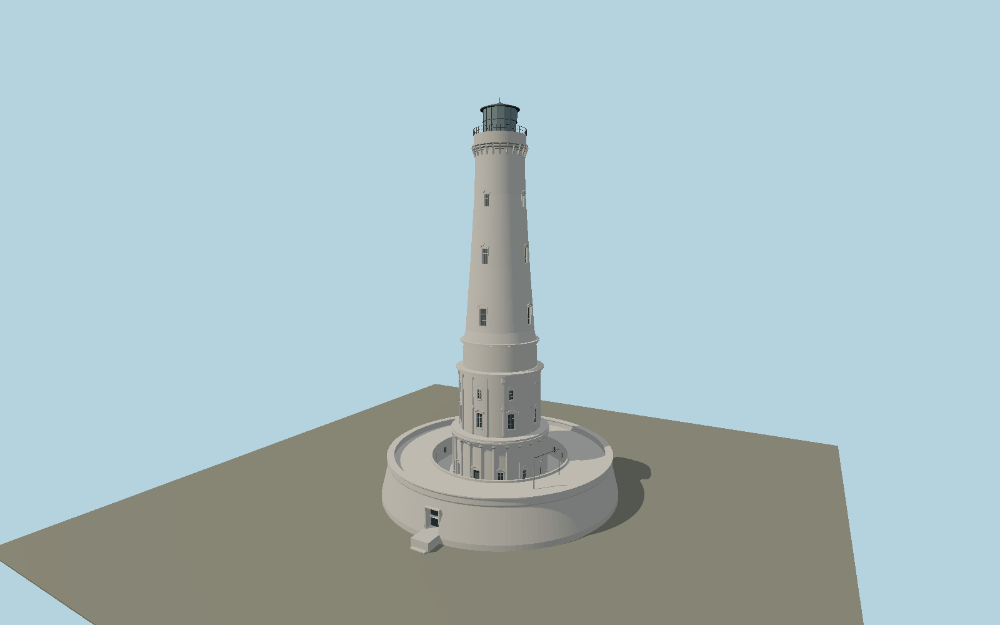

# Cordouan Lighthouse — N0639

Tidal limestone lighthouse with circular seawall terrace, articulated Renaissance lower stages, columns, pilasters and pedimented windows beneath the long tapered upper tower and lantern.

## Identity and evidence

Exact catalog identity **Q199234**. Source facts: `{"heightMeters":67.5,"platformDiameterMeters":41.65,"basis":"French lighthouse operator nomination to IALA and current official visitor page."}`. The source specification keeps published dimensions separate from reconstructed details.

- https://heritage.iala.int/lighthouses/cordouan-lighthouse/
- https://www.phare-de-cordouan.fr/decouvrir/visite-virtuelle/
- https://heritage.iala.int/content/uploads/2021/05/Cordouan-south-facade-2.jpg
- https://www.openstreetmap.org/way/100219438
- https://www.openstreetmap.org/way/961700310
- https://www.openstreetmap.org/way/759047106

Original geometry and shared procedural materials. Official photographs are research references only; no reference imagery or third-party mesh is embedded or redistributed.

## Authored geometry and materials

42,006 triangles, 79,140 vertices, 5 surface groups; 3,356,376 source bytes. SHA-256: `sha256:f4a0a7e666bc88ede23dc0a6c5f436bf29d5c41ec50c30a89bb81dc4fcc252d3`. Actual bounds: -20.825, 0.000, -20.825 to 20.825, 67.500, 23.880 m.

Shared canonical material graphs with metric UV repeats in extras.molenSurface; portable glTF PBR factors and vertex colors remain. Dark recesses/lantern panels retain local fallback materials. Shared references: `matgraph:molen.worldgen.material.stone_limestone` (2.4 × 1.6 m), `matgraph:molen.worldgen.material.metal_painted` (2 × 2 m), `matgraph:molen.worldgen.material.stone_granite` (2 × 2 m), `matgraph:molen.worldgen.material.wood_plain` (2 × 0.25 m). Model-native axes: {"up":"+Y","front":"+Z","origin":"Authored main tower center at local base level; attached ensembles are offset from this origin."}.

## Placement proposal

Exact mapped core identifies the center. Entry path961700310 meets the tower8.00m east and1.15m south of center, fixing authored+Z entrance at heading1.428030571rad. Outer entrance steps961700309 confirm the east quadrant. Terrain contact places the tidal fort base on its mapped reef; the host supplies tide and terrain behavior. Proposed anchor -1.173325364, 45.586319808 (longitude, latitude), heading 1.428030571 radians. Elevation policy: **terrain-contact**. This is a reviewable proposal, not a completed site-fit certification. Ground models require terrain contact; offshore models also require water-datum and base-height checks.

## Limitations and review

- The modeled exterior follows the cited published facts and inspected photographs. Unpublished dimensions and local fittings are explicitly photo-proportioned; no claim of engineering survey accuracy is made.
- Portable PBR and shared metric surfaces are provided. Surface weathering, material color under local lighting and fine facade relief require close render review before maximum-detail acceptance.
- Main height and platform diameter are published; intermediate stage radii, sculpture relief, window locations and stair geometry are photo-proportioned. The crown keeper building surrounds a mapped12m-radius courtyard; its3.1m court and6.3m roof levels are photo-proportioned. The optical red/green sectors and tidal rocks/causeway beyond the immediate stairs are not modeled.

Near/far fixtures are in `spec.qaCameras`. Float32 finite geometry, triangle degeneracy and winding are checked by the generator. Current rendering, shared-material, maximum-fidelity and geographic review results are recorded in `qa.json` and the readiness ledger; source generation alone does not approve a model.

Regenerate with `node packages/worldgen/scripts/generate-lighthouse-models.mjs --ids=N0639`; add `--check` for reproducibility. Editable component recipes are in `packages/worldgen/scripts/lighthouse-expansion-models.mjs`. The generator protects artist-edited master hashes and preserves import/capture/shared-capture/QA documents.
