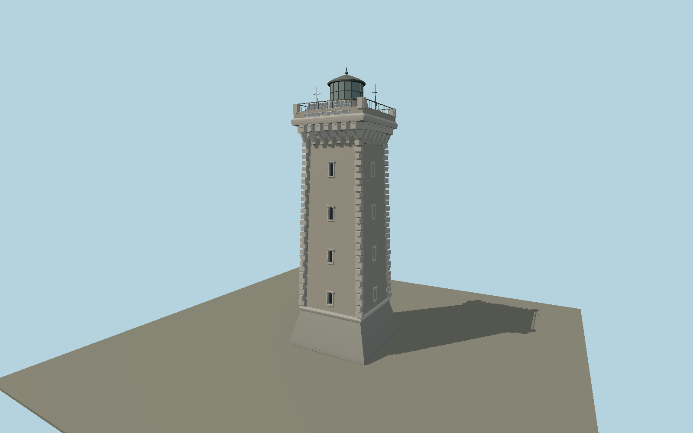

# La Vieille Lighthouse — N0654

Weathered square granite tower with a full-height rounded northern stair projection, small white-framed openings, alternating corner stones, deep paired corbels and a castellated square gallery. Restored dark lantern, sector panes, southern solar panels and aerials follow the operator’s2022 photograph.

## Identity and evidence

Exact catalog identity **Q2085015**. Source facts: `{"heightMeters":26.9,"seaElevationMeters":36,"year":1887,"basis":"Finistère departmental archives and DIRM2025 operator portfolio both publish26.90m structure height. Archive description specifies semicircular northern projection. DIRM photograph documents restored2022 lantern and notes the Temperley mast fell in2008; it is omitted."}`. The source specification keeps published dimensions separate from reconstructed details.

- https://archives.finistere.fr/histoires-animees/expositions-numeriques/phares-et-balises/la-vieille
- https://www.dirm.nord-atlantique-manche-ouest.developpement-durable.gouv.fr/IMG/pdf/livret_phares_2025_export_web_mini_cle527eb3.pdf
- https://www.openstreetmap.org/way/737263555

Original geometry and shared procedural materials. Official photographs are research references only; no reference imagery or third-party mesh is embedded or redistributed.

## Authored geometry and materials

11,636 triangles, 22,000 vertices, 4 surface groups; 912,424 source bytes. SHA-256: `sha256:9a794d7fd916f3ad829e4366355e01bb80949686d3cd4d6902712c1e51cdd0b5`. Actual bounds: -4.100, 0.000, -7.918 to 4.100, 26.900, 4.100 m.

Shared canonical material graphs with metric UV repeats in extras.molenSurface; portable glTF PBR factors and vertex colors remain. Dark recesses/lantern panels retain local fallback materials. Shared references: `matgraph:molen.worldgen.material.stone_ashlar` (2.4 × 1.5 m), `matgraph:molen.worldgen.material.metal_painted` (2 × 2 m), `matgraph:molen.worldgen.material.stone_granite` (2 × 2 m). Model-native axes: {"up":"+Y","front":"+Z","origin":"Authored main tower center at local base level; attached ensembles are offset from this origin."}.

## Placement proposal

Exact-QID mapped square footprint sets the axis; the primary archive specifies its round projection on the north, resolving the quadrant. Authored-X eastish, -Z north-northwest rounded projection. Host terrain supplies contact with Gorle Bella rock. Proposed anchor -4.75644475, 48.0406734 (longitude, latitude), heading 0.161623460236 radians. Elevation policy: **terrain-contact**. This is a reviewable proposal, not a completed site-fit certification. Ordinary ground models use terrain contact; Kiipsaare requires an offshore water/base-height check.

## Limitations and review

- The modeled exterior follows the cited published facts and inspected photographs. Unpublished dimensions and local fittings are explicitly photo-proportioned; no claim of engineering survey accuracy is made.
- Portable PBR and shared metric surfaces are provided. Surface weathering, material color under local lighting and fine facade relief require close render review before maximum-detail acceptance.
- Square shaft dimensions follow the mapped6.43m plan; setbacks, corbels and projections are photo-proportioned. The rock is host terrain; external lost loading mast is deliberately absent from this post2022 exterior. Static lantern glazing does not simulate its navigation sectors.

Near/far fixtures are in `spec.qaCameras`. Float32 finite geometry, triangle degeneracy and winding are checked by the generator. Rendering, shared-material alignment, maximum-fidelity and geographic reviews remain pending until their hash-bound reports exist.

Regenerate with `node packages/worldgen/scripts/generate-lighthouse-models.mjs --ids=N0654`; add `--check` for reproducibility. Editable component recipes are in `packages/worldgen/scripts/lighthouse-models.mjs`. The generator protects artist-edited master hashes and preserves import/capture/shared-capture/QA documents.
