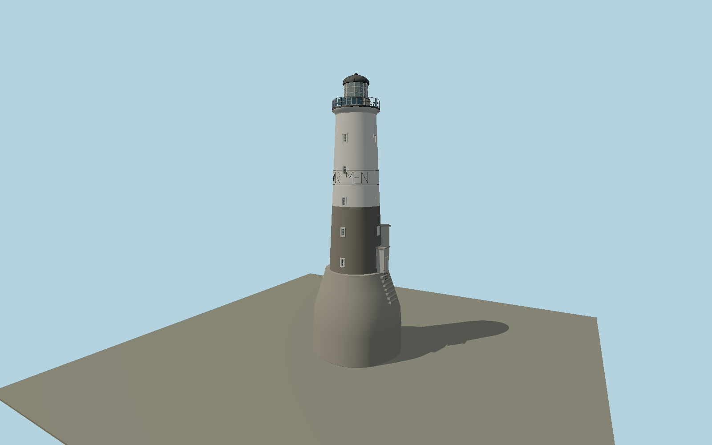

# Ar Men — N0663

Isolated sea tower rising from a massive irregular strengthening belt, dark lower shaft and white upper masonry, repeated recessed windows and painted AR-MEN name band. Two asymmetric eastern shelters, landing steps and ladder, black gallery with current photovoltaic array, stone watchroom, fine lantern bars and ribbed metal dome.

## Identity and evidence

Exact catalog identity **Q623540**. Source facts: `{"heightMeters":37,"lanternDiameterMeters":3,"strengtheningBeltHeightMeters":11.2,"basis":"Iroise marine-park technical factsheet specifies37m total,3m lantern and11.2m strengthening envelope, and locates attached shelters northeast/east. Its33.5m above-sea figure supports bottom at-3.5m for the37m structure. DIRM2025 operator photograph governs present gallery solar array, name band and masonry silhouette. Exact-QID mapped7.1m circle represents original tower core, not the wider irregular belt."}`. The source specification keeps published dimensions separate from reconstructed details.

- https://parc-marin-iroise.fr/editorial/le-phare-dar-men
- https://parc-marin-iroise.fr/media/504/download
- https://www.dirm.nord-atlantique-manche-ouest.developpement-durable.gouv.fr/IMG/pdf/livret_phares_2025_export_web_mini_cle527eb3.pdf
- https://pop.culture.gouv.fr/notice/merimee/PA29000086
- https://www.openstreetmap.org/way/628663159

Original geometry and shared procedural materials. Official photographs are research references only; no reference imagery or third-party mesh is embedded or redistributed.

## Authored geometry and materials

37,926 triangles, 71,868 vertices, 7 surface groups; 3,046,524 source bytes. SHA-256: `sha256:250990a60f85a9ff822338016c06f16469e8560bc0b40ca6ac1b1ffde3e16236`. Actual bounds: -6.100, 0.000, -5.700 to 6.100, 37.000, 5.700 m.

Shared canonical material graphs with metric UV repeats in extras.molenSurface; portable glTF PBR factors and vertex colors remain. Dark recesses/lantern panels retain local fallback materials. Shared references: `matgraph:molen.worldgen.material.plaster_lime` (2 × 2 m), `matgraph:molen.worldgen.material.stone_ashlar` (2.4 × 1.5 m), `matgraph:molen.worldgen.material.metal_painted` (2 × 2 m), `matgraph:molen.worldgen.material.stone_granite` (2 × 2 m), `matgraph:molen.worldgen.material.wood_plain` (2 × 0.25 m), `matgraph:molen.worldgen.material.concrete_plain` (2 × 2 m). Model-native axes: {"up":"+Y","front":"+Z","origin":"Authored main tower center at local base level; attached ensembles are offset from this origin."}.

## Placement proposal

Exact-QID mapped core establishes center. Authored+X east and-Z north set the two shelters to the official northeast/east quadrants. Marine-park37m total versus33.5m above-sea envelope implies bottom-3.5m; this explicit absolute datum avoids sea terrain incorrectly raising the foundation. Tidal level varies, and the reef is supplied by the host. Proposed anchor -4.997732568, 48.050120766 (longitude, latitude), heading 0 radians. Elevation policy: **sea-level**. This is a reviewable proposal, not a completed site-fit certification. Ground models require terrain contact; offshore models also require water-datum and base-height checks.

## Limitations and review

- The modeled exterior follows the cited published facts and inspected photographs. Unpublished dimensions and local fittings are explicitly photo-proportioned; no claim of engineering survey accuracy is made.
- Portable PBR and shared metric surfaces are provided. Surface weathering, material color under local lighting and fine facade relief require close render review before maximum-detail acceptance.
- Irregular belt plan and individual component elevations are photo-proportioned; the mapped circle is the narrow core. Historic gantry arrangements differ from the2025 operator photo, whose solar array is represented. Name-band lettering is geometric. Reusable stone surfaces represent coursing without copying individual weathering marks.

Near/far fixtures are in `spec.qaCameras`. Float32 finite geometry, triangle degeneracy and winding are checked by the generator. Current rendering, shared-material, maximum-fidelity and geographic review results are recorded in `qa.json` and the readiness ledger; source generation alone does not approve a model.

Regenerate with `node packages/worldgen/scripts/generate-lighthouse-models.mjs --ids=N0663`; add `--check` for reproducibility. Editable component recipes are in `packages/worldgen/scripts/lighthouse-final-coastal-models.mjs`. The generator protects artist-edited master hashes and preserves import/capture/shared-capture/QA documents.
