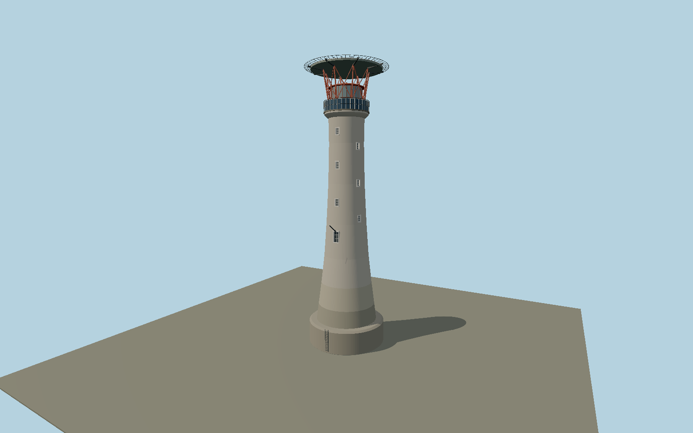

# Eddystone Lighthouse — N0646

1882 curved granite sea tower with staggered recessed windows, dark photovoltaic gallery apron, red lantern support cage and modern above-lantern helideck with radial safety net.

## Identity and evidence

Exact catalog identity **Q546122**. Source facts: `{"heightMeters":49,"year":1882,"automation":"Above-lantern helipad added for the 1982 automation; operator current photograph shows solar apron.","basis":"Trinity House live lighthouse page and operator photograph."}`. The source specification keeps published dimensions separate from reconstructed details.

- https://www.trinityhouse.co.uk/lighthouses-and-lightvessels/eddystone-lighthouse
- https://www.trinityhouse.co.uk/asset/952/view/1200
- https://trinityhouse.co.uk/asset/5623/download?1746607918=

Original geometry and shared procedural materials. Official photographs are research references only; no reference imagery or third-party mesh is embedded or redistributed.

## Authored geometry and materials

24,268 triangles, 45,428 vertices, 5 surface groups; 1,884,444 source bytes. SHA-256: `sha256:46ef73743a35eb6f2463a6297a57f46f6a051adc6e530005076066a506645c1a`. Actual bounds: -7.325, 0.000, -7.325 to 7.325, 49.022, 7.325 m.

Shared canonical material graphs with metric UV repeats in extras.molenSurface; portable glTF PBR factors and vertex colors remain. Dark recesses/lantern panels retain local fallback materials. Shared references: `matgraph:molen.worldgen.material.stone_ashlar` (2.4 × 1.5 m), `matgraph:molen.worldgen.material.metal_painted` (2 × 2 m), `matgraph:molen.worldgen.material.stone_granite` (2 × 2 m), `matgraph:molen.worldgen.material.wood_plain` (2 × 0.25 m). Model-native axes: {"up":"+Y","front":"+Z","origin":"Authored main tower center at local base level; attached ensembles are offset from this origin."}.

## Placement proposal

Trinity House2025-30 Aids to Navigation Review p73 gives WGS84 50deg10.843min N,004deg15.936min W, superseding coarse catalog reference. Round tower and circular helideck have no principal plan axis. Sparse opening azimuth remains photo-reconstructed; ground is local reef contact, not a claimed mean-sea-level datum. Proposed anchor -4.2656, 50.180716666667 (longitude, latitude), heading 0 radians. Elevation policy: **terrain-contact**. This is a reviewable proposal, not a completed site-fit certification. Ordinary ground models use terrain contact; Kiipsaare requires an offshore water/base-height check.

## Limitations and review

- The modeled exterior follows the cited published facts and inspected photographs. Unpublished dimensions and local fittings are explicitly photo-proportioned; no claim of engineering survey accuracy is made.
- Portable PBR and shared metric surfaces are provided. Surface weathering, material color under local lighting and fine facade relief require close render review before maximum-detail acceptance.
- Current granite tower exterior and modern service deck are included. Old Smeaton stump and surrounding rocks are separate site features and are not included in this asset. Intermediate radii, glazing, panel subdivisions and helideck members are photo-proportioned.

Near/far fixtures are in `spec.qaCameras`. Float32 finite geometry, triangle degeneracy and winding are checked by the generator. Rendering, shared-material alignment, maximum-fidelity and geographic reviews remain pending until their hash-bound reports exist.

Regenerate with `node packages/worldgen/scripts/generate-lighthouse-models.mjs --ids=N0646`; add `--check` for reproducibility. Editable component recipes are in `packages/worldgen/scripts/lighthouse-models.mjs`. The generator protects artist-edited master hashes and preserves import/capture/shared-capture/QA documents.
