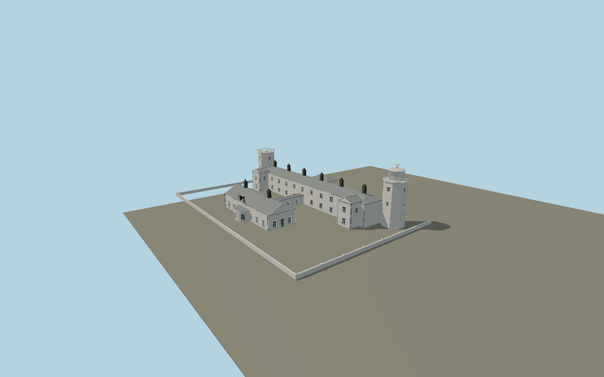

# Lizard Lighthouse — N0680

Twin white octagonal towers with only the eastern tower carrying a diamond-glazed lantern, active optic and weather vane; hooded windows, long two-storey keeper range, projecting gable bays, six tall black chimney stacks, individual rear outshuts, covered engine-room corridor, gabled engine house and semicircular foghorn bay.

## Identity and evidence

Exact catalog identity **Q1866643**. Source facts: `{"activeHeightMeters":19,"towerCenterSeparationMeters":68.01,"focalElevationMeters":70,"keeperRangeLengthMeters":60.53,"engineHousePlanMeters":[28.54,9.98],"basis":"Trinity House publishes19m tower height and identifies the active eastern lantern, twin1752towers and engine house. Historic England listing1328497 describes octagonal towers, hooded windows, projecting end gables, six tall black chimneys, slate roofs and rear service wings. Exact OSM building parts fix tower centers, active diameter, keeper range/outshut and engine-room footprints; remaining vertical dimensions and small detail are photo-proportioned."}`. The source specification keeps published dimensions separate from reconstructed details.

- https://www.trinityhouse.co.uk/lighthouses-and-lightvessels/lizard-lighthouse
- https://www.trinityhouse.co.uk/lighthouse-cottage-rental/lizard-holiday-cottages
- https://historicengland.org.uk/listing/the-list/list-entry/1328497
- https://www.trinityhouse.co.uk/asset/970/view/1400
- https://www.trinityhouse.co.uk/asset/1624/view/1400
- https://www.trinityhouse.co.uk/asset/4418/view/1400
- https://www.openstreetmap.org/way/65369068
- https://www.openstreetmap.org/way/814270620
- https://www.openstreetmap.org/way/814270621
- https://www.openstreetmap.org/way/846164579
- https://www.openstreetmap.org/way/846164580

Original geometry and shared procedural materials. Official photographs are research references only; no reference imagery or third-party mesh is embedded or redistributed.

## Authored geometry and materials

142,646 triangles, 267,364 vertices, 6 surface groups; 11,073,084 source bytes. SHA-256: `sha256:7bde0f3f1d57f44f2d5ce961db23d126cf00896e499d6e92c08c4e2a67b38318`. Actual bounds: -72.090, 0.000, -15.665 to 7.080, 19.000, 42.700 m.

Shared canonical material graphs with metric UV repeats in extras.molenSurface; portable glTF PBR factors and vertex colors remain. Dark recesses/lantern panels retain local fallback materials. Shared references: `matgraph:molen.worldgen.material.plaster_lime` (2 × 2 m), `matgraph:molen.worldgen.material.slate` (1.5 × 1.6 m), `matgraph:molen.worldgen.material.metal_painted` (2 × 2 m), `matgraph:molen.worldgen.material.wood_plain` (2 × 0.25 m). Model-native axes: {"up":"+Y","front":"+Z","origin":"Authored main tower center at local base level; attached ensembles are offset from this origin."}.

## Placement proposal

Origin is the mapped active eastern-tower polygon centroid. Native+X runs along the long keeper range east/slightly north; native+Z faces the southern engine room and coast. Exact tower and engine-house parts remove the180degree ambiguity. The western tower is offset[-67.95,0,2.82]m; the source uses ordinary common station-grade contact and does not mistake70m focal elevation for model height. Proposed anchor -5.20211360017, 49.96020745193 (longitude, latitude), heading 0.162 radians. Elevation policy: **terrain-contact**. This is a reviewable proposal, not a completed site-fit certification. Ordinary ground models use terrain contact; Kiipsaare requires an offshore water/base-height check.

## Limitations and review

- The modeled exterior follows the cited published facts and inspected photographs. Unpublished dimensions and local fittings are explicitly photo-proportioned; no claim of engineering survey accuracy is made.
- Portable PBR and shared metric surfaces are provided. Surface weathering, material color under local lighting and fine facade relief require close render review before maximum-detail acceptance.
- The current exterior is reconstructed from operator photographs and heritage description. Service-wing roof ridges, small joinery and chimney pots are photograph-based dimensions. Fine lens prisms and weather-vane contours are original geometric approximations. Garden walls use the published station layout rather than cadastral wall surveys; detached hostel, coastal terrain and temporary furniture remain map context.

Near/far fixtures are in `spec.qaCameras`. Float32 finite geometry, triangle degeneracy and winding are checked by the generator. Rendering, shared-material alignment, maximum-fidelity and geographic reviews remain pending until their hash-bound reports exist.

Regenerate with `node packages/worldgen/scripts/generate-lighthouse-models.mjs --ids=N0680`; add `--check` for reproducibility. Editable component recipes are in `packages/worldgen/scripts/lighthouse-models.mjs`. The generator protects artist-edited master hashes and preserves import/capture/shared-capture/QA documents.
