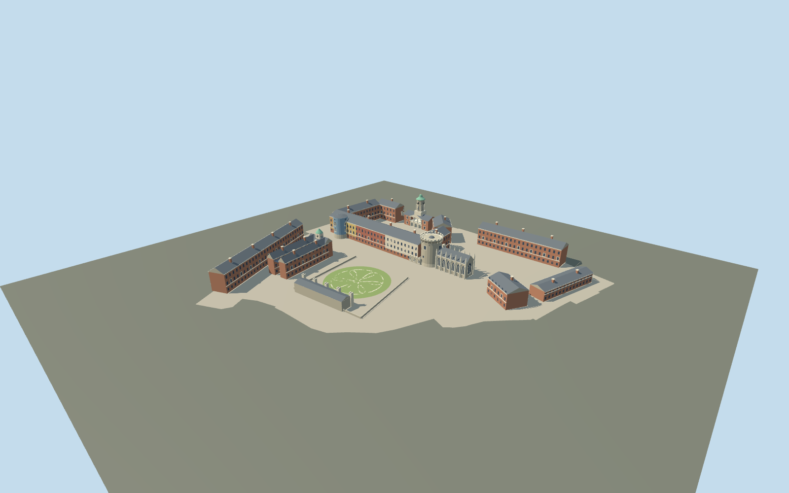

# Dublin Castle

Dublin Castle current exterior campus: open Georgian Upper and Lower Courts, Bedford clock pavilion and flanking gates, round Record and Bermingham towers, pinnacled Gothic Chapel Royal, circular Dubh Linn garden, Coach House and Chester Beatty clock range.

## Evidence and reconstruction

Published dimensions and reconstructed details are separated in spec.json. Primary references:

- [Reference](https://dublincastle.ie/wp-content/uploads/2017/01/DublinCastle_Maps_website.pdf)
- [Reference](https://dublincastle.ie/strategicframeworkplan/)
- [Reference](https://dublincastle.ie/the-medieval-tower/)
- [Reference](https://dublincastle.ie/the-chapel-royal/)
- [Reference](https://dublincastle.ie/the-bedford-tower-castle-gates-guard-house/)
- [Reference](https://dublincastle.ie/the-clock-tower-building-the-state-stables/)
- [Reference](https://dublincastle.ie/the-castle-gardens/)
- [Reference](https://www.buildingsofireland.ie/buildings-search/building/50910292/dublin-castle-bermingham-tower-dublin-castle-dublin-2-co-dublin)
- [Reference](https://www.openstreetmap.org/way/350242806)

No third-party geometry, photograph or bitmap texture is embedded. Shared surface graphs come from the central library; vertex tints carry model colors. Glazing uses PBR materials; transparent surfaces are declared per model.

## Model and axes

10,334 triangles; 25,890 vertices; 7 material groups; 1,060,080 bytes. Native bounds: -131.217, 0.000, -122.990 to 131.216, 34.000, 122.990. Source hash: `sha256:2c0581c7d1f82f7fc14473f121f65eee2157d6cf38b4826ce35b2bb53641efab`.

{"up":"+Y","longitudinal":"+X east-northeast,12.49 degrees north of east","front":"+Z gardens; -Z Dame/Castle Street; Lower Court toward +X","origin":"Mapped entire campus center; provisional ground attachment Y=0"}

Exact campus perimeter and interpreted OPW components establish orientation; geographic activation requires terrain/approach and footprint interaction review. Synthetic captures establish appearance only.

## Reproduce

Run `node packages/worldgen/scripts/generate-signature-towers.mjs --ids=N0275` (or add `--check`). The generator preserves manually edited masters by checking their baseline hashes. Import through the standard authored-model workflow with optimization disabled; then capture all QA cameras, including shared-surface views.

## Pending work

- Original medium-fi exterior interpretation, not a conservation or cadastral survey.
- All heights, radii, component widths and openings inferred from primary photographs and plans; no surveyed elevation is claimed.
- South-facing painted ranges use interpreted clear red/ochre/blue tints seen in OPW aerial evidence; paint exactness remains subject to site review.
- Upper/Lower Courtyards remain open. Existing buildings are abbreviated; future strategic-plan proposals and neighboring offices are excluded.
- Garden serpent paths are a broad stylized interpretation, not an exact reproduction of the paving pattern.
- Fine Gothic carving, stone joints, glazing bars, statuette attributes, full interiors and tiny fixtures omitted.
- Actual terrain contact, approaches, geographic activation, continuous-motion shimmer and physical-device performance remain pending.

This bundle follows the medium-fi standard. Medium-fi appearance and geographic fit are reviewed separately. Hash-bound visual acceptance is recorded separately after capture inspection.

## Additional geographic data

© OpenStreetMap contributors, ODbL-1.0. OPW, Grafton and NIAH primary references used as research only.
