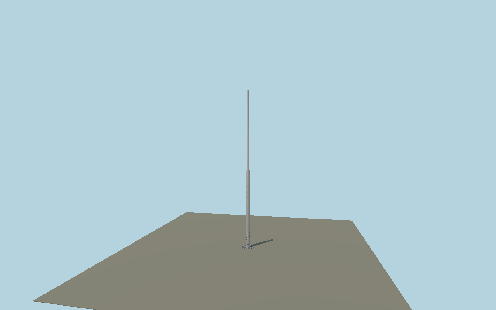

# Spire of Dublin

Tapered 120 m stainless steel monument, separate reflective geological pattern islands, 11,884 actual tip perforations with plate reveals and internal diffuser, concentric base grating, dark stone surround and eight removable bollards. Reusable polished and bead-blasted material graphs supply the metal finishes.

## Identity and geometry

Catalog N0975, [Q1134365](https://www.wikidata.org/wiki/Q1134365). Dublin City Council and fabricator dimensions fix the 120 m cone, 3 m base and 150 mm tip. IMOA fixes 11,884 holes of 15 mm diameter over the upper 12 m. Surround/grating/bollards are scaled from the inspected architect photograph, not a site survey.

Spire centre at street pavement datum. +Z is the provisional southern approach; axial form is rotationally symmetric but the base pattern is not; +Y is up. The geographic proposal identifies its anchor and orientation evidence separately from remaining terrain and azimuth uncertainty.

Source facts and measured references are recorded in spec.json. References: [1](https://www.visitdublin.com/the-spire), [2](https://aqua-design.ie/case-studies/the-spire-dublin/), [3](https://www.imoa.info/molybdenum-uses/molybdenum-grade-stainless-steels/architecture/stainless-steel-spire-graces.php), [4](https://www.publicart.ie/fileadmin/user_upload/PDF_Folder/The_Spire_of_Dublin_-_Science_and_Technology_in_Action.pdf), [5](https://www.newsteelconstruction.com/wp/making-the-dublin-spire/), [6](https://www.openstreetmap.org/way/96578181). Reference pages and images are not redistributed.

## Original source and shared materials

Geometry is authored in `packages/worldgen/scripts/spire-of-dublin-model.mjs`. Shared material graphs with metric repeat UV0 and original vertex tints; GLB PBR fallback remains self-contained. No per-model texture duplication. No third-party mesh or photograph is embedded.

1,313,806 triangles; 2,538,454 vertices; 5 material groups; 14,914,312 source bytes. Source hash: `sha256:48e30d716fe4469c297f1baa44eaabf1baa2ee8b2bae2f461b4ae6046724c6aa`. Geometry validation checks finite Float32 coordinates, indices, triangle area and winding before export.

Regenerate with `node packages/worldgen/scripts/generate-heritage-towers.mjs N0975`; add `--check` for reproducibility. The generator refuses to overwrite a master whose hash differs from source.json. Import uses `--no-optimize` to preserve facade recesses.

## Remaining detail and review

- The unique base stencil is an original stratified reconstruction. Its complete individual island shapes and azimuth require a measured or photographic unwrap before maximum-fidelity approval.
- Exact frustum joints, hole row layout and stagger are unresolved. Hole count and diameter are faithful; the present explicit layout is reconstructed.
- Current night lighting, basal lighting, maintenance door and service hardware remain unfinished. The static pale diffuser represents daylight rather than an active beacon.
- Ground surround and bollards follow early architect photographs and require comparison with the present streetscape. No surrounding tram tracks or buildings are baked into the model.
- Near/far visual QA, shared-material inspection and maximum-fidelity approval remain pending.

Named near/far cameras are included for lit visual review. A valid export is not maximum-fidelity certification.
