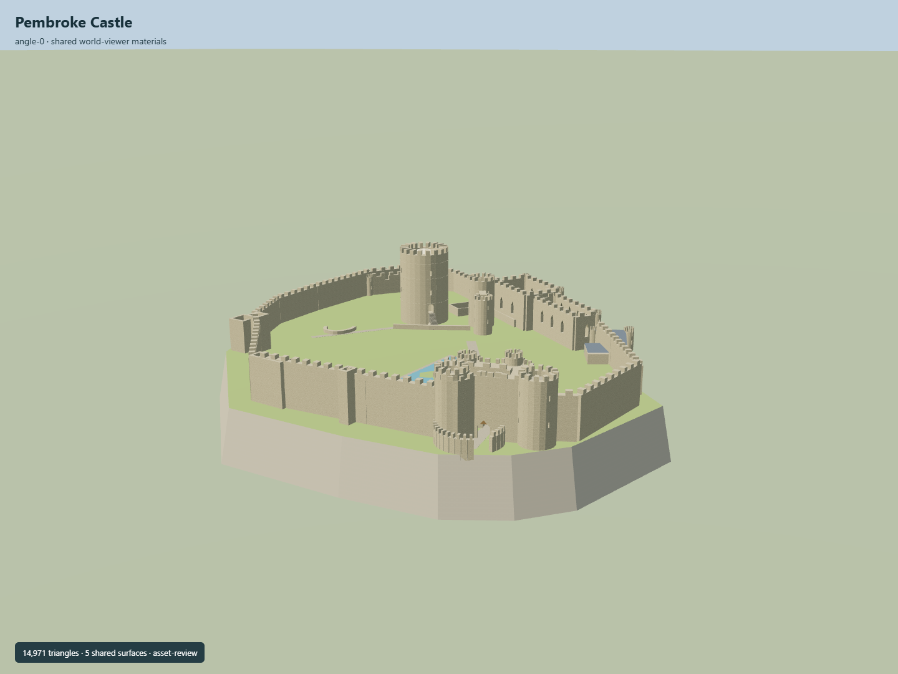

# Pembroke Castle

25m circular limestone keep with domed crown, asymmetric oblique gatehouse and low curved barbican, hollow perimeter towers and irregular curtain ring, roofless Great/Norman/western halls, mostly lost inner-gate footings, StAnne projection, original cliff/promontory with walled Wogan mouth and schematic visitor map.

## Evidence and reconstruction

Published dimensions and reconstructed details are separated in spec.json. Primary references:

- [Reference](https://api.openstreetmap.org/api/0.6/map?bbox=-4.9224,51.6757,-4.9183,51.6786)
- [Reference](https://pembrokecastle.co.uk/)
- [Reference](https://pembrokecastle.co.uk/explore/)
- [Reference](https://cadwpublic-api.azurewebsites.net/reports/listedbuilding/FullReport?id=6314)
- [Reference](https://cadwpublic-api.azurewebsites.net/reports/sam/FullReport?id=3013&lang=en)
- [Reference](https://coflein.gov.uk/en/site/94945/)
- [Reference](https://coflein.gov.uk/en/archives/6174476)
- [Reference](https://pembrokecastle.co.uk/wogan-cavern/)
- [Reference](https://pembrokecastle.co.uk/wp-content/uploads/2026/02/Dinnis-et-al-2023-CKS-WC22.pdf)
- [Reference](https://pembrokecastle.co.uk/wp-content/uploads/2024/12/Jarrold-Pembroke-Castle-409.jpg)
- [Reference](https://pembrokecastle.co.uk/wp-content/uploads/2024/12/Jarrold-Pembroke-Castle-333.jpg)
- [Reference](https://pembrokecastle.co.uk/wp-content/uploads/2025/01/Directions-Parking.jpg)
- [Reference](https://pembrokecastle-co-uk.inprogress.uk/wp-content/uploads/2024/11/map-screenshot.jpg)
- [Reference](https://coflein.gov.uk/media/132/30/large_di2006_0556.jpg)
- [Reference](https://pembrokecastle.co.uk/blocks/download/20190213035045Pembroke%20Castle%20Information%20pack.pdf)

Five existing256-square shared graphs, linear palette and central metric repeats. No new/embedded textures, copied map artwork or downloaded meshes. Preserve unresolved cave-section/DEM discrepancy.

## Model and axes

14,971 triangles; 44,913 vertices; 7 material groups; 1,800,592 bytes. Native bounds: -71.060, 0.400, -73.150 to 76.285, 40.000, 72.105. Source hash: `sha256:10961af60023dbb13174f3007af7ea6ec0d9d5a6e7944d285ed06ae386d66910`.

{"up":"+Y","front":"Oblique southeastern main entrance, baked in East/South coordinates","longitudinal":"+Z south","origin":"Wikidata reference coordinate; original plateauY15 attachment plane over native datum2.5m. Cliff and Wogan descend below it."}

Native+X east/+Z south encodes the actual mapped oblique passage with heading0. PlatformY15 is a provisional attachment plane; cliff/Wogan extend below. Raw coarseDEM is retained separately. Real vertical registration/cutout and site association require review.

## Reproduce

Run `node packages/worldgen/scripts/generate-signature-towers.mjs --ids=N0295` (or add `--check`). The generator preserves manually edited masters by checking their baseline hashes. Import through the standard authored-model workflow with optimization disabled; then capture all QA cameras, including shared-surface views.

## Pending work

- Exact identity is a map node. Nearby physical traces have no shared exact-QID area; their castle association and current physical fit need geographic review. Some east/StAnne traces explicitly warn that they are inaccurate.
- Published keep dimensions and cave measurements are retained. Other heights/thicknesses, missing wall/roof partitions, windows, arches, stairs, restored towers and low barbican are original estimates.
- Coarse Terrarium data peaks near13.77m while published cave floor9–10mOD and5m chamber height imply a higher overlying hall. Native datum2.5m and plateauY15 (absolute17.5m) are original provisional section controls. Preserve the raw DEM and this unresolved difference; real vertical registration/blending remains pending.
- Wogan chamber is a simplified exterior/dark interior volume with published approximate bounds; its rock form, masonry aperture positions and complete spiral circulation are not surveyed.
- No full rooms, exhibits, vault interiors, inscriptions, exact archaeological ruins or walkable circulation/collision are complete. GreatMap is a schematic original visitor prop, not reproduced artwork.
- Only existing shared low-frequency256-square graph textures are used; private photos/plans and operator rendered navigation model are not copied or redistributed.
- Synthetic captures and authored LODs do not approve real site fit, continuous streaming or physical-device performance. Keep placement inactive with footprint replacement off.

This bundle follows the medium-fi standard. Medium-fi appearance and geographic fit are reviewed separately. Hash-bound visual acceptance is recorded separately after capture inspection.

## Additional geographic data

© OpenStreetMap contributors; Cadw; Pembroke Castle Trust; RCAHMW/Toby Driver; Dinnis et al2023/British Cave Research Association; Mapzen/NASA/USGS terrain data.
