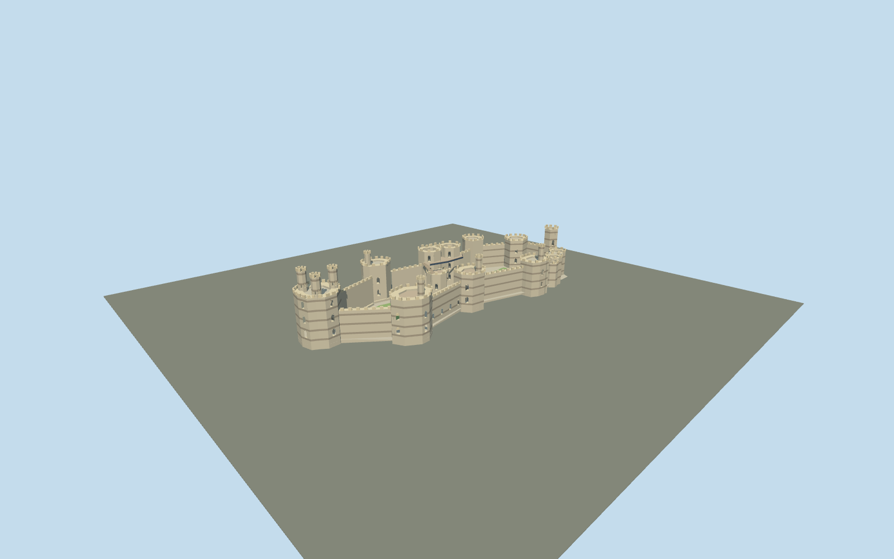

# Caernarfon Castle

Present-day Caernarfon: nine polygonal towers, three Eagle turrets, grey/warm banded river walls, two open wards, raised Queen's Gate and restored timber King's Gate decks.

## Evidence and reconstruction

Published dimensions and reconstructed details are separated in spec.json. Primary references:

- [Reference](https://cadw.gov.wales/visit/places-to-visit/castell-caernarfon)
- [Reference](https://cadw.gov.wales/more-about-castell-caernarfon)
- [Reference](https://cadwpublic-api.azurewebsites.net/reports/listedbuilding/FullReport?id=3814)
- [Reference](https://cadwpublic-api.azurewebsites.net/reports/sam/FullReport?id=3417&lang=en)
- [Reference](https://commons.wikimedia.org/wiki/File:Caernarfon_Castle_plan_labelled.png)
- [Reference](https://buttress.net/projects/caernarfon-castle-gatehouse)
- [Reference](https://buttress.net/journal/2023/08/30/detail-upper-deck-seating-caernarfon-castle)
- [Reference](https://www.openstreetmap.org/way/70264991)

No third-party geometry, photograph or bitmap texture is embedded. Shared surface graphs come from the central library; vertex tints carry model colors. Glazing uses PBR materials; transparent surfaces are declared per model.

## Model and axes

16,236 triangles; 44,172 vertices; 5 material groups; 1,788,164 bytes. Native bounds: -87.541, 0.000, -32.945 to 87.368, 35.000, 33.038. Source hash: `sha256:de64bc71d2a140862b42bfc76fd24f7581d81da9333069a84a0bfbd3a7b481a1`.

{"up":"+Y","longitudinal":"+X east-northeast,10.88 degrees north of east","front":"-Z town-facing King's Gate; +Z Seiont river curtain","origin":"Mapped perimeter center; architectural foundations Y=0, provisional courtyard Y=2"}

Draft map alignment with resolved signed axes; no geographic activation until river bedrock, court datum and both gate approaches are reviewed.

## Reproduce

Run `node packages/worldgen/scripts/generate-signature-towers.mjs --ids=N0273` (or add `--check`). The generator preserves manually edited masters by checking their baseline hashes. Import through the standard authored-model workflow with optimization disabled; then capture all QA cameras, including shared-surface views.

## Pending work

- Original medium-fi current exterior; tower interiors, fine carvings, galleries and stair systems abbreviated.
- All elevations and rear tower edges are approximate, not surveyed.
- Town walls, external bridge/quay and natural rock omitted.
- Actual terrain/gate approach fit, continuous-motion shimmer and physical-device performance pending.

This bundle follows the medium-fi standard. Medium-fi appearance and geographic fit are reviewed separately. Hash-bound visual acceptance is recorded separately after capture inspection.

## Additional geographic data

© OpenStreetMap contributors, ODbL-1.0. Cadw plan: Crown copyright, Open Government Licence v1.0. Operator and Buttress photographs used as visual references only.
