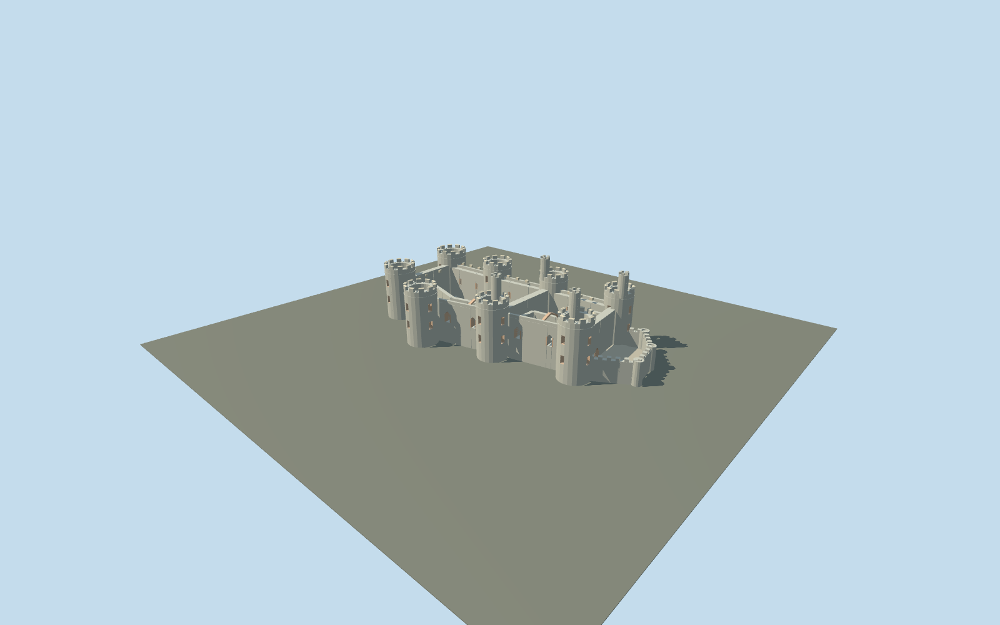

# Conwy Castle

Present-day roofless Conwy Castle: eight open round towers, four tall inner-ward stair turrets, bent south hall range, paired open wards and low end barbicans.

## Evidence and reconstruction

Published dimensions and reconstructed details are separated in spec.json. Primary references:

- [Reference](https://cadw.gov.wales/visit/places-to-visit/castell-conwy)
- [Reference](https://cadwpublic-api.azurewebsites.net/reports/listedbuilding/FullReport?id=3250)
- [Reference](https://cadwpublic-api.azurewebsites.net/reports/sam/FullReport?id=3411&lang=en)
- [Reference](https://commons.wikimedia.org/wiki/File:Conwy_Castle_plan.jpg)
- [Reference](https://cadw.gov.wales/more-about-castell-conwy)
- [Reference](https://www.openstreetmap.org/way/52467063)

No third-party geometry, photograph or bitmap texture is embedded. Shared surface graphs come from the central library; vertex tints carry model colors. Glazing uses PBR materials; transparent surfaces are declared per model.

## Model and axes

11,944 triangles; 32,196 vertices; 5 material groups; 1,305,620 bytes. Native bounds: -60.800, 0.000, -29.480 to 60.800, 30.000, 29.480. Source hash: `sha256:58cbbd6888f8f94e8e8b7b656f528be093b292e0f059f7a450f97eb907dd9117`.

{"up":"+Y","longitudinal":"+X east, about 4.26 degrees north of east","front":"+X river barbican; -X western town entrance","origin":"Mapped outline center; foundations Y=0, proposed courtyard Y=2m"}

Map-aligned perimeter and named plan components resolve orientation. Tower heights, internal walls and court datum remain approximate; geographic activation awaits terrain review.

## Reproduce

Run `node packages/worldgen/scripts/generate-signature-towers.mjs --ids=N0270` (or add `--check`). The generator preserves manually edited masters by checking their baseline hashes. Import through the standard authored-model workflow with optimization disabled; then capture all QA cameras, including shared-surface views.

## Pending work

- Simplified current ruin exterior; lower interiors, fine tracery and stairs abbreviated.
- Tower elevations are inferred; cached30m maximum lacks a reference. River-relative published heights are distinct from model heights.
- Town walls, adjacent bridges, visitor buildings and natural bedrock omitted.
- Actual terrain seating, continuous-motion shimmer and physical-device performance pending.

This bundle follows the medium-fi standard. Medium-fi appearance and geographic fit are reviewed separately. Hash-bound visual acceptance is recorded separately after capture inspection.

## Additional geographic data

© OpenStreetMap contributors, ODbL-1.0. Cadw plan: Crown copyright, Open Government Licence v1.0. Current Cadw photographs used as visual references only.
