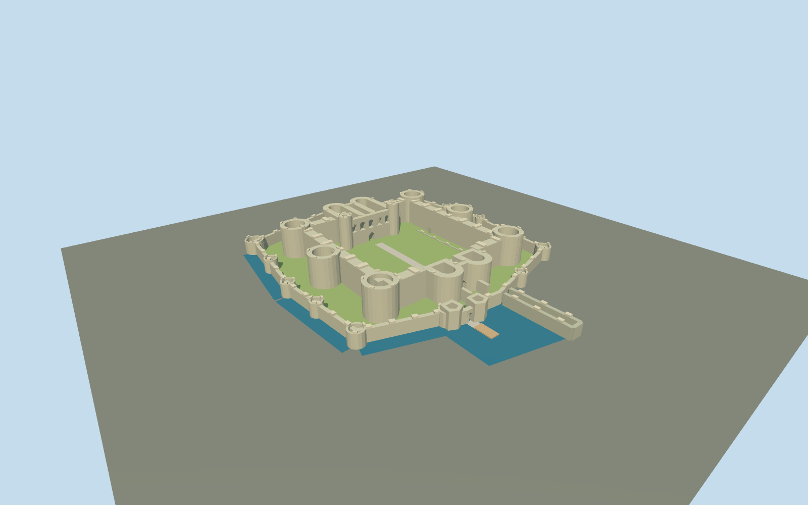

# Beaumaris Castle

Present-day roofless concentric castle:six squat inner towers,twin-D gatehouses,five north-hall openings,lower outer tower circuit,offset sea gate,low unfinished foundations and moat/dock study.

## Evidence and reconstruction

Published dimensions and reconstructed details are separated in spec.json. Primary references:

- [Reference](https://cadw.gov.wales/visit/places-to-visit/beaumaris-castle?lang=en)
- [Reference](https://cadw.gov.wales/media/1099)
- [Reference](https://cadw.gov.wales/beaumaris-castle-access-guide)
- [Reference](https://www.openstreetmap.org/way/48296427)

No third-party geometry, photograph or bitmap texture is embedded. Shared surface graphs come from the central library; vertex tints carry model colors. Glazing uses PBR materials; transparent surfaces are declared per model.

## Model and axes

6,071 triangles; 15,561 vertices; 4 material groups; 635,876 bytes. Native bounds: -59.973, 0.000, -77.918 to 56.527, 17.600, 72.900. Source hash: `sha256:1da3b3af8ac20f9955c4e4ed7c555649bc9ff3fce42be9f3bed9c322dcc1cad6`.

{"up":"+Y","longitudinal":"+Z toward the sea gate and dock","lateral":"+X across the inner ward toward the chapel tower","origin":"Cached outer-castle rectangle center;provisional flat ground datumY0,ward surfaceY0.6"}

Approximate mapped-plan exterior. Ground and heights estimated;heading toward mapped dock. Inactive until whole-site/terrain review.

## Reproduce

Run `node packages/worldgen/scripts/generate-signature-towers.mjs --ids=N0283` (or add `--check`). The generator preserves manually edited masters by checking their baseline hashes. Import through the standard authored-model workflow with optimization disabled; then capture all QA cameras, including shared-surface views.

## Pending work

- Approximate current roofless exterior study. Cached OSM outer outline and primary scaled plan inform controls,but internal tower centers,gate bodies,wall thicknesses and all elevations are inferred rather than surveyed.
- Y0 flat authoring datum and17.6m highest northern stair turret are estimates. No sampled terrain or measured anchor elevation. Ground contact and actual street/shore elevation need review.
- Inner towers and south gate remain squat;lost roofs,unbuilt upper stories and dashed buried walls are not reconstructed as complete medieval buildings. Selected low footings only;no complete interiors or circulation/collision certification.
- Moat is approximate opaque blue strips along the north/west defenses and a dock study surface,not a current waterline polygon or engine water simulation. Eastern former moat stays dry. Dock is a surviving wall study;coastline/town walls and demolished mill excluded.
- Selected broad parapet remnants and genuine gate/hall openings survive;individual arrow loops,stone joints,thin rails,modern access fixtures,trees and visitor center excluded.
- Shared256² limestone,weathered limestone and wood graphs;ground/water remain untextured. Research images not redistributed;no baked light or AO.
- Heading0.263147147rad uses the mapped dock to disambiguate the plan axis. Signed orientation,whole-site fit,moat overlap,temporal state and footprint replacement remain pending. Inactive draft,replaceFootprint=false.
- Synthetic English-terrace review context is not the real Beaumaris shore;physical laptop/phone timing and continuous-motion LOD behavior remain unmeasured.

This bundle follows the medium-fi standard. Medium-fi appearance and geographic fit are reviewed separately. Hash-bound visual acceptance is recorded separately after capture inspection.

## Additional geographic data

© OpenStreetMap contributors;Cadw,Welsh Government architectural references.
