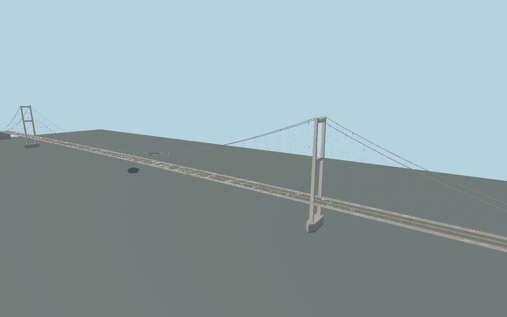

# Severn Bridge — original 1966 crossing

The original M48 Severn suspension bridge: two white steel portal towers, paired inclined hangers, continuous main cables, shallow aerofoil box deck, cantilever footways, cutwater piers and concrete cable anchorages. Includes close-view cable sockets, parapets, tower saddles, access doors and four traffic lanes.

## Identity and authored scope

N0005 / Wikidata Q1850537 is the original **M48 Severn suspension bridge**. It is not the M4 Prince of Wales Bridge. The authored suspension span is 1,597.5 m; simplified anchorage exteriors extend the asset to 1,637.5 m. Separate Aust, Beachley and Wye approach structures are outside this asset. +X points toward Aust, +Y is up, and the horizontal origin is the main-span midpoint.

## Evidence and uncertainty

The [Historic England listing](https://historicengland.org.uk/listing/the-list/list-entry/1119760) gives the 987.5 m main span and two 305 m side spans. [Severn Bridges Trust construction details](https://severnbridges.org/2012/05/17/building-the-severn-bridge/) give 23.5 m tower-leg spacing and 40 × 11.5 m cutwater piers. Its [deck account](https://severnbridges.org/2012/05/17/design-of-the-severn-bridge/) describes the 3.048 m deep aerofoil box with corners 22.86 m apart. The [hanger account](https://severnbridges.org/2016/02/29/more-design-issues/) gives 18.288 m clamp spacing and a usual 9.144 m longitudinal offset to each lower eye.

The detailed hanger account implies 344 hangers, while the general account says 340; this model uses 344 and records the difference. Main cables use a nominal 0.5 m diameter; the [construction account](https://severnbridges.org/2016/02/23/more-suspending-the-severn-bridge-deck/) gives 0.05 m original hangers. Modern replacement diameters and exact fitting profiles remain unverified. The overall 32 m deck width follows the source's 105 ft figure, whose adjacent 35 m metric conversion is inconsistent.

**The vertical frame is unresolved.** [Stannah's project account](https://www.stannahlifts.co.uk/news/severn-bridge-project-stannah-150-story) places tower tops 136 m above mean high water. The [Trust foundation account](https://severnbridges.org/2016/02/23/more-severn-bridge-foundations-and-anchorages/) places the deck center 37 m above mean sea level and other text rounds steel tower height to 125 m. These are not a reconciled survey frame. The source has explicit local reconstruction coordinates and must not be terrain-draped into geographic production as though Y=0 were a checked elevation. See `spec.json` sourceFacts, reconstruction and limitations for the complete distinction.

## Source and verification

Original deterministic geometry from `packages/worldgen/scripts/severn-bridge-model.mjs`, with five PBR materials and no third-party mesh or embedded photograph. 308,648 triangles, 563,792 vertices, 24,003,148 bytes. Actual AABB: -818.750, 0.000, -20.000 to 818.750, 135.384, 20.000 m. SHA-256: `sha256:41a39bb8d560fad968924a5f1cd2dc687f8af781a35c039da0be20e415d29450`.

Regenerate with `node packages/worldgen/scripts/generate-severn-bridge.mjs`; verify determinism with `--check`. The generator protects artist-edited GLB masters by comparing their baseline hash before any overwrite and validates finite attributes, triangle winding and nondegenerate Float32 geometry. Import using the normal Molen asset workflow and `--no-optimize`: whole-crossing position quantization destroys small parapet and cable geometry. Do not handwrite runtime asset sidecars.

Runtime asset ID: `molen.worldgen.structure.n0005_severn_bridge`. The scene supplies an oblique tower-and-span preview; `spec.json` supplies near tower/deck/hanger, under-deck and full-crossing cameras. Valid source geometry is not visual acceptance: import, runtime rendering and inspected captures are separate gates.

## Remaining work

- This asset covers the suspension bridge and simplified anchorage exteriors. Aust Viaduct, Beachley Viaduct and Wye Bridge are separate structures and are not included.
- Primary accounts use incompatible or incompletely specified vertical datums: 136 m above mean high water for the tower, 37 m above mean sea level for the road, and a rounded 125 m steel tower height. These numbers are not a verified common vertical frame. Local elevations require engineering drawing/site survey reconciliation before geographic activation.
- The detailed Trust account describes 172 hangers per cable (344 total); its general account says 340. This reconstruction uses 344 at the documented nominal pitch, with reconstructed end offsets, short-hanger transition and socket clearance at tower legs. It does not claim an as-built hanger schedule.
- Tower section sizes/taper, portal depths, cable sag, pier elevations, vertical road curve, anchorage extents, footway brackets and roadside fittings are reconstructed. Source photos inform visual forms, not photogrammetry or exact material colors.
- Current white steel paint is represented with original vertex-color PBR materials. Weathering textures, maintenance interiors, submerged foundations, traffic, animated cables and collision refinement are not included. Near/far visual acceptance and geographic fit remain separate gates.
