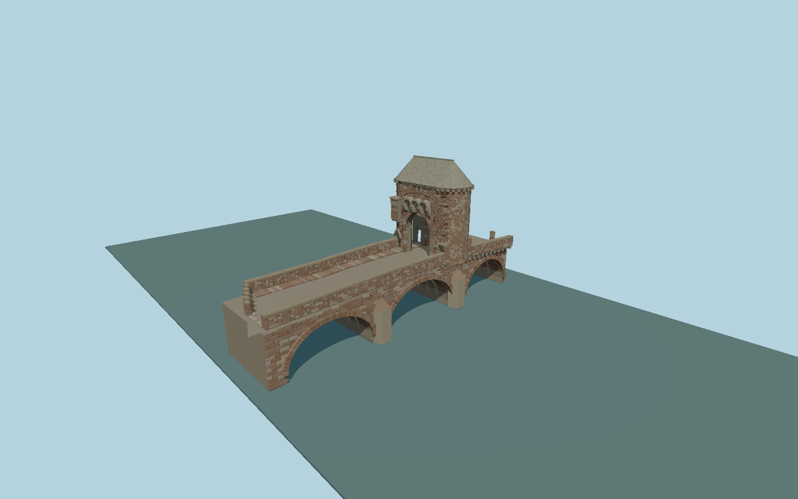

# Monnow Bridge and Gatehouse

Current three-span pedestrian bridge and unique surviving gatehouse: ribbed medieval vaults, widened segmental outer arches, cutwaters, corbelled footways, individually coursed mixed sandstone, three unlike gate passages, western machicolations and garderobe, roof of two half cones joined by a ridge, separate stone roof courses and exposed oak passage timbers.

## Evidence

- [Primary reference](https://cadwpublic-api.azurewebsites.net/reports/listedbuilding/FullReport?lang=en&id=2218)
- [Primary reference](https://commons.wikimedia.org/wiki/File:20200308_Monmouth_bridge_gate.jpg)
- [Primary reference](https://commons.wikimedia.org/wiki/File:20200308_Monmouth_east_bridge.jpg)
- [Primary reference](https://commons.wikimedia.org/wiki/File:Monmouth_-_Monnow_Bridge_-_geograph.org.uk_-_6006131.jpg)
- [Primary reference](https://commons.wikimedia.org/wiki/File:Gate_Tower,_Monnow_Bridge_-_geograph.org.uk_-_7725437.jpg)
- [Primary reference](https://www.openstreetmap.org/way/855452311)
- [Primary reference](https://www.openstreetmap.org/way/855457354)

Published dimensions and reconstruction assumptions are separated in spec.json. Source photos were consulted; no photos or third-party geometry are embedded. Map plan attribution: © OpenStreetMap contributors, ODbL-1.0.

## Source

254408 triangles; 19914572 bytes; 4 material groups. SHA256: sha256:583c14671cfcacad5a168ee5ced4420d72caad35750169f87fb7d9e32c733a89.

Shared surfaces (stone_sandstone_raw, metal_painted, wood_plain) are loaded through the central library; any transparent materials use local PBR parameters. Axis and provisional vertical datum are in spec.json.

Regenerate with node packages/worldgen/scripts/generate-researched-bridges.mjs --ids=N0015; append --check to verify. Import and capture through the standard next-1000 scripts. Geometry validation does not substitute for current-frame visual review.

## Reconstruction limits

- Arch stations, pier elevations, stone arrangements and minor roof details are reconstructed from primary photographs, not survey geometry.
- Upper gatehouse interior rooms and unseen structure are outside this exterior asset; the three public passages remain open.
- The older reported 7.3 m bridge width differs from the current mapped widened footways; the model retains the complete mapped deck.
- Real riverbed and bank elevations must be reviewed before geographic approval.
