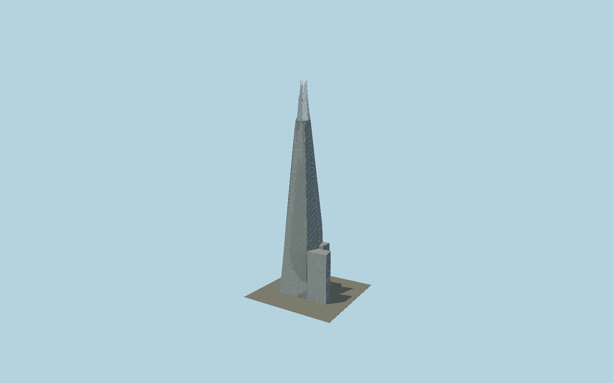

# The Shard

Eight independently mapped sloped glass facades, open corner gaps, differentiated 235–309.6 m tips, exposed steel crown, detailed panel grids and the separate 70/74 m eastern podium wings.

## Evidence and reconstruction

Published dimensions and reconstructed details are separated in spec.json. Primary references:

- [Reference](https://www.the-shard.com/about/)
- [Reference](https://www.the-shard.com/about/level-guide)
- [Reference](https://www.permasteelisagroup.com/historic-project/the-shard/)
- [Reference](https://www.macegroup.com/projects/the-shard/)
- [Reference](https://www.arup.com/projects/the-shard/)

No third-party geometry, photograph or bitmap texture is embedded. Shared surface graphs come from the central library; vertex tints carry model colors. Glazing uses PBR materials; transparent surfaces are declared per model.

## Model and axes

269,299 triangles; 578,981 vertices; 3 material groups; 24,077,148 bytes. Native bounds: -43.493, 0.000, -30.671 to 43.457, 309.652, 30.671. Source hash: `sha256:80e65f53174a440d80c1fd18300e6685d3cb820c97dd69d5e8208438851c60d9`.

{"up":"+Y","longitudinal":"+X along the cached mapped building frame","front":"+Z toward the long southern edge in that frame","origin":"Exact-QID outer-envelope rectangle center at ground level; eight independently mapped facade planes retain their individual peaks"}

The geographic proposal uses exact-QID OpenStreetMap evidence. Map-derived orientation and estimated architectural details require real-site visual review; preview eligibility is distinct from geographic/fidelity approval. Map attribution: © OpenStreetMap contributors, ODbL-1.0.

## Reproduce

Run `node packages/worldgen/scripts/generate-signature-towers.mjs --ids=N0141` (or add `--check`). The generator preserves manually edited masters by checking their baseline hashes. Import through the standard authored-model workflow with optimization disabled; then capture all QA cameras, including shared-surface views.

## Pending work

- Facade lean directions, eight tips and podium dimensions follow attributed detailed map parts; panel sizes, steel member sections and seals are reconstructed within those envelopes.
- Occupied-floor glass uses opaque PBR glazing; the open crown uses double-sided alpha glazing so its internal frame remains visible. Offices, winter gardens, hotel interiors, signage and building services are outside this exterior asset.
- The mapped building outline includes the eastern podium. The native origin retains its map frame; the occupied center and individual shard peaks are independently offset.

This bundle contains source geometry, not a claim of maximum-fidelity completion. Hash-bound visual acceptance is recorded separately after capture inspection.
