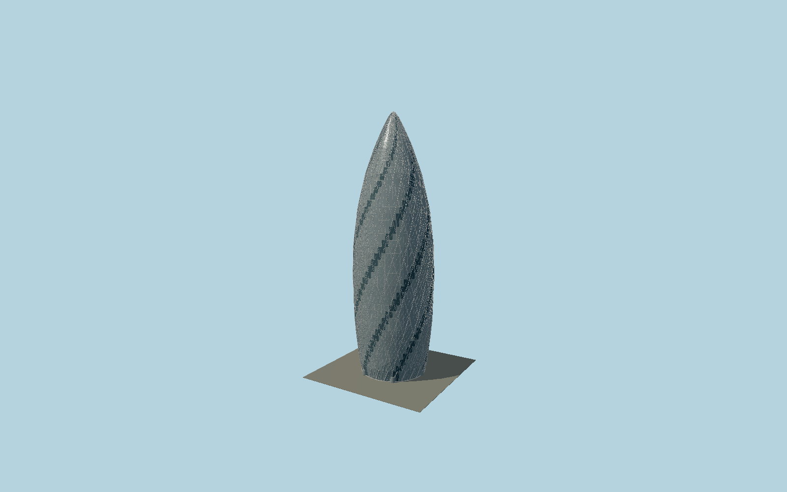

# 30 St Mary Axe

The curved Gherkin envelope with six dark helical light-well bands, triangular glass subdivisions, external diagonal lattice, narrowed ground colonnade, circular revolving entrance pavilions and rounded glazed crown.

## Evidence and reconstruction

Published dimensions and reconstructed details are separated in spec.json. Primary references:

- [Reference](https://thegherkin.com/)
- [Reference](https://thegherkin.com/availability/)
- [Reference](https://www.arup.com/globalassets/downloads/insights/t/tall-buildings-rising-to-the-net-zero-challenge/tall-buildings-rising-to-the-net-zero-challenge_arupv2-1.pdf)

No third-party geometry, photograph or bitmap texture is embedded. Shared surface graphs come from the central library; vertex tints carry model colors. Glass is an opaque PBR approximation.

## Model and axes

94,364 triangles; 219,816 vertices; 3 material groups; 8,828,288 bytes. Native bounds: -28.416, 0.000, -28.412 to 28.416, 180.032, 28.412. Source hash: `sha256:6646b8847ee0ed126fbe1b5cc96173068b05284dde61c7a6a3a23a6c4a326f6c`.

{"up":"+Y","longitudinal":"+X along the mapped building long axis","front":"+Z through one of six repeated entrances","origin":"Ground-level center of exact-QID mapped footprint frame"}

The geographic proposal uses exact-QID OpenStreetMap evidence. Map-derived orientation and estimated architectural details require real-site visual review; preview eligibility is distinct from geographic/fidelity approval. Map attribution: © OpenStreetMap contributors, ODbL-1.0.

## Reproduce

Run `node packages/worldgen/scripts/generate-signature-towers.mjs --ids=N0149` (or add `--check`). The generator preserves manually edited masters by checking their baseline hashes. Import through the standard authored-model workflow with optimization disabled; then capture all QA cameras, including shared-surface views.

## Pending work

- Exterior geometry uses published overall dimensions and map evidence; panel subdivision, connection dimensions and local entrance details are reconstructed. Glazing uses opaque PBR with explicit geometry; no copied facade photograph is embedded.
- Exact longitudinal curvature, facade twist phase and revolving entrance dimensions are reconstructed; the source 180 m envelope has precedence over erroneous aggregated height metadata.

This bundle contains source geometry, not a claim of maximum-fidelity completion. Hash-bound visual acceptance is recorded separately after capture inspection.
