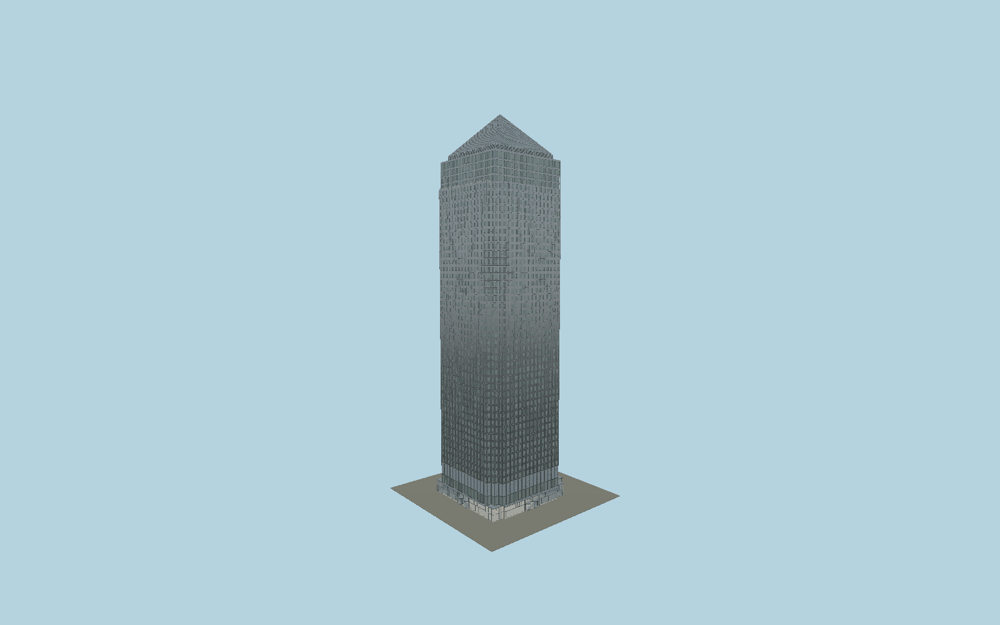

# One Canada Square

One Canada Square: a linen-finish stainless tower with two inward steps at each corner, individually recessed paired windows, four narrower glazed upper storeys, west terrace, folded-louvre pyramid and four entrance elevations with revolving doors.

## Evidence and reconstruction

Published dimensions and reconstructed details are separated in spec.json. Primary references:

- [Reference](https://pcparch.com/work/one-canada-square-and-docklands-light-railway-station)
- [Reference](https://offices.canarywharf.com/wp-content/uploads/2025/07/One-Canada-Square-Brochure_v17g.pdf)
- [Reference](https://images1.loopnet.com/d2/g_LDyTiUwUQh7gLJ-NzRTflr7BdsBQ8ZRfc0XYVIK_8/One%20Canada%20SquareBrochurepdf.pdf)
- [Reference](https://www.entuitive.com/projects/one-canada-square,-canary-wharf)
- [Reference](https://www.skyscrapercenter.com/building/one-canada-square/1040)
- [Reference](https://colt-international.co.uk/solutions/louvre/)
- [Reference](https://websaweprd.blob.core.windows.net/cms-assets-international/2023-06/One%20Canada%20Square_Case_Study.pdf)
- [Reference](https://www.openstreetmap.org/way/5986754)

No third-party geometry, photograph or bitmap texture is embedded. Shared surface graphs come from the central library; vertex tints carry model colors. Glazing uses PBR materials; transparent surfaces are declared per model.

## Model and axes

964,326 triangles; 1,916,364 vertices; 7 material groups; 80,565,028 bytes. Native bounds: -32.570, 0.000, -30.630 to 32.570, 235.000, 30.630. Source hash: `sha256:14c413cae5e3836d384e695f2591c202663ad918600403622ad13f8b62147f0f`.

{"up":"+Y","longitudinal":"+X east-southeast along local street grid","front":"+Z south-southwest","origin":"Mapped lower-envelope center; upper tower center is X=-2.65 m; Y0 is terrain contact."}

The geographic proposal uses exact-QID OpenStreetMap evidence. Map-derived orientation and estimated architectural details require real-site visual review; preview eligibility is distinct from geographic/fidelity approval. Map attribution: © OpenStreetMap contributors, ODbL-1.0.

## Reproduce

Run `node packages/worldgen/scripts/generate-signature-towers.mjs --ids=N0222` (or add `--check`). The generator preserves manually edited masters by checking their baseline hashes. Import through the standard authored-model workflow with optimization disabled; then capture all QA cameras, including shared-surface views.

## Pending work

- Maximum-fidelity review remains pending: external plan dimensions, lower office datum, cladding subpanels and louvre profile are reconstructed. The exact distribution of nine revolving doors is unverified; N2/E3/S2/W2 is an explicit working allocation.
- The model uses the architect’s 235 m tip. The Council on Vertical Urbanism lists 236 m from the lowest significant entrance; their one-metre datum difference is unresolved. Marketing 244/245 m claims are not used.
- Ground-floor glazing/canopies, lower plant floors, roof track and beacon are photo-informed approximations. Interiors, station links, retail pavilions and nearby buildings are outside the exterior model.
- Geographic approval requires real pavement/terrain contact and signed current facade fit. A flat-ground map overlay alone does not establish those conditions.

This bundle contains source geometry, not a claim of maximum-fidelity completion. Hash-bound visual acceptance is recorded separately after capture inspection.
