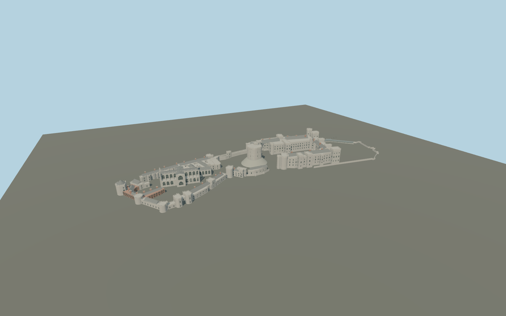

# Windsor Castle

Individually arranged Upper, Middle and Lower Wards: mapped palace ranges and named towers, open quadrangle, Round Tower and artificial motte, Saint George’s and Albert Memorial chapels, timber-and-brick Horseshoe Cloister and Henry VIII gateway.

## Evidence and reconstruction

Published dimensions and reconstructed details are separated in spec.json. Primary references:

- [Reference](https://www.rct.uk/visit/windsor-castle/who-built-windsor-castle)
- [Reference](https://historicengland.org.uk/listing/the-list/list-entry/1117776)
- [Reference](https://www.openstreetmap.org/way/23580556)
- [Reference](https://commons.wikimedia.org/wiki/File:Aerial_view_of_Windsor_Castle.jpg)
- [Reference](https://commons.wikimedia.org/wiki/File:Windsor_Castle_Upper_Ward_Quadrangle_Corrected_2-_Nov_2006.jpg)
- [Reference](https://commons.wikimedia.org/wiki/File:Windsor_Castle_Round_Tower.JPG)
- [Reference](https://commons.wikimedia.org/wiki/File:St._Georges_Chapel,_Windsor_Castle_(1)_v2.jpg)
- [Reference](https://commons.wikimedia.org/wiki/File:Horseshoe_Cloister_-_2026.jpg)

No third-party geometry, photograph or bitmap texture is embedded. Shared surface graphs come from the central library; vertex tints carry model colors. Glazing uses PBR materials; transparent surfaces are declared per model.

## Model and axes

385,417 triangles; 783,315 vertices; 8 material groups; 32,829,044 bytes. Native bounds: -291.413, 0.000, -99.343 to 291.177, 52.000, 99.687. Source hash: `sha256:e9e70f934d7a05e8f2c5b4d091c1759e1dfacf58f82306cc6c85dc8e93c90396`.

{"up":"+Y","longitudinal":"+X from Lower Ward toward Upper Ward and East Terrace Garden","front":"+Z toward the Long Walk","origin":"Cached OSM precinct center; provisional structural base"}

Draft only: per-building horizontal placement uses mapped meter coordinates, but terrain datum and vertical elevations are provisional. Viewer activation and footprint replacement remain disabled pending geographic fit review.

## Reproduce

Run `node packages/worldgen/scripts/generate-signature-towers.mjs --ids=N0239` (or add `--check`). The generator preserves manually edited masters by checking their baseline hashes. Import through the standard authored-model workflow with optimization disabled; then capture all QA cameras, including shared-surface views.

## Pending work

- Maximum exterior fidelity is pending. This is an original exterior reconstruction, not a surveyed as-built model. Heights, facade bay spacing, roof profiles and corner details need elevation verification.
- Chapel tracery is geometric but simplified; heraldic beasts, statues, heraldry, gates and sculptural capitals require dedicated individually verified detail. No generic statue is claimed to represent them.
- No interiors, natural hill, foliage, temporary works or royal flags are supplied. Artificial motte, structural walls and terrace revetments use provisional elevations. The open grounds require real terrain contact.
- Chapel and Albert Chapel volumes follow manually aligned mapped envelopes; palace and residential ranges use exact individual plan vertices with tolerance reduction. Roofing is independently reconstructed.
- Shared limestone, raw limestone, weathered limestone, slate, wood, brick and painted-metal graphs are reused; glazing is local PBR. No new bitmap textures or copied photographic pixels.

This bundle contains source geometry, not a claim of maximum-fidelity completion. Hash-bound visual acceptance is recorded separately after capture inspection.

## Additional geographic data

Individual building geometry in map-parts.json derives from © OpenStreetMap contributors, ODbL-1.0. Its source URL, signed meter frame and retrieval date are recorded with the data. Reference photographs are linked only; no pixels are redistributed in the model.
