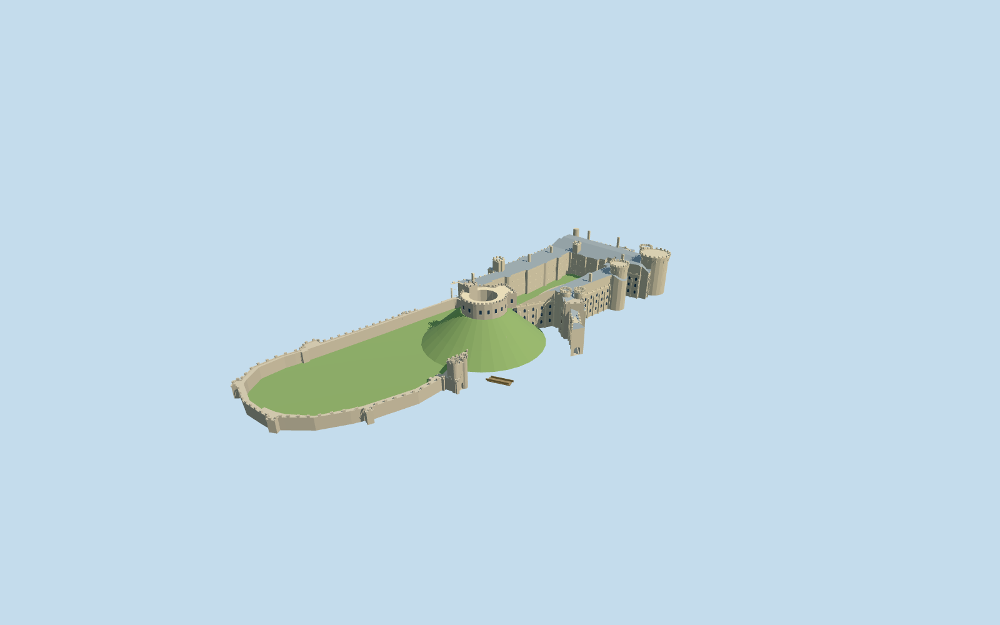

# Arundel Castle

Current Arundel Castle exterior: hollow Norman shell keep on its artificial motte, medieval northern curtain and gate defenses, open residential quadrangle with Gothic window rhythm, corbelled round towers, slate pitched roofs and chimneys.

## Evidence and reconstruction

Published dimensions and reconstructed details are separated in spec.json. Primary references:

- [Reference](https://api.openstreetmap.org/api/0.6/map?bbox=-0.5580,50.8543,-0.5500,50.8591)
- [Reference](https://api.openstreetmap.org/api/0.6/relation/1118816/full)
- [Reference](https://www.arundelcastle.org/explore/)
- [Reference](https://www.arundelcastle.org/)
- [Reference](https://www.arundelcastle.org/wp-content/uploads/2019/11/arundel-castle-set-on-a-hill.jpg)
- [Reference](https://www.visitengland.com/sites/ve/files/styles/page_header_ve_sm/public/lookatmedam/4364f7fe-54d0-40f6-afc2-181bcf4c191dl.jpg?h=14a770de&itok=EOBatrcD)
- [Reference](https://www.arundelcastle.org/wp-content/uploads/2019/09/castle-exterior-1.jpg)
- [Reference](https://historicengland.org.uk/listing/the-list/list-entry/1012500)
- [Reference](https://historicengland.org.uk/listing/the-list/list-entry/1027926)

Six existing shared 256-square stone, slate, timber and gravel graphs; flat glass and earthwork lawn. Metric repeats and linear tints. No embedded/new image, downloaded mesh or photo texture.

## Model and axes

15,379 triangles; 46,137 vertices; 8 material groups; 1,850,024 bytes. Native bounds: -84.429, 0.000, -144.204 to 123.611, 34.050, 129.524. Source hash: `sha256:432c23cd81b9906115543bd1f4d7b941e42204ed848d5b93d732821d39c7818c`.

{"up":"+Y","longitudinal":"Long castle axis is NW/SE. Native +X east, +Z south; authoring major-axis rotation is baked into vertices, runtime heading 0.","origin":"Horizontal exact-QID map anchor; Y0 at provisional bailey/motte base, keep wall attachment Y20. Artificial motte is included as landmark earthwork."}

Exact-QID map rings and separately mapped keep/tunnel remain attributed in native East/South heading 0. Published motte/keep dimensions guide a provisional base; actual site elevation and facade fit remain pending.

## Reproduce

Run `node packages/worldgen/scripts/generate-signature-towers.mjs --ids=N0303` (or add `--check`). The generator preserves manually edited masters by checking their baseline hashes. Import through the standard authored-model workflow with optimization disabled; then capture all QA cameras, including shared-surface views.

## Pending work

- Native East/South geometry preserves the exact-QID castle multipolygon, its two voids, mapped keep part and service tunnel. Heading 0 is a map-axis convention; actual-site facade/placement review is still required.
- Published approximate motte and keep dimensions guide the earthwork and wall height. Residential/gatehouse/turret heights, roofs, windows, crenels, stair/well annex and vertical attachment are photographic estimates.
- The artificial motte is included as a faceted landmark earthwork. The natural escarpment and site grade belong to host terrain; Y0 is a provisional bailey datum, not a measured sea-level elevation.
- Fitzalan Chapel, Arundel Cathedral, High Street Lodge and other detached estate buildings are separate assets and excluded. No composite centroid placement is used for them.
- Shared low-frequency material graphs use metric repeats and linear palette tints. No embedded image, unique photo texture, downloaded mesh or copied printed plan.
- Interiors, sculpted heraldry, detailed tracery, fine railings, gardens and collision certification are excluded. Window panes are stylized blue-grey; the keep and court are real open geometry.
- Operator and VisitEngland photographs remain private reference files; only attribution and original controls ship.
- Continuous viewer upgrades and physical ordinary-laptop/phone performance remain pending.

This bundle follows the medium-fi standard. Medium-fi appearance and geographic fit are reviewed separately. Hash-bound visual acceptance is recorded separately after capture inspection.

## Additional geographic data

© OpenStreetMap contributors; Historic England; Arundel Castle Trustees; VisitEngland.
