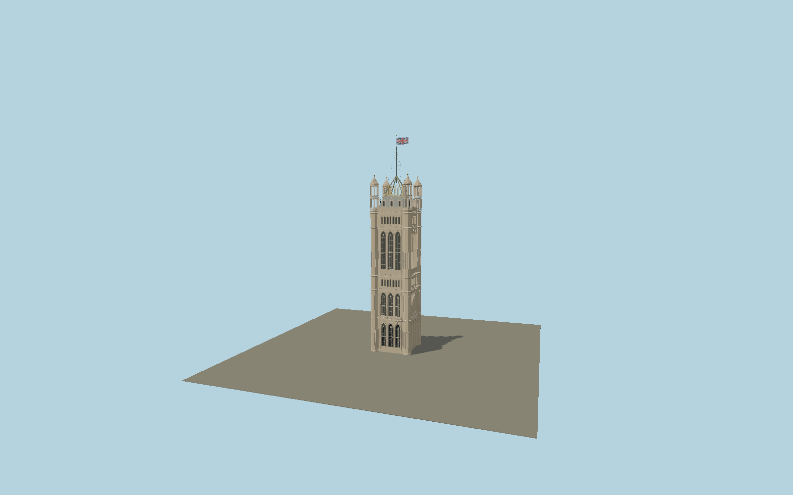

# Victoria Tower

The richly carved Westminster archive tower: Sovereign’s Entrance, paired lancets, Perpendicular blind tracery, Tudor rose and portcullis bands, four octagonal lantern pinnacles, slate mansard and dormers, open gilded crown and stayed iron flagstaff with Union flag.

## Identity and geometry

Catalog N0578, [Q1858077](https://www.wikidata.org/wiki/Q1858077). Parliament publishes the 98.5 m stone tower and additional 22 m flagstaff. The exact mapped outline determines the approximately 20.15 m main body and projecting octagonal corners. The restoration architect’s current exterior photograph establishes major lancet stages, smaller seven-light bands, tracery, mansard dormers, open corner lanterns and gilded iron crown. Parliament’s Abingdon Street visitor route and the credited southwest photograph establish the west and south open porch arches. The contemporary 1852 published account locates the inner royal doorway on the north side of that porch.

Exact-QID mapped tower centroid, pavement contact Y=0; separate Palace wings are not included. −Z is the western Sovereign’s Entrance toward Abingdon Street; +X is north toward the adjoining Palace; +Y is up. The geographic proposal identifies its anchor and orientation evidence separately from remaining terrain and azimuth uncertainty.

Source facts and measured references are recorded in spec.json. References: [1](https://www.parliament.uk/about/living-heritage/building/palace/architecture/palacestructure/victoria-tower/), [2](https://www.parliament.uk/about/living-heritage/building/palace/architecture/palacestructure/victoria-tower/victoria-tower-project/), [3](https://www.parliament.uk/about/living-heritage/building/cultural-collections/archives/victoriatower/purposebuilthome/), [4](https://alicecartledge.co.uk/projects/restoration-and-renewal-victoria-tower), [5](https://www.parliament.uk/link/45992c23d00c4e61b1d5dfb0b5fea042.aspx), [6](https://www.openstreetmap.org/way/367642689), [7](https://upload.wikimedia.org/wikipedia/commons/9/91/The_houses_of_Parliament%3B_%28IA_housesofparliame00unse%29.pdf), [8](https://commons.wikimedia.org/wiki/File:Westminster_Palace_Victoria_Tower.jpg). Reference pages and images are not redistributed.

## Original source and shared materials

Geometry is authored in `packages/worldgen/scripts/gothic-heritage-tower-models.mjs`. Shared material graphs with metric repeat UV0 and original vertex tints; GLB PBR fallback remains self-contained. No per-model texture duplication. No third-party mesh or photograph is embedded.

535,608 triangles; 1,090,048 vertices; 6 material groups; 44,582,588 source bytes. Source hash: `sha256:a5fc9a100ea5aec67ffed8bcf10a13cf3e08c010f8f0f6a796990fd6dd480cab`. Geometry validation checks finite Float32 coordinates, indices, triangle area and winding before export.

Regenerate with `node packages/worldgen/scripts/generate-heritage-towers.mjs N0578`; add `--check` for reproducibility. The generator refuses to overwrite a master whose hash differs from source.json. Import uses `--no-optimize` to preserve facade recesses.

## Remaining detail and review

- Carved saints, heraldic roses and portcullises are original polygonal relief and figures, not casts of named artworks or transcribed royal inscriptions. The visible facade divisions, lanterns and crown follow the restoration architect’s photographs.
- The permanent exterior is modeled without temporary 2025–2031 repair scaffolding. The Union flag represents an ordinary non-sovereign-present state; flag motion and archive interiors are outside this static exterior asset.
- Near/far visual QA, shared-material inspection and maximum-fidelity approval remain pending.

Named near/far cameras are included for lit visual review. A valid export is not maximum-fidelity certification.
