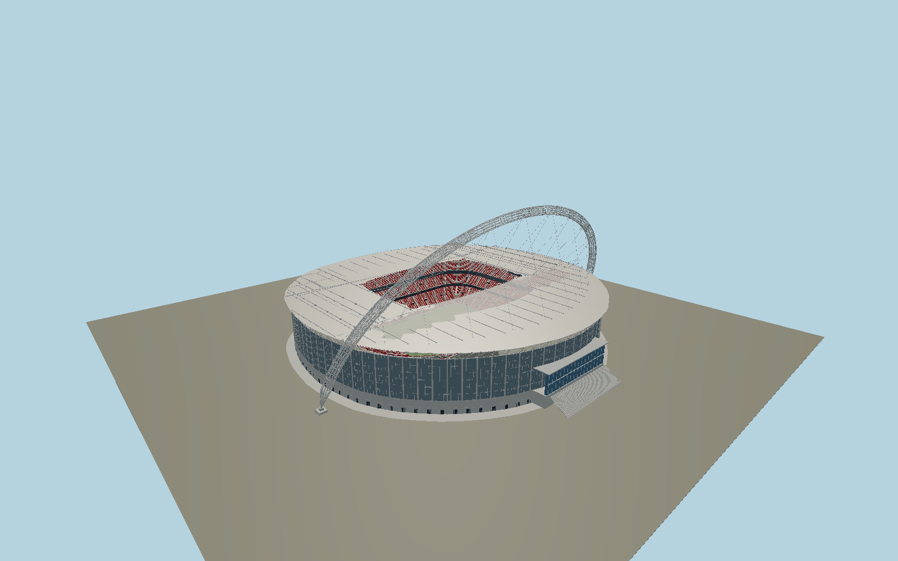

# Wembley Stadium — N0684

Current Wembley with its315m span,133m high inclined tubular lattice arch; twelve physical457mm chords, square diaphragm rings and pencil ends, triangulated forestays and backstays, semi-Vierendeel roof trusses and bowstring chord, seven sliding-panel roof regions around an open central aperture, translucent north roof strip, glazed and pale precast stadium envelope, north Olympic Way entrance, royal box and three deep red seating tiers.

## Identity and evidence

Exact catalog identity **Q128468**. Source facts: `{"archSpanMeters":315,"archHeightMeters":133,"archInclinationDegrees":22,"archNominalOuterDiameterMeters":7.4,"archChordCount":12,"archChordDiameterMeters":0.457,"archDiaphragmSectionMeters":0.3,"roofHeightMeters":52,"movingRoofPanels":7,"fieldMeters":[105,68],"basis":"Current operator publishes133m arch height,315m span,7.4m diameter and52m roof. Structural designer Kourosh Kayvani publishes12×457mm chords,300mm square diaphragms at approximately11m centers,22degree inclination, cable arrangement, roof truss details and seven movable panels; paper diagrams and four pages were visually examined. Architect photos control north entrance, glaze/precast color, red tiers and exposed members. Exact pitch and joined current roof polygons determine axis and outline. Mapped114.5×69.2m pitch polygon includes grass margins; marked field remains105×68m. Engineer paper135m/7m figures are preserved as differing design-datum/internal-diameter descriptions rather than silently overriding operator dimensions."}`. The source specification keeps published dimensions separate from reconstructed details.

- https://www.wembleystadium.com/about/stadium-facts-and-features
- https://help.wembleystadium.com/support/solutions/articles/7000028145-stats-and-facts
- https://help.wembleystadium.com/support/solutions/articles/7000028144-wembley-stadium-roof
- https://populous.com/showcases/wembley-stadium
- https://populous.com/uploads/2024/05/Wembley_2.jpg
- https://populous.com/uploads/2018/01/Wembley_7-e1715865066701.jpg
- https://populous.com/uploads/2018/01/Wembley_5.jpg
- https://lsaa.org/images/pdf_files/projects/Wembley_Reduced_2025.pdf
- https://techrete.com/wp-content/uploads/2020/03/Wembley-Stadium-Fact-Sheet.pdf
- https://www.openstreetmap.org/relation/912489
- https://www.openstreetmap.org/way/116539074
- https://www.openstreetmap.org/way/27784957

Published primary pictures and engineering figures inform an original component-authored model only. No photograph, drawing texture, manufacturer mesh or font is embedded. OpenStreetMap-derived plans retain contributor attribution, ODbL1.0.

## Authored geometry and materials

903,922 triangles, 1,741,216 vertices, 7 surface groups; 73,534,768 source bytes. SHA-256: `sha256:8fcd72e41515867f5bacc500d42c8e3b24f6cd9f944bf72ee53043d1ff237bfd`. Actual bounds: -160.700, 0.000, -171.500 to 160.700, 133.283, 133.540 m.

Shared canonical material graphs with metric UV repeats in extras.molenSurface; portable glTF PBR factors and vertex colors remain. Dark recesses/lantern panels retain local fallback materials. Shared references: `matgraph:molen.worldgen.material.metal_standing_seam` (2.5 × 3 m), `matgraph:molen.worldgen.material.metal_painted` (2 × 2 m), `matgraph:molen.worldgen.material.concrete_plain` (2 × 2 m). Model-native axes: {"up":"+Y","front":"-Z","origin":"Mapped pitch center at playing-field/structural-foot gradeY0. Native+X east along the goal axis; +Zsouth. The inclined arch stands on the northern side."}.

## Placement proposal

Pitch goal axis is east-west, so native+X follows it and native-Z is the north Olympic Way entrance and arch. Footprint and aperture are independently mapped. Arch map itself records artistic plan interpolation, therefore only its approximately315m feet and north-side position are used; the22degree geometry comes from the designer. Ground contactY0 preserves feet and playing field, with north stair/entrance grade reconstructed from published views. Proposed anchor -0.27956525, 51.55596295 (longitude, latitude), heading 0.003693795533106074 radians. Elevation policy: **terrain-contact**. See qa.json for the geographic review status and scope; this placement proposal does not claim surveyed site accuracy. Native ground and pitch datums follow the individual geographic proposal; depressed bowls require their declared terrain cutout.

## Limitations and review

- Static roof covering all seats while keeping the pitch open; movable panel motion, bogie internals, ticket-seat count and event advertisements are outside this exterior model. Structural connection plate schedules, field margins and smaller mullion dimensions are reconstructed from published photographs. The visible arch and roof structure preserve published section dimensions, but no structural analysis certification or engineering survey is claimed.

Portable review uses a flat ground contact fixture.

Near/far fixtures are in `spec.qaCameras`. Float32 finite geometry, triangle degeneracy and winding are checked by the generator. The hash-bound qa.json and capture reports record the scope and status of rendering, shared-material, exterior-fidelity and geographic reviews.

Regenerate with `node packages/worldgen/scripts/generate-stadium-models.mjs --ids=N0684`; add `--check` for reproducibility. Editable component recipes are registered by the imports and study list in `packages/worldgen/scripts/generate-stadium-models.mjs`. The generator protects artist-edited master hashes and preserves import/capture/shared-capture/QA documents.
