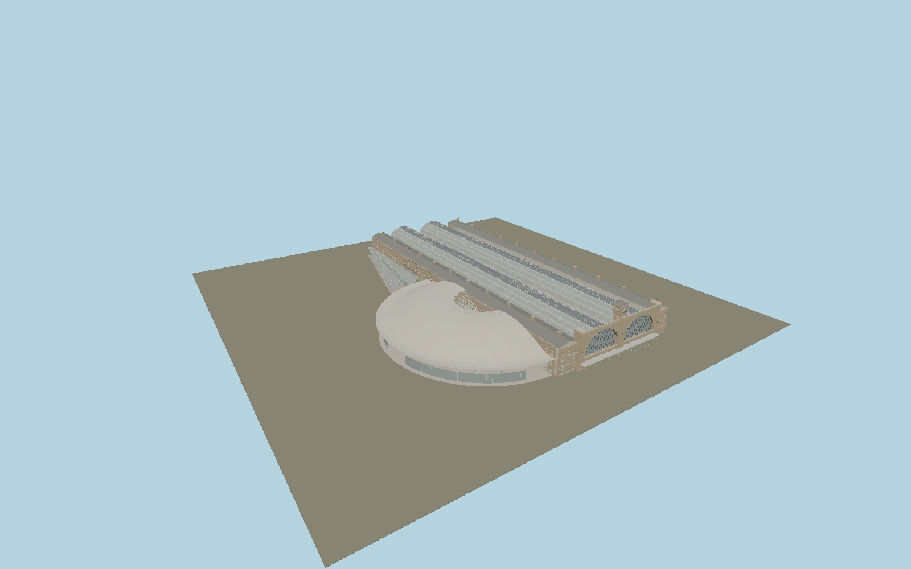

# London King's Cross railway station

Individual twin barrel train sheds, stock-brick clock facade and glazed arches, separately articulated eastern/western ranges, suburban shed and three-circle western concourse shell with funnel and diagrid. Roof ribs and facade bays reuse mesh buffers across glTF nodes.

## Identity and geometry

Catalog N0791, [Q219867](https://www.wikidata.org/wiki/Q219867). The engineering report fixes the 36 m clock tower, 138 m concourse roof diameter and 65 m platform bridge. Train spans and range proportions follow the inspected scaled sections. Roof meridian radii fit the documented three-tangent-circle construction and remain provisional.

Approximate combined station and concourse plan centre, at platform approach ground level. +Z is the southern clock facade; +X is east; +Y is up; +Y is up. The geographic proposal identifies its anchor and orientation evidence separately from remaining terrain and azimuth uncertainty.

Source facts and measured references are recorded in spec.json. References: [1](https://www.arup.com/globalassets/downloads/arup-journal/the-arup-journal-2012-issue-2.pdf), [2](https://historicengland.org.uk/listing/the-list/list-entry/1078328), [3](https://www.networkrail.co.uk/who-we-are/our-history/iconic-infrastructure/the-history-of-london-kings-cross-station/), [4](https://www.openstreetmap.org/way/260720558). Reference pages and images are not redistributed.

## Original source and shared materials

Geometry is authored in `packages/worldgen/scripts/kings-cross-station-model.mjs`. Shared material graphs with metric repeat UV0 and original vertex tints; GLB PBR fallback remains self-contained. No per-model texture duplication. No third-party mesh or photograph is embedded.

540,926 triangles; 1,021,198 vertices; 7 material groups; 10,838,624 source bytes. Source hash: `sha256:243fb45927fe51ccf98c6d1dc18ad7acd1bab563e0010b03cb187f115ccddac5`. Geometry validation checks finite Float32 coordinates, indices, triangle area and winding before export.

Regenerate with `node packages/worldgen/scripts/generate-heritage-towers.mjs N0791`; add `--check` for reproducibility. The generator refuses to overwrite a master whose hash differs from source.json. Import uses `--no-optimize` to preserve facade recesses.

## Remaining detail and review

- Detailed source study, not maximum-fidelity certification. The scene must be compared with current station photographs and surveyed member footprints.
- Western Range contains historically distinct ranges, the bomb gap, parcels atrium and booking hall. Current repeated facade modules require replacement with their precise individual elevations and openings.
- Clock tick marks stand in for Roman numerals; station name lettering, entrance fanlights, precise stone cornices, doors, drainage, roof lantern details, signage and shopfronts need individual authoring.
- The concourse uses a faithful construction method with estimated meridian radii and support positions. Exact diagrid topology, glazed roof zones, mezzanine boundaries and escalators are unfinished.
- Platforms and rails are schematic; no trains, underground station, adjacent hotel or square furnishings are embedded. Transparent glass and final lighting require further material review.
- Near/far visual QA, shared-material inspection and maximum-fidelity approval remain pending.

Named near/far cameras are included for lit visual review. A valid export is not maximum-fidelity certification.
