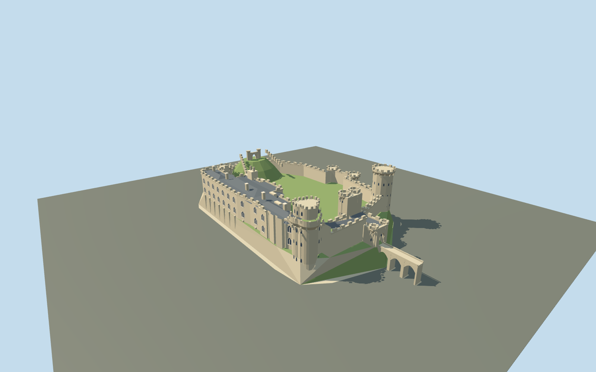

# Warwick Castle

Buff sandstone castle with open courtyard,many-sided Guy tower,lobed two-stage Caesar tower,clocked twin-turret gatehouse and projecting barbican,castellated river ranges with low slate roofs,octagonal western towers and a stepped grassy motte.

## Evidence and reconstruction

Published dimensions and reconstructed details are separated in spec.json. Primary references:

- [Reference](https://www.warwick-castle.com/explore/shows/historical-attractions/towers-ramparts/)
- [Reference](https://historicengland.org.uk/listing/the-list/list-entry/1000386)
- [Reference](https://historicengland.org.uk/listing/the-list/list-entry/1364805)
- [Reference](https://www.warwick-castle.com/media/ixagflho/towers-ramparts.jpg)
- [Reference](https://www.warwick-castle.com/media/dq3h55sp/towers-ramparts.jpg)
- [Reference](https://commons.wikimedia.org/wiki/File:2007-08-26-09095_GreatBritain_Warwick.jpg)
- [Reference](https://commons.wikimedia.org/wiki/File:Warwick_Castle_May_2016.jpg)
- [Reference](https://commons.wikimedia.org/wiki/File:Warwick_Castle_-_Caesar%27s_Tower_2016.jpg)
- [Reference](https://commons.wikimedia.org/wiki/File:Exterior_of_Warwick_Castle_from_across_the_River_Avon,_2009.jpg)
- [Reference](https://commons.wikimedia.org/wiki/File:Warwick_Castle_Gatehouse.jpg)
- [Reference](https://www.openstreetmap.org/relation/553839)

Mapped curtain/domestic/court rings reproduce attributed OpenStreetMap data underODbL-1.0. Other geometry is original approximate authoring. No downloaded mesh,research photograph or unique texture is embedded;three existing shared material graphs supply reusable surfaces.

## Model and axes

8,649 triangles; 25,947 vertices; 5 material groups; 1,040,976 bytes. Native bounds: -84.653, 0.000, -54.876 to 103.000, 40.000, 54.876. Source hash: `sha256:dac27326e5e7818a427fb3b48c043861696b3787a1a0187946bf928f0e57f18a`.

{"up":"+Y","lateral":"+X approximately north-east along cached axis;main gate faces +X","longitudinal":"+Z approximately south-east on river/domestic-range side","origin":"Cached map envelope center;Y0 estimated lower river-facing Caesar/retaining footing,Y11 inferred court/Guy base. Signed orientation and terrain datum pending."}

Original approximate exterior on mapped castle/court rings;inactive until real-site review.

## Reproduce

Run `node packages/worldgen/scripts/generate-signature-towers.mjs --ids=N0290` (or add `--check`). The generator preserves manually edited masters by checking their baseline hashes. Import through the standard authored-model workflow with optimization disabled; then capture all QA cameras, including shared-surface views.

## Pending work

- Original approximate current exterior;full mapped curtain/domestic/court rings retained near. Upper geometry,tower radii/lobes,window/roof rhythm,motte,terrain proxy and approach are estimates,not an architectural survey.
- Operator publishes Guy29m/Caesar40m local tower heights;Guy baseY11,courtY11 and lower Caesar footingY0 are inferred relative alignment. Modeled maximumY40 is not a surveyed absolute datum. Other heights are estimates. Historic England calls Caesar trilobed,operator says quatrefoil;three pronounced lobes are interpreted from inspected images.
- Three identities:many-sided Guy tower,lobed two-stage Caesar tower and crenellated gate/barbican around open court. Street adds Gothic window/bay rhythm,corbels,clock diamond and domestic roofs/chimneys. Fine lattice,lettering,flags,balusters,stone joints,microbevels and interiors omitted.
- Existing shared256²sandstone,slate and timber graphs,linear palette tints,metric UVs and actual graph means at skyline. Opaque blue-grey glass;untextured turf/roof supports. No photographs,unique textures,baked shadows or AO embedded.
- Grass motte/terrain proxy and synthetic British-townhouse neighbors are review context,not surveyed site terrain. Mill,weir,river,outer parks and visitor infrastructure are not members of this castle exterior bundle. Real-site completeness/attachments and signed placement remain pending.
- Inactive geographic draft,replaceFootprint=false. Forced resident LOD samples do not certify adaptive streaming,network upgrades,subframe shimmer or physical-device timing.

This bundle follows the medium-fi standard. Medium-fi appearance and geographic fit are reviewed separately. Hash-bound visual acceptance is recorded separately after capture inspection.

## Additional geographic data

© OpenStreetMap contributors;Warwick Castle operator;Historic England;primary photographers Gernot Keller,DeFacto and Haydn Curtis.
