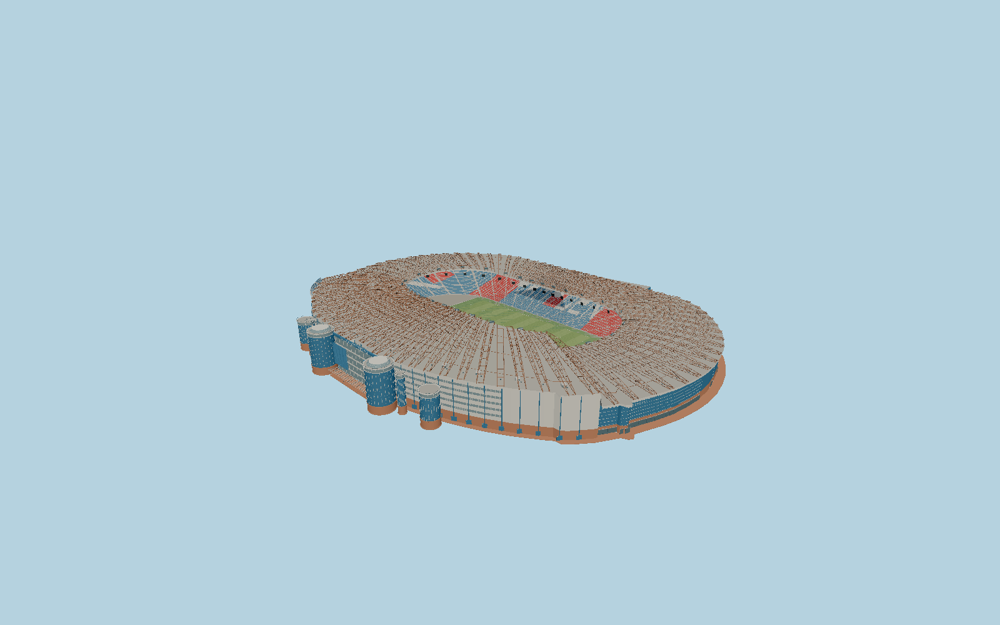

# Hampden Park — N0689

Hampden’s retained broad shallow oval terraces, low north/east/west roofs and taller two-tier South Stand; 84 exposed weathered cantilever frames above pale roof panels, brick and silver facade, round blue entrance turrets and smaller stair projections, North Stand wedge extension, red/blue seating with white Hampden lettering and saltire ends, opposing video boards and a marked football field.

## Identity and evidence

Exact catalog identity **Q193651**. Source facts: `{"basis":"Four individually mapped grandstands and the current pitch determine the directed plan. The operator’s current entrance photo and 2024 Rangers club aerial show exposed brown roof frames above pale roof sheets, five South Stand window bands, round blue turrets, brick bases and curved wall. The official hospitality brochure confirms the two decks/skyboxes and white HAMPDEN/saltire seating patterns. Glasgow planning report12/00988/DC records the 103m North Stand extension,9m upper facade,2.4–4m undercroft,11.2–13m total gables, blue aluminum cladding and9.2m concrete panels. Other story/roof/field heights are photographic reconstructions, not survey measurements."}`. The source specification keeps published dimensions separate from reconstructed details.

- https://www.hampdenpark.co.uk/
- https://www.hampdenpark.co.uk/assets/media/Hampden-Events/204156-sod-ham-hospev-brochure-2-compressed.pdf
- https://www.rangers.co.uk/article/scottish-gas-womens-scottish-cup-semi-final-draw/6uMdNS86oUdoBYZyUalNjF
- https://www.scottishfa.co.uk/en/news/hampden-park-joins-european-elite-on-the-big-screens
- https://onlineservices.glasgow.gov.uk/CouncillorsandCommittees/viewSelectedDocument.asp?c=P62AFQ81T1DXZ30G
- https://www.openstreetmap.org/way/202317415
- https://www.openstreetmap.org/way/202317409
- https://www.openstreetmap.org/way/202317413
- https://www.openstreetmap.org/way/202317417
- https://www.openstreetmap.org/way/58216903

Original component-authored mesh. Published photographs/plans are evidence only; no photographic pixels, external font or downloaded model are embedded. Projected OpenStreetMap coordinates retain contributor attribution, ODbL1.0.

## Authored geometry and materials

1,118,062 triangles, 2,088,516 vertices, 8 surface groups; 86,519,280 source bytes. SHA-256: `sha256:2b0093e5b771ca9b2f10de175cd756d55c79dbd4debfaf2be4c7e21980954ad4`. Actual bounds: -127.380, -4.450, -146.221 to 112.294, 30.621, 149.647 m.

Shared canonical material graphs with metric UV repeats in extras.molenSurface; portable glTF PBR factors and vertex colors remain. Dark recesses/lantern panels retain local fallback materials. Shared references: `matgraph:molen.worldgen.material.brick` (1.92 × 0.9 m), `matgraph:molen.worldgen.material.metal_standing_seam` (2.5 × 3 m), `matgraph:molen.worldgen.material.metal_painted` (2 × 2 m), `matgraph:molen.worldgen.material.concrete_plain` (2 × 2 m), `matgraph:molen.worldgen.material.gravel` (2 × 2 m). Model-native axes: {"up":"+Y","front":"+Z","origin":"Mapped pitch centroid, native +Z toward the east goal and +X toward the North Stand. Y0 is the public South Stand forecourt; the pitch is reconstructed 4.2m below it."}.

## Placement proposal

The current pitch polygon supplies origin and the eastward directed long axis; the South Stand turrets sit on native−X, resolving the 180-degree ambiguity. Separate actual building ways avoid the much larger stadium parcel and neighboring Lesser Hampden. The North Stand extension retains its mapped oblique street frontage. Proposed anchor -4.2519949, 55.825863525 (longitude, latitude), heading 1.6864733948839226 radians. Elevation policy: **terrain-contact**. See qa.json for the geographic review status and scope; this placement proposal does not claim surveyed site accuracy. Native ground and pitch datums follow the individual geographic proposal; depressed bowls require their declared terrain cutout.

## Limitations and review

- Detailed current exterior in a static football configuration. Story and roof heights outside the published North Stand extension, local pitch-to-forecourt grade, frame junctions, individual chair count and minor glazing divisions are reconstructed from primary photographs. Temporary sponsor graphics, staff rooms and inaccessible enclosed interiors are outside this exterior scope. The proposed future redevelopment is not represented.

Ground-free review preserves the below-forecourt bowl; the actual world-viewer terrain cutter protects its playing field.

Near/far fixtures are in `spec.qaCameras`. Float32 finite geometry, triangle degeneracy and winding are checked by the generator. The hash-bound qa.json and capture reports record the scope and status of rendering, shared-material, exterior-fidelity and geographic reviews.

Regenerate with `node packages/worldgen/scripts/generate-stadium-models.mjs --ids=N0689`; add `--check` for reproducibility. Editable component recipes are registered by the imports and study list in `packages/worldgen/scripts/generate-stadium-models.mjs`. The generator protects artist-edited master hashes and preserves import/capture/shared-capture/QA documents.
