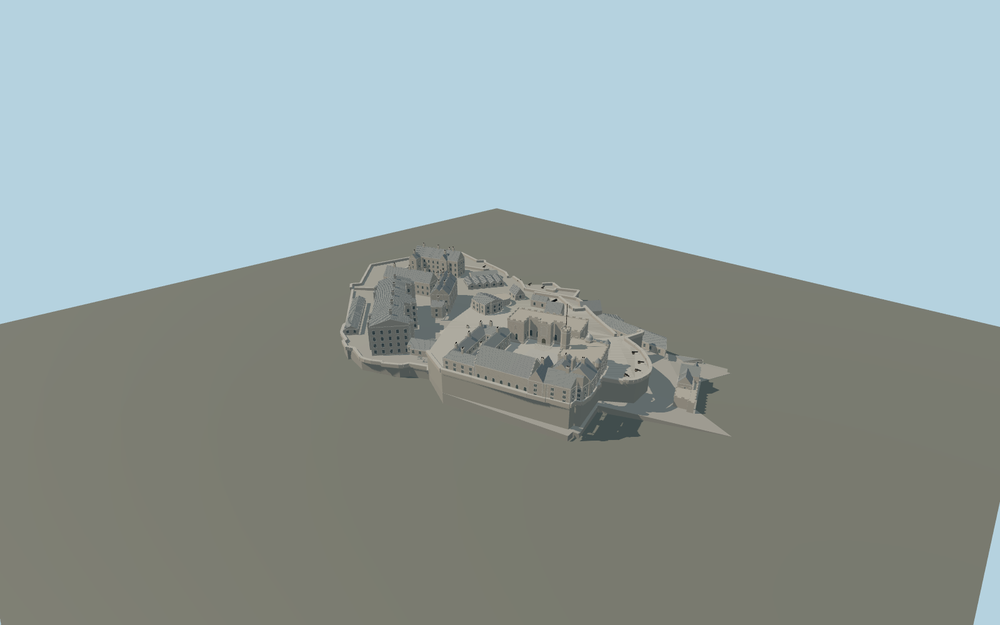

# Edinburgh Castle

Edinburgh Castle with stepped wards, open Crown Square and Hospital Square, Royal Palace and octagonal clock turret, Great Hall, Queen Anne range, Scottish National War Memorial, St Margaret chapel, New Barracks, Governors House, Half Moon and Argyle batteries, and open gate passages.

## Evidence and reconstruction

Published dimensions and reconstructed details are separated in spec.json. Primary references:

- [Reference](https://www.openstreetmap.org/way/4301292)
- [Reference](https://www.edinburghcastle.scot/media/fpanlfr2/orientation-map.pdf)
- [Reference](https://www.edinburghcastle.scot/see-and-do/highlights/the-royal-palace/)
- [Reference](https://www.edinburghcastle.scot/see-and-do/highlights/half-moon-battery/)
- [Reference](https://commons.wikimedia.org/wiki/File:Edinburgh_Castle_plan_coloured.png)
- [Reference](https://commons.wikimedia.org/wiki/File:Edinburgh_Castle_from_the_south_east.JPG)
- [Reference](https://commons.wikimedia.org/wiki/File:Façade_of_the_Scottish_National_War_Memorial,_Edinburgh_Castle,_Scotland,_UK.jpg)

No third-party geometry, photograph or bitmap texture is embedded. Shared surface graphs come from the central library; vertex tints carry model colors. Glazing uses PBR materials; transparent surfaces are declared per model.

## Model and axes

259,930 triangles; 518,622 vertices; 8 material groups; 21,794,276 bytes. Native bounds: -138.542, 0.000, -75.714 to 137.779, 49.000, 75.801. Source hash: `sha256:4cd274cfb172ebeddbbb803c2f7f3cd6aa3140f3c27f8823e8bda61562641388`.

{"up":"+Y","longitudinal":"+X toward the eastern entrance/esplanade","front":"+Z toward the southern palace and barracks exterior","origin":"Cached exact-identity precinct center, provisional gate-level datum"}

Draft placement; relative terrace levels and site terrain must be checked before geographic activation.

## Reproduce

Run `node packages/worldgen/scripts/generate-signature-towers.mjs --ids=N0242` (or add `--check`). The generator preserves manually edited masters by checking their baseline hashes. Import through the standard authored-model workflow with optimization disabled; then capture all QA cameras, including shared-surface views.

## Pending work

- Maximum fidelity is pending. Courtyard elevations, heights, roof junctions, opening positions, and gatehouse fit are reconstructed rather than surveyed.
- Master includes architectural niches, stonework, window frames, guns and crenellations; statues, memorial carvings, heraldic shields and inscriptions are not faithful sculptural reproductions.
- Castle Rock is represented only by provisional stepped retaining plinths. No claim of terrain fit, exact geology, interiors, trees or temporary esplanade installations.
- The palace turret clock is static. Dormers, precisely stepped gables, decorative ridge pieces, Foogs Gate and individual roof details still need close-reference refinement.
- Shared sandstone, raw limestone, weathered limestone, slate, ceramic chimney pots, timber and painted metal; PBR glazing. No embedded images.

This bundle contains source geometry, not a claim of maximum-fidelity completion. Hash-bound visual acceptance is recorded separately after capture inspection.

## Additional geographic data

Map geometry © OpenStreetMap contributors, ODbL-1.0. Reference photos linked only; no copied image textures or external meshes.
