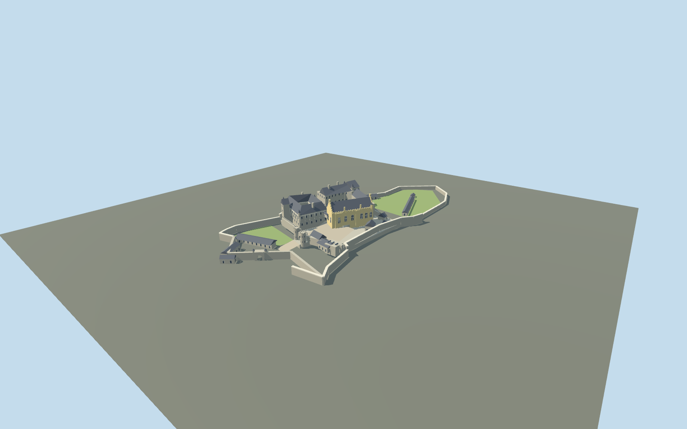

# Stirling Castle

Present-day fortified compound with ochre Great Hall, open Lion’s Den palace court, Chapel Royal, King’s Old Building, low twin-drum Forework and walled Nether Bailey.

## Evidence and reconstruction

Published dimensions and reconstructed details are separated in spec.json. Primary references:

- [Reference](https://portal.historicenvironment.scot/designation/SM90291)
- [Reference](https://www.historicenvironment.scot/publications/all/publication/?publicationId=420047e5-b241-4318-9127-a5f400f193f9)
- [Reference](https://app-hes-pubs-prod-neu-01.azurewebsites.net/api/file/1a36b0f6-f3e3-4374-b1d2-a603009ca16a)
- [Reference](https://www.openstreetmap.org/way/100542995)
- [Reference](https://www.openstreetmap.org/relation/1083531)

No third-party geometry, photograph or bitmap texture is embedded. Shared surface graphs come from the central library; vertex tints carry model colors. Glazing uses PBR materials; transparent surfaces are declared per model.

## Model and axes

8,327 triangles; 18,489 vertices; 5 material groups; 768,644 bytes. Native bounds: -65.886, 0.000, -159.277 to 65.851, 34.000, 139.152. Source hash: `sha256:ccc7e8dc71d97488c56879f42e20bd27356fd2685bca5de765a5f169fd20f938`.

{"up":"+Y","longitudinal":"+Z southeast toward the entrance","front":"+Z southeast","origin":"Mapped compound frame center; Y=0 synthetic lower-bailey datum"}

The historic castle boundary encloses multiple buildings and open space. Do not replace it with a single generic building. Exact-QID parts anchor this ensemble, but vertical fit and approach-gate alignment need real-site review.

## Reproduce

Run `node packages/worldgen/scripts/generate-signature-towers.mjs --ids=N0262` (or add `--check`). The generator preserves manually edited masters by checking their baseline hashes. Import through the standard authored-model workflow with optimization disabled; then capture all QA cameras, including shared-surface views.

## Pending work

- Heights, relative court levels, roof shapes, ornamental rhythms and small turrets are photographic approximations. Individual Renaissance sculptures and interior rooms are omitted.
- Northern magazines and outer ancillary buildings are simplified; the esplanade, cliffs and off-site gardens are excluded.
- Context renders use synthetic procedural neighbors. Geographic placement, continuous-motion shimmer and physical-device performance remain unmeasured.

This bundle follows the medium-fi standard. Medium-fi appearance and geographic fit are reviewed separately. Hash-bound visual acceptance is recorded separately after capture inspection.

## Additional geographic data

Footprints © OpenStreetMap contributors, ODbL-1.0. HES guide images are linked visual evidence only; no third-party images or meshes are redistributed.
