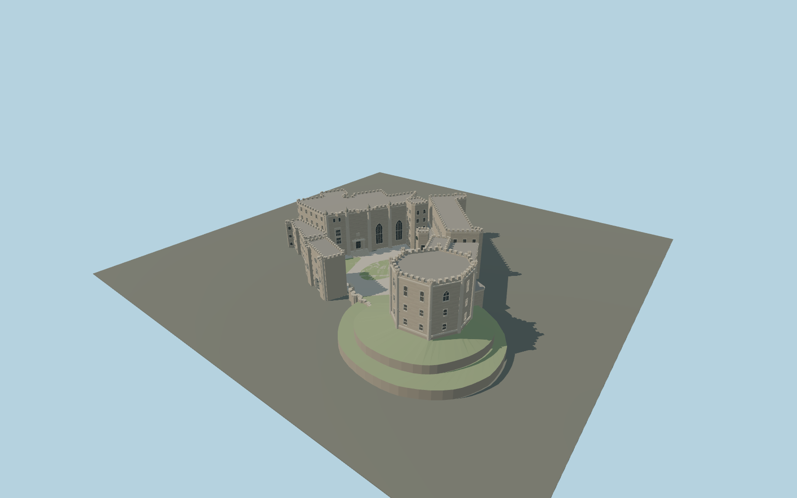

# Durham Castle

Durham Castle exterior: Great Hall and four domed octagonal turrets, Black Stairs, low Tunstall Gallery with upper hall, polygonal clock stair, chapel, separate raised octagonal keep, open gatehouse passage, and landscaped open bailey.

## Evidence and reconstruction

Published dimensions and reconstructed details are separated in spec.json. Primary references:

- [Reference](https://historicengland.org.uk/listing/the-list/list-entry/1121383)
- [Reference](https://historicengland.org.uk/listing/the-list/list-entry/1160921)
- [Reference](https://historicengland.org.uk/listing/the-list/list-entry/1322868)
- [Reference](https://historicengland.org.uk/listing/the-list/list-entry/1322867)
- [Reference](https://dur.ac.uk/things-to-do/venues/durham-castle/history-and-architecture/external-architecture-overview/)
- [Reference](https://dur.ac.uk/things-to-do/venues/durham-castle/history-and-architecture/norman-castle/)
- [Reference](https://www.openstreetmap.org/way/81522967)

No third-party geometry, photograph or bitmap texture is embedded. Shared surface graphs come from the central library; vertex tints carry model colors. Glazing uses PBR materials; transparent surfaces are declared per model.

## Model and axes

193,007 triangles; 391,289 vertices; 8 material groups; 16,407,064 bytes. Native bounds: -49.317, 0.000, -34.022 to 67.839, 30.270, 70.684. Source hash: `sha256:7fee2a5d8b31bbce3e59a071d8eeb7a8db12714ef718b19592cb1b84aaf4f6a8`.

{"up":"+Y","longitudinal":"+X 30.047 degrees north of east","front":"Open bailey toward native +Z; keep toward +X,+Z","origin":"Main-range mapped anchor; courtyard ground datum"}

Signed native map frame preserves mapped component separation. Terrain and in-world directional fit still require review.

## Reproduce

Run `node packages/worldgen/scripts/generate-signature-towers.mjs --ids=N0256` (or add `--check`). The generator preserves manually edited masters by checking their baseline hashes. Import through the standard authored-model workflow with optimization disabled; then capture all QA cameras, including shared-surface views.

## Pending work

- Maximum exterior fidelity remains pending: rear elevation window rhythms, precise stone tracery, roof junctions, heraldic shields and figurative porch carvings need more bespoke reference work. Plain reserved panels are not complete carvings.
- Motte and floor elevations are inferred from courtyard photographs. In-world terrain contact and orientation review remain pending; replaceFootprint=false.
- Interior rooms, Norman Chapel vaults, Cathedral, Palace Green Library and surrounding city are outside this exterior asset.
- Detailed master and four independent runtime levels share central surfaces. Physical laptop and phone performance measurements remain pending.

This bundle contains source geometry, not a claim of maximum-fidelity completion. Hash-bound visual acceptance is recorded separately after capture inspection.

## Additional geographic data

Map data © OpenStreetMap contributors, ODbL-1.0. Original deterministic geometry; no reference photos or third-party meshes embedded.
