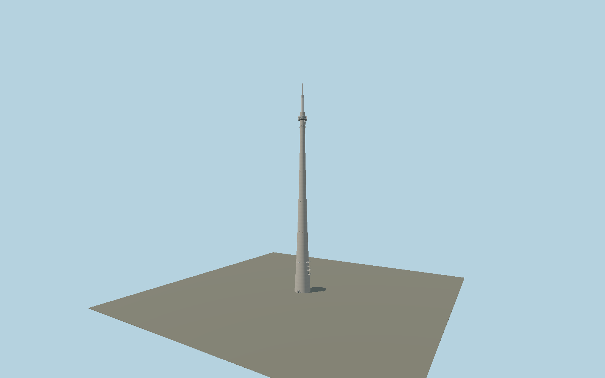

# Emley Moor transmitting station

Individual tapered concrete broadcasting tower, 20-bay glazed turret, four lower cantilever platforms, antenna mounting rings and modern shortened two-stage radome. True shaft-door recesses, cabin windows, panel frames, safety rails, ladders and obstruction lights use shared procedural surfaces.

## Identity and geometry

Catalog N1006, [Q638586](https://www.wikidata.org/wiki/Q638586). Arup original sections set concrete dimensions and cabin rhythm; dated February/September 2023 photographs set the current antenna envelope and mounting details. The mapped circular footprint supplies a center but its 17.6 m diameter conflicts with the published 24.38 m base; it is not a sizing source.

Center of the mapped tower footprint, Y=0 at ground contact. +Z is the provisional main entrance, with the lower GPO platform stack on +X; compass orientation awaits site review; +Y is up. The geographic proposal identifies its anchor and orientation evidence separately from remaining terrain and azimuth uncertainty.

Source facts and measured references are recorded in spec.json. References: [1](https://www.arup.com/globalassets/downloads/arup-journal/the-arup-journal-1972-issue-1.pdf), [2](https://historicengland.org.uk/listing/the-list/list-entry/1350339), [3](https://www.arqiva.com/news/end-of-an-era-emley-moor), [4](https://tx.mb21.co.uk/gallery/gallerypage.php?txid=336&pageid=4299), [5](https://tx.mb21.co.uk/gallery/gallerypage.php?txid=336&pageid=4370), [6](https://tx.mb21.co.uk/gallery/gallerypage.php?txid=336&pageid=32), [7](https://tx.mb21.co.uk/gallery/gallerypage.php?txid=336&pageid=1851), [8](https://www.openstreetmap.org/way/476925020). Reference pages and images are not redistributed.

## Original source and shared materials

Geometry is authored in `packages/worldgen/scripts/emley-moor-model.mjs`. Shared material graphs with metric repeat UV0 and original vertex tints; GLB PBR fallback remains self-contained. No per-model texture duplication. No third-party mesh or photograph is embedded.

271,888 triangles; 516,378 vertices; 4 material groups; 21,855,100 source bytes. Source hash: `sha256:b1cb61affc9a55e2f6397b813995390039669a57e6aeb7f82f0046f814676709`. Geometry validation checks finite Float32 coordinates, indices, triangle area and winding before export.

Regenerate with `node packages/worldgen/scripts/generate-heritage-towers.mjs N1006`; add `--check` for reproducibility. The generator refuses to overwrite a master whose hash differs from source.json. Import uses `--no-optimize` to preserve facade recesses.

## Remaining detail and review

- The modern radome transition heights are scaled estimates from dated 2023 photographs, not fabrication dimensions. Both historical and current-height claims remain explicit.
- Turret external radius/height, equipment positions, lift-joint rhythm, doors and platforms are detailed reconstructions. Exact current antenna inventory and compass phases remain pending.
- The lower antenna gallery and small entrance cage follow 2011 photos; the upper array follows 2023 photos. Current ground equipment, independent station buildings, fences and cable ducts need coordinated site review.
- Map ring is smaller than the engineering base. Geographic approval requires resolving its envelope and validating site azimuth and ground datum.
- Near/far visual QA, shared-material inspection and maximum-fidelity approval remain pending.

Named near/far cameras are included for lit visual review. A valid export is not maximum-fidelity certification.
