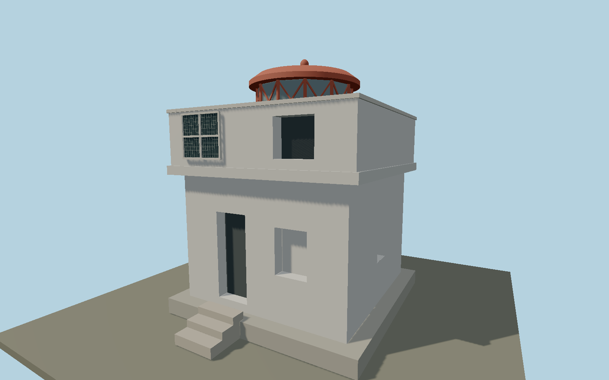

# Thridrangaviti Lighthouse — N0647

Small white square coastal service building with projecting roof terrace, solid pierced parapet, red diamond-framed lantern and exterior photovoltaic panel above a recessed maintenance entrance.

## Identity and evidence

Exact catalog identity **Q28375893**. Source facts: `{"heightMeters":7.4,"baseMeters":[5.7,5.7],"basis":"Exact-QID OSM building envelope supports 7.4m, unlike cached unreferenced4m. Coastal authority maintenance photograph dated22July2015 establishes the proportions and distinctive fixtures.","referenceAppearanceYear":2015}`. The source specification keeps published dimensions separate from reconstructed details.

- https://www.vegagerdin.is/media/2023/09/arsskyrsla_vegagerdarinnar_2015.pdf
- https://www.openstreetmap.org/way/1002414326

Original geometry and shared procedural materials. Official photographs are research references only; no reference imagery or third-party mesh is embedded or redistributed.

## Authored geometry and materials

3,062 triangles, 5,660 vertices, 4 surface groups; 243,312 source bytes. SHA-256: `sha256:cd7764d0324acbd3509b7c9bc6323b4d6c70ce32fadf75de7c893e34e067409d`. Actual bounds: -2.900, 0.000, -2.900 to 2.900, 7.400, 3.890 m.

Shared canonical material graphs with metric UV repeats in extras.molenSurface; portable glTF PBR factors and vertex colors remain. Dark recesses/lantern panels retain local fallback materials. Shared references: `matgraph:molen.worldgen.material.plaster_lime` (2 × 2 m), `matgraph:molen.worldgen.material.metal_painted` (2 × 2 m), `matgraph:molen.worldgen.material.concrete_plain` (2 × 2 m). Model-native axes: {"up":"+Y","front":"+Z","origin":"Authored main tower center at local base level; attached ensembles are offset from this origin."}.

## Placement proposal

Square platform centered and aligned to mapped building. +Z door/PV facade faces the mapped helicopter approach on the south side (helipad node8645377489 at[-20.5133282,63.4886035]), selecting the south-facing square quadrant. Authority maintenance photo shows the door toward that approach. Terrain must contain the sea stack summit; base is summit contact. Proposed anchor -20.51327785, 63.48870655 (longitude, latitude), heading 0.192807138777 radians. Elevation policy: **terrain-contact**. This is a reviewable proposal, not a completed site-fit certification. Ground models require terrain contact; offshore models also require water-datum and base-height checks.

## Limitations and review

- The modeled exterior follows the cited published facts and inspected photographs. Unpublished dimensions and local fittings are explicitly photo-proportioned; no claim of engineering survey accuracy is made.
- Portable PBR and shared metric surfaces are provided. Surface weathering, material color under local lighting and fine facade relief require close render review before maximum-detail acceptance.
- Tower exterior, red diagonal glazing frame and photovoltaic cell grid follow the authority maintenance image, with site-facing axis from mapped approach. Natural rock stack and adjacent helicopter landing area are terrain/site features beyond this lighthouse building; the building is authored at its summit contact.

Near/far fixtures are in `spec.qaCameras`. Float32 finite geometry, triangle degeneracy and winding are checked by the generator. Current rendering, shared-material, maximum-fidelity and geographic review results are recorded in `qa.json` and the readiness ledger; source generation alone does not approve a model.

Regenerate with `node packages/worldgen/scripts/generate-lighthouse-models.mjs --ids=N0647`; add `--check` for reproducibility. Editable component recipes are in `packages/worldgen/scripts/lighthouse-offshore-models.mjs`. The generator protects artist-edited master hashes and preserves import/capture/shared-capture/QA documents.
