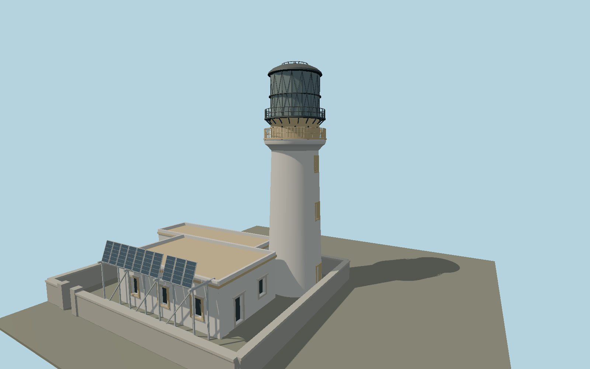

# Flannan Isles Lighthouse — N0658

White taper and ochre margins with an L-shaped keeper house, blocked lower tower openings, curved cornice and golden watchroom, small portholes, black diagonal lantern glazing and domed cap. Full open-braced southern solar gantry and compact walled tower court.

## Identity and evidence

Exact catalog identity **Q15217844**. Source facts: `{"heightMeters":23,"year":1899,"towerBaseDiameterMeters":5.77345,"basis":"NLB and HES publish23m. HES specifies stage details, portholes, blocked lower openings and keeper-window counts. Actual arc of exact-QID OSM854321119 fits5.773m diameter; remaining L-plan comes from that outline. Dated2018 original photographer exterior views govern solar gantry and current margins."}`. The source specification keeps published dimensions separate from reconstructed details.

- https://www.nlb.org.uk/lighthouses/flannan-islands/
- https://portal.historicenvironment.scot/designation/LB48143
- https://uklighthousetour.com/2018/06/03/the-flannans-finally/
- https://uklighthousetour.com/wp-content/uploads/2018/06/lighthouse2.jpg
- https://uklighthousetour.com/wp-content/uploads/2018/06/lighthouse3.jpg
- https://www.openstreetmap.org/way/854321119

Original geometry and shared procedural materials. Official photographs are research references only; no reference imagery or third-party mesh is embedded or redistributed.

## Authored geometry and materials

30,386 triangles, 56,924 vertices, 8 surface groups; 2,418,512 source bytes. SHA-256: `sha256:c3bd185a92fc210dc7144db31ea668814ae9ba7307dc5be0e5a74ae502ee5012`. Actual bounds: -19.125, 0.000, -4.725 to 4.575, 23.000, 14.960 m.

Shared canonical material graphs with metric UV repeats in extras.molenSurface; portable glTF PBR factors and vertex colors remain. Dark recesses/lantern panels retain local fallback materials. Shared references: `matgraph:molen.worldgen.material.plaster_lime` (2 × 2 m), `matgraph:molen.worldgen.material.stone` (2 × 2 m), `matgraph:molen.worldgen.material.stone_ashlar` (2.4 × 1.5 m), `matgraph:molen.worldgen.material.stone_limestone` (2.4 × 1.6 m), `matgraph:molen.worldgen.material.metal_painted` (2 × 2 m), `matgraph:molen.worldgen.material.stone_granite` (2 × 2 m), `matgraph:molen.worldgen.material.wood_plain` (2 × 0.25 m). Model-native axes: {"up":"+Y","front":"+Z","origin":"Authored main tower center at local base level; attached ensembles are offset from this origin."}.

## Placement proposal

Origin fitted to mapped circular tower arc, not whole-house bbox. Mapped keeper block extends southwest; HES southern solar gantry resolves quadrant. Court wall extent is reconstructed compactly around building; remote landing/stair terrain is excluded. Proposed anchor -7.58816108988, 58.288165646211 (longitude, latitude), heading 0.200781670264 radians. Elevation policy: **terrain-contact**. This is a reviewable proposal, not a completed site-fit certification. Ground models require terrain contact; offshore models also require water-datum and base-height checks.

## Limitations and review

- The modeled exterior follows the cited published facts and inspected photographs. Unpublished dimensions and local fittings are explicitly photo-proportioned; no claim of engineering survey accuracy is made.
- Portable PBR and shared metric surfaces are provided. Surface weathering, material color under local lighting and fine facade relief require close render review before maximum-detail acceptance.
- Detailed exterior follows dated2018 primary photographic appearance and heritage description; individual whitewash repairs are shared material. Tower court boundary is proportioned from photographs rather than a cadastral survey. Detached chapel, island landing rails and cliff stairs remain separate site geometry.

Near/far fixtures are in `spec.qaCameras`. Float32 finite geometry, triangle degeneracy and winding are checked by the generator. Current rendering, shared-material, maximum-fidelity and geographic review results are recorded in `qa.json` and the readiness ledger; source generation alone does not approve a model.

Regenerate with `node packages/worldgen/scripts/generate-lighthouse-models.mjs --ids=N0658`; add `--check` for reproducibility. Editable component recipes are in `packages/worldgen/scripts/lighthouse-northsea-models.mjs`. The generator protects artist-edited master hashes and preserves import/capture/shared-capture/QA documents.
