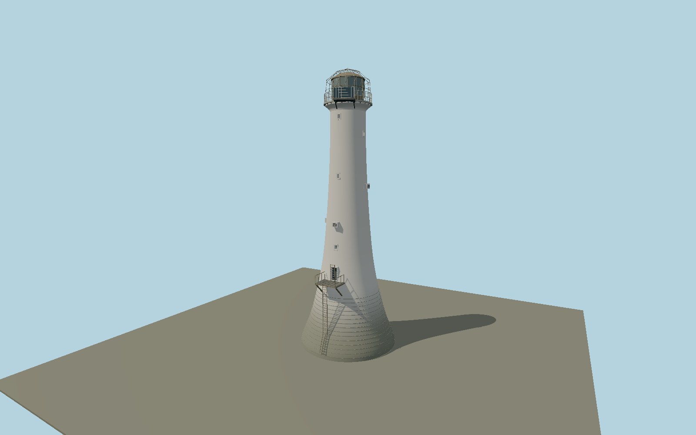

# Bell Rock Lighthouse — N0652

Curved white sandstone tower above a broad sea-washed granite base, high bronze door ladder and landing, small staggered windows and vents, echinus cornice, triangular bronze lantern, copper dome, open bird cage and SSE solar bay.

## Identity and evidence

Exact catalog identity **Q2305375**. Source facts: `{"heightMeters":36,"baseDiameterMeters":12.8016,"shaftTopDiameterMeters":4.572,"solidMasonryHeightMeters":9.144,"year":1811,"basis":"Current NLB and HES height36m; original NLB quoted42ft base,15ft top and30ft solid base converted exactly. Profiles between those dimensional anchors and fittings are reconstructed from photographs and HES description."}`. The source specification keeps published dimensions separate from reconstructed details.

- https://www.nlb.org.uk/lighthouses/bell-rock/
- https://portal.historicenvironment.scot/designation/LB45197
- https://commons.wikimedia.org/wiki/File:Bell_Rock_Lighthouse_01.jpg
- https://www.openstreetmap.org/way/710617370

Original geometry and shared procedural materials. Official photographs are research references only; no reference imagery or third-party mesh is embedded or redistributed.

## Authored geometry and materials

69,466 triangles, 136,348 vertices, 7 surface groups; 5,746,316 source bytes. SHA-256: `sha256:da2d3054e54debcef23e831926a3bcf0bb1cc23e9ba2c4f76cf139a1b30f8a75`. Actual bounds: -6.401, 0.000, -6.401 to 6.401, 36.000, 6.603 m.

Shared canonical material graphs with metric UV repeats in extras.molenSurface; portable glTF PBR factors and vertex colors remain. Dark recesses/lantern panels retain local fallback materials. Shared references: `matgraph:molen.worldgen.material.plaster_lime` (2 × 2 m), `matgraph:molen.worldgen.material.stone_ashlar` (2.4 × 1.5 m), `matgraph:molen.worldgen.material.metal_painted` (2 × 2 m), `matgraph:molen.worldgen.material.stone_granite` (2 × 2 m), `matgraph:molen.worldgen.material.wood_plain` (2 × 0.25 m), `matgraph:molen.worldgen.material.concrete_plain` (2 × 2 m). Model-native axes: {"up":"+Y","front":"+Z","origin":"Authored main tower center at local base level; attached ensembles are offset from this origin."}.

## Placement proposal

Exact-QID mapped tower center supersedes the catalog point160m away. Authored+X east/+Z south places HES solar platform in the SSE octant. Door azimuth is photo-reconstructed; reef contact is delegated to host terrain. Proposed anchor -2.38729745, 56.43419915 (longitude, latitude), heading 0 radians. Elevation policy: **terrain-contact**. This is a reviewable proposal, not a completed site-fit certification. Ground models require terrain contact; offshore models also require water-datum and base-height checks.

## Limitations and review

- The modeled exterior follows the cited published facts and inspected photographs. Unpublished dimensions and local fittings are explicitly photo-proportioned; no claim of engineering survey accuracy is made.
- Portable PBR and shared metric surfaces are provided. Surface weathering, material color under local lighting and fine facade relief require close render review before maximum-detail acceptance.
- Asset covers the tower and attached equipment; detached reef walkways and landing infrastructure are separate site structures. The date-stamped2005 research photograph and2024 HES description govern visible details; individual repairs and marine staining are not surveyed.

Near/far fixtures are in `spec.qaCameras`. Float32 finite geometry, triangle degeneracy and winding are checked by the generator. Current rendering, shared-material, maximum-fidelity and geographic review results are recorded in `qa.json` and the readiness ledger; source generation alone does not approve a model.

Regenerate with `node packages/worldgen/scripts/generate-lighthouse-models.mjs --ids=N0652`; add `--check` for reproducibility. Editable component recipes are in `packages/worldgen/scripts/lighthouse-northern-models.mjs`. The generator protects artist-edited master hashes and preserves import/capture/shared-capture/QA documents.
