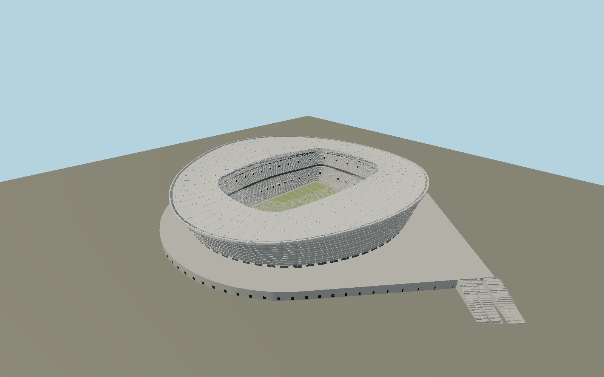

# Cape Town Stadium — N0698

Silver translucent abalone-shell envelope, twelve horizontal facade profiles, 72 inclined concrete pylons and an undulating glass cable-wheel roof. Clear16m inner cantilever,9,000 glass panel cells, ring-of-fire lights, a pearly three-tier bowl with post2010 upper hospitality boxes, and three mapped grand-stair banks on the elevated street-grid podium give Cape Town its specific appearance.

## Identity and evidence

Exact catalog identity **Q173559**. Source facts: `{"published":"gmp and the operator describe290x265m dimensions,50m maximum height, a16m clear inner glass strip,9000 laminated16mm panels and a three-tier bowl. The operator lists360 floodlights,100x68m rugby field with8m in-goals, and hospitality suites added in2020/21. Structural engineering evidence records72 radial concrete frames and3x0.8m pylons. Architect sections resolve higher long sides and lower ends.","reconstructed":"Mapped roof/pitch and21 stair centerlines fix site placement. The mapped roof is283x261m versus rounded published290x265m, and its actual footprint is retained. Podium edge is interpolated from mapped stair tops and roof perimeter; its8.5m rise, detailed truss camber, balcony subdivisions and individual seating distribution are section/photo reconstructions. The translucent fabric uses local PBR alpha while opaque architectural surfaces reuse canonical graphs."}`. The source specification keeps published dimensions separate from reconstructed details.

- https://www.gmp.de/en/projects/501/cape-town-stadium
- https://www.sbp.de/en/project/cape-town-stadium/
- https://www.dhlstadium.co.za/venues/stadium-bowls
- https://thestormers.com/wp-content/uploads/2021/11/DHL-Stadium-Fast-Facts-03-Oct-2021-2.pdf
- https://constructalia.arcelormittal.com/en/case_study_gallery/south_africa/arcelormittal-steel-for-cape-town-stadium
- https://www.idc-online.com/technical_references/pdfs/civil_engineering/Cape_Town_Stadium_structural_challenges.pdf
- https://www.openstreetmap.org/relation/8706182
- https://www.openstreetmap.org/way/44948355

Original authored geometry; primary photos and architect sections used as research, not embedded art. OSM-derived plan coordinates are attributed to OpenStreetMap contributors under ODbL1.0.

## Authored geometry and materials

2,070,330 triangles, 3,761,806 vertices, 10 surface groups; 156,512,300 source bytes. SHA-256: `sha256:127d895307870025cf1570b1297b1bf80e981e333affc6e1bacc05ebbbc2dc35`. Actual bounds: -182.840, -0.636, -230.019 to 231.022, 50.350, 154.955 m.

Shared canonical material graphs with metric UV repeats in extras.molenSurface; portable glTF PBR factors and vertex colors remain. Dark recesses/lantern panels retain local fallback materials. Shared references: `matgraph:molen.worldgen.material.membrane` (4 × 4 m), `matgraph:molen.worldgen.material.metal_painted` (2 × 2 m), `matgraph:molen.worldgen.material.concrete_plain` (2 × 2 m), `matgraph:molen.worldgen.material.gravel` (2 × 2 m). Model-native axes: {"up":"+Y","front":"+Z","origin":"Mapped pitch center; +Z north-northwest, +X west-southwest. Field and outer street contactY0; raised podiumY8.5 reconstructed from sections."}.

## Placement proposal

Exact mapped pitch directs+Z north-northwest and+X west-southwest. Three asymmetric mapped stair groups resolve180-degree ambiguity. Terrain contact is the outside street/field datum; the podium is elevated, consistent with architect sections. Proposed anchor 18.411151750000002, -33.903441525 (longitude, latitude), heading 2.9282975441253463 radians. Elevation policy: **terrain-contact**. See qa.json for the geographic review status and scope; this placement proposal does not claim surveyed site accuracy. Native ground and pitch datums follow the individual geographic proposal; depressed bowls require their declared terrain cutout.

## Limitations and review

- Current permanent exterior in shared Molen style, including post2010 upper hospitality volumes. Suite subdivisions, seat inventory, local podium height, roof camber and hidden members are reconstructions. Transparent glass and fabric retain local PBR to preserve alpha; no claim of full optical transmission simulation. Temporary sponsor wraps, event scenery, neighboring independent sports buildings and enclosed rooms are omitted.

Portable review uses a flat ground contact fixture.

Near/far fixtures are in `spec.qaCameras`. Float32 finite geometry, triangle degeneracy and winding are checked by the generator. The hash-bound qa.json and capture reports record the scope and status of rendering, shared-material, exterior-fidelity and geographic reviews.

Regenerate with `node packages/worldgen/scripts/generate-stadium-models.mjs --ids=N0698`; add `--check` for reproducibility. Editable component recipes are registered by the imports and study list in `packages/worldgen/scripts/generate-stadium-models.mjs`. The generator protects artist-edited master hashes and preserves import/capture/shared-capture/QA documents.
