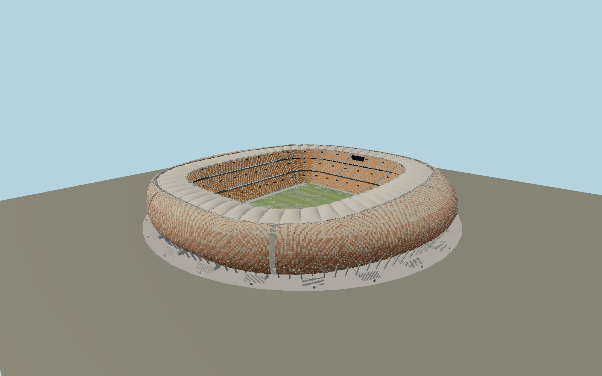

# FNB Stadium — N0687

South African calabash with the mapped near-circular belly and rectangular roof aperture, thousands of earth-tone GFRC panels and genuine short light openings, ten geographic slots, inclined concrete feet, 120 curved ribs, triangular spatial roof ring, sixty undulating PTFE cantilevers, orange three-tier seating and a distinct western hospitality band.

## Identity and evidence

Exact catalog identity **Q163521**. Source facts: `{"basis":"ExactQ163521 OSM envelope and separate roof/field polygons determine the plan and orientation. Roof designer sbp gives40m above field, roughly300m diameter,36m cantilever and800m triangular ring. Fabrication analyst EnginSoft records three0.71–0.91m tubular ring chords,28support locations including12shafts,60cantilevers and120facade sectors. The GFRC supplier case study records1.2x1.8m,13mm panels in8colors; its60m overall summary conflicts with the roof designer’s40m above-field datum, so the engineering datum governs this model. Five full-resolution sbp construction/completed photos were inspected for curvature, glazing strips, panel openings and roof corrugation. Panel mosaic and smaller connection positions are reconstructed, not an inventory claim."}`. The source specification keeps published dimensions separate from reconstructed details.

- https://www.sbp.de/en/project/soccer-city-stadium/
- https://www.enginsoft.com/expertise/johannesburg-2010-world-cup-stadium-roof-and-facade-design.html
- https://populous.com/showcases/soccer-city
- https://constructalia.arcelormittal.com/en/case_study_gallery/south_africa/soccer-city-stadium-with-arcelormittal-steel
- https://dcpd6wotaa0mb.cloudfront.net/mdms/dms/CSB/10018898/Cem-FIL-Architects-Case-Study_Soccer-City-Stadium_11-2013_Rev0_approved.pdf?v=1402892862000
- https://www.openstreetmap.org/way/48848017
- https://www.openstreetmap.org/relation/1639587

Primary references inform original mesh geometry. No photographic pixels, Getty images or downloaded model are embedded. Map-derived plan is attributed to OpenStreetMap contributors under ODbL1.0.

## Authored geometry and materials

1,674,942 triangles, 3,200,092 vertices, 7 surface groups; 132,106,428 source bytes. SHA-256: `sha256:312a28c04a0592fb024e6224f443f86f82bc83dd22a7ea2f52508f03983bb3ae`. Actual bounds: -156.126, -0.232, -157.844 to 157.097, 40.000, 155.219 m.

Shared canonical material graphs with metric UV repeats in extras.molenSurface; portable glTF PBR factors and vertex colors remain. Dark recesses/lantern panels retain local fallback materials. Shared references: `matgraph:molen.worldgen.material.membrane` (4 × 4 m), `matgraph:molen.worldgen.material.metal_painted` (2 × 2 m), `matgraph:molen.worldgen.material.concrete_plain` (2 × 2 m). Model-native axes: {"up":"+Y","front":"+Z","origin":"Mapped pitch center; +Z follows its southward axis. Field and structural foot datum are native Y0; the photographed access podium rises above it."}.

## Placement proposal

Exact pitch polygon establishes origin and southward axis; western hospitality strip resolves facade direction. Separate facade and roof loops preserve the circular calabash around the elongated playing field. NativeY0 is the local field/structural-foot reference; exterior podium and access stairs are modeled above that datum. Ten facade slots are oriented by bearings to the nine other2010venue cities and Berlin, following the architect’s concept. Proposed anchor 27.982639075, -26.234736599999998 (longitude, latitude), heading 0.023383820974738855 radians. Elevation policy: **terrain-contact**. See qa.json for the geographic review status and scope; this placement proposal does not claim surveyed site accuracy. Native ground and pitch datums follow the individual geographic proposal; depressed bowls require their declared terrain cutout.

## Limitations and review

- Photograph-based exterior reconstruction with explicit panel joints/openings and shared physical concrete/steel/membrane surfaces. The8-color mosaic and individual small windows are reconstructed and do not certify every panel’s installed position. Full fabrication bolt inventory, exact spectator count, enclosed VIP interiors and changing event decoration are excluded. Roof designer’s40m above-field dimension is used rather than averaging it with a conflicting supplier summary. External grade transitions and modest podium heights are reconstructed from engineer photos.

Portable review uses a flat ground contact fixture.

Near/far fixtures are in `spec.qaCameras`. Float32 finite geometry, triangle degeneracy and winding are checked by the generator. The hash-bound qa.json and capture reports record the scope and status of rendering, shared-material, exterior-fidelity and geographic reviews.

Regenerate with `node packages/worldgen/scripts/generate-stadium-models.mjs --ids=N0687`; add `--check` for reproducibility. Editable component recipes are registered by the imports and study list in `packages/worldgen/scripts/generate-stadium-models.mjs`. The generator protects artist-edited master hashes and preserves import/capture/shared-capture/QA documents.
