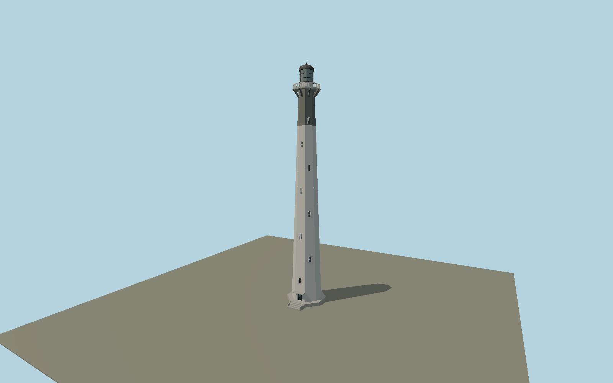

# Nosy Alañaña Light — N0662

Slender eight-sided concrete taper with staggered arched window rows, worn pale lower shaft and dark upper daymark, strong eight gallery consoles, octagonal concrete balustrade, round lantern and domed cap. Broad stepped entrance podium and flat projecting door canopy.

## Identity and evidence

Exact catalog identity **Q3378451**. Source facts: `{"heightMeters":60,"baseAcrossFlatsApproxMeters":7.1,"year":1932,"basis":"APMF operator2020 ministerial visit explicitly gives60m height and photographs the doorway, concrete landing steps and lantern. Original2023 Riaan Wessels and2006 Maxsnet exterior photographs establish octagonal taper, staggered arches, upper dark band, concrete gallery and domed cap. Widths and intermediate elevations are photograph proportions."}`. The source specification keeps published dimensions separate from reconstructed details.

- https://apmf.mg/index.php/mediatheque/images/fanilon-dranomasina-eny-aminny-nosy-alagnagna-phare-de-lile-aux-prunes
- https://apmf.mg/sites/default/files/images/3_11.jpg
- https://apmf.mg/sites/default/files/images/2_10.jpg
- https://apmf.mg/sites/default/files/images/4_11.jpg
- https://commons.wikimedia.org/wiki/File:Outside_of_lighthouse.jpg
- https://commons.wikimedia.org/wiki/File:Phare_de_l%27Ile_aux_Prunes.jpg
- https://www.openstreetmap.org/node/5316362054

Original geometry and shared procedural materials. Official photographs are research references only; no reference imagery or third-party mesh is embedded or redistributed.

## Authored geometry and materials

29,308 triangles, 53,288 vertices, 5 surface groups; 2,220,024 source bytes. SHA-256: `sha256:970225172ec03e19a3acddffa3b5c1c8eb04cb9c924484ff781dcfbe8cb91033`. Actual bounds: -4.712, 0.000, -4.712 to 4.712, 60.000, 6.600 m.

Shared canonical material graphs with metric UV repeats in extras.molenSurface; portable glTF PBR factors and vertex colors remain. Dark recesses/lantern panels retain local fallback materials. Shared references: `matgraph:molen.worldgen.material.plaster_lime` (2 × 2 m), `matgraph:molen.worldgen.material.metal_painted` (2 × 2 m), `matgraph:molen.worldgen.material.wood_plain` (2 × 0.25 m), `matgraph:molen.worldgen.material.concrete_plain` (2 × 2 m). Model-native axes: {"up":"+Y","front":"+Z","origin":"Authored main tower center at local base level; attached ensembles are offset from this origin."}.

## Placement proposal

Exact-QID lighthouse node fixes island position, replacing the older point about7m north. Octagonal facade direction and entry toward the southern keeper compound are photograph/site-layout reconstructions; no surveyed entrance bearing is claimed. Terrain supplies island ground contact. Proposed anchor 49.4600634, -18.0488027 (longitude, latitude), heading 0 radians. Elevation policy: **terrain-contact**. This is a reviewable proposal, not a completed site-fit certification. Ordinary ground models use terrain contact; Kiipsaare requires an offshore water/base-height check.

## Limitations and review

- The modeled exterior follows the cited published facts and inspected photographs. Unpublished dimensions and local fittings are explicitly photo-proportioned; no claim of engineering survey accuracy is made.
- Portable PBR and shared metric surfaces are provided. Surface weathering, material color under local lighting and fine facade relief require close render review before maximum-detail acceptance.
- Paint degradation varies strongly between the2006,2020 and2023 photographs. The model preserves pale shaft/dark upper daymark with reusable plaster and metal surfaces rather than copied stains. Detached keeper houses and island vegetation remain map/environment features; static glazing does not operate a navigational light.

Near/far fixtures are in `spec.qaCameras`. Float32 finite geometry, triangle degeneracy and winding are checked by the generator. Rendering, shared-material alignment, maximum-fidelity and geographic reviews remain pending until their hash-bound reports exist.

Regenerate with `node packages/worldgen/scripts/generate-lighthouse-models.mjs --ids=N0662`; add `--check` for reproducibility. Editable component recipes are in `packages/worldgen/scripts/lighthouse-models.mjs`. The generator protects artist-edited master hashes and preserves import/capture/shared-capture/QA documents.
