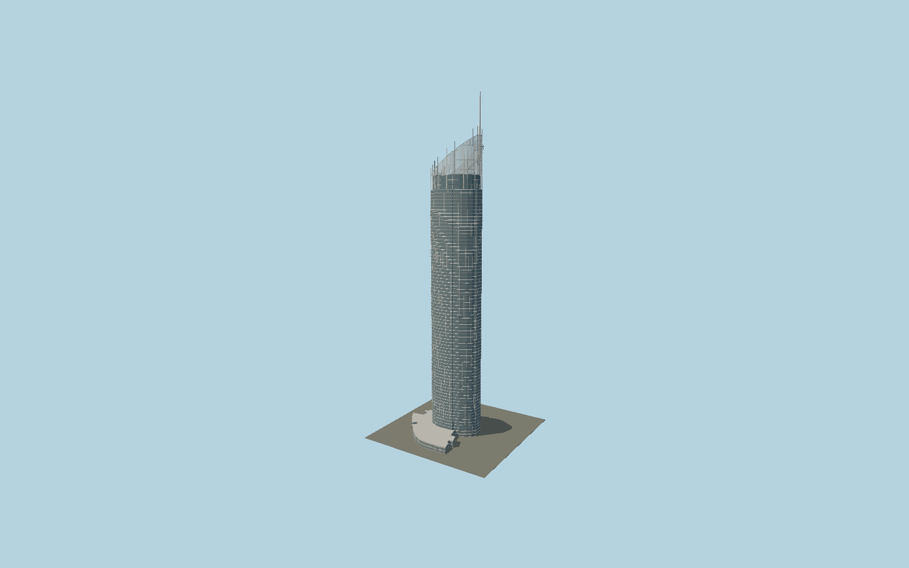

# Q1 Tower

Q1’s curved asymmetric apartment shaft with closely spaced white floor bands, individual blue-glass panes and projecting rear balcony edges, topped by its open sloping glass-and-steel sail and322.5 m offset mast.

## Evidence and reconstruction

Published dimensions and reconstructed details are separated in spec.json. Primary references:

- [Reference](https://dxp1416ihlpln.cloudfront.net/s3fs-public/2019-07/2015-Project-Bulletin-Q1-Low-Res.pdf)
- [Reference](https://www.skypoint.com.au/about-us)
- [Reference](https://www.skypoint.com.au/climb)
- [Reference](https://www.q1.com.au/)
- [Reference](https://www.openstreetmap.org/way/188325694)

No third-party geometry, photograph or bitmap texture is embedded. Shared surface graphs come from the central library; vertex tints carry model colors. Glass is an opaque PBR approximation.

## Model and axes

195,163 triangles; 510,515 vertices; 5 material groups; 20,213,148 bytes. Native bounds: -51.878, 0.000, -30.238 to 23.900, 322.500, 51.007. Source hash: `sha256:b6fbf8c626493ca589dd03a844d3516c652df4693757387ff6824217696e1216`.

{"up":"+Y","longitudinal":"+X along the mapped building long axis","front":"+Z","origin":"Ground-level center of exact-QID mapped footprint frame"}

The geographic proposal uses exact-QID OpenStreetMap evidence. Map-derived orientation and estimated architectural details require real-site visual review; preview eligibility is distinct from geographic/fidelity approval. Map attribution: © OpenStreetMap contributors, ODbL-1.0.

## Reproduce

Run `node packages/worldgen/scripts/generate-signature-towers.mjs --ids=N0162` (or add `--check`). The generator preserves manually edited masters by checking their baseline hashes. Import through the standard authored-model workflow with optimization disabled; then capture all QA cameras, including shared-surface views.

## Pending work

- Exterior geometry uses published overall dimensions and map evidence; panel subdivision, connection dimensions and local entrance details are reconstructed. Glazing uses opaque PBR with explicit geometry; no copied facade photograph is embedded.
- Crown ribs, transparent sail, external climb treads and rails, local balconies and individual pane grids are explicit. Exact intermediate climb bends and detailed balcony variations remain photo reconstruction. Main shaft and podium footprints are mapped separately.

This bundle contains source geometry, not a claim of maximum-fidelity completion. Hash-bound visual acceptance is recorded separately after capture inspection.
