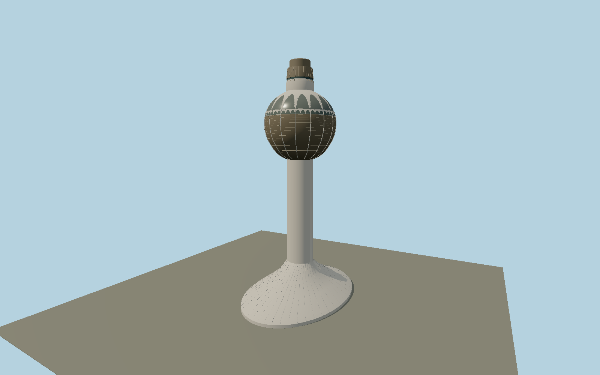

# Jeddah Light — N0644

Pale slender control tower on an elongated two-wing flared base, with bronze lower spherical glazing, a belt of small round arcades, sixteen tall arched windows and stacked cylindrical control rooms.

## Identity and evidence

Exact catalog identity **Q1151131**. Source facts: `{"heightMeters":131.4,"heightBasis":"Catalog/Wikidata quantity; primary NGA photograph establishes identity and shape but does not independently measure this value.","geometryBasis":"NGA Sailing Directions Pub172, sector6 p118 and photographer fadlallah original2003 view establish arched capsule openings, small arcade belt, bronze-glazed lower half and flat control crown. Exact-identity OSM building/parts establish elongated base envelope.","mappedBaseMeters":[57.4,82.4],"mappedCoreAnchor":[39.149702,21.468607]}`. The source specification keeps published dimensions separate from reconstructed details.

- https://msi.nga.mil/api/publications/download?key=16694491%2FSFH00000%2FPub172bk.pdf
- https://saudipedia.com/en/jeddah-city
- https://www.wikidata.org/wiki/Q1151131
- https://commons.wikimedia.org/wiki/File:Jeddah_control_tower.jpg
- https://www.openstreetmap.org/way/265419490
- https://www.openstreetmap.org/way/265419493
- https://www.openstreetmap.org/way/265419494

Original geometry and shared procedural materials. Official photographs are research references only; no reference imagery or third-party mesh is embedded or redistributed.

## Authored geometry and materials

87,188 triangles, 211,388 vertices, 3 surface groups; 8,658,592 source bytes. SHA-256: `sha256:7f417fc648085c6af7dd032c21c8741afc749557040fbc4e682e30227d7598cf`. Actual bounds: -28.261, 0.000, -41.261 to 28.261, 131.400, 41.261 m.

Shared canonical material graphs with metric UV repeats in extras.molenSurface; portable glTF PBR factors and vertex colors remain. Dark recesses/lantern panels retain local fallback materials. Shared references: `matgraph:molen.worldgen.material.metal_painted` (2 × 2 m), `matgraph:molen.worldgen.material.concrete_plain` (2 × 2 m). Model-native axes: {"up":"+Y","front":"+Z","origin":"Authored main tower center at local base level; attached ensembles are offset from this origin."}.

## Placement proposal

Tower core centered on mapped upper control-room circular parts. Elongated base +Z axis aligns with mapped opposed sloped wings, north/south roof directions349.5/169.5degrees. Upper tower rotational symmetry has no facade ambiguity; unsupported four-way entry canopies were removed. Proposed anchor 39.149702, 21.468607 (longitude, latitude), heading 0.18326 radians. Elevation policy: **terrain-contact**. This is a reviewable proposal, not a completed site-fit certification. Ground models require terrain contact; offshore models also require water-datum and base-height checks.

## Limitations and review

- The modeled exterior follows the cited published facts and inspected photographs. Unpublished dimensions and local fittings are explicitly photo-proportioned; no claim of engineering survey accuracy is made.
- Portable PBR and shared metric surfaces are provided. Surface weathering, material color under local lighting and fine facade relief require close render review before maximum-detail acceptance.
- Intermediate capsule radii, arch subdivisions and glazing colors are photo-proportioned to the published total height, with mapped base size. The continuous base envelope is retained without fabricated entrance canopies. Surrounding terminal, port pavement and transient roof equipment are separate site features.

Near/far fixtures are in `spec.qaCameras`. Float32 finite geometry, triangle degeneracy and winding are checked by the generator. Current rendering, shared-material, maximum-fidelity and geographic review results are recorded in `qa.json` and the readiness ledger; source generation alone does not approve a model.

Regenerate with `node packages/worldgen/scripts/generate-lighthouse-models.mjs --ids=N0644`; add `--check` for reproducibility. Editable component recipes are in `packages/worldgen/scripts/lighthouse-coastal-models.mjs`. The generator protects artist-edited master hashes and preserves import/capture/shared-capture/QA documents.
