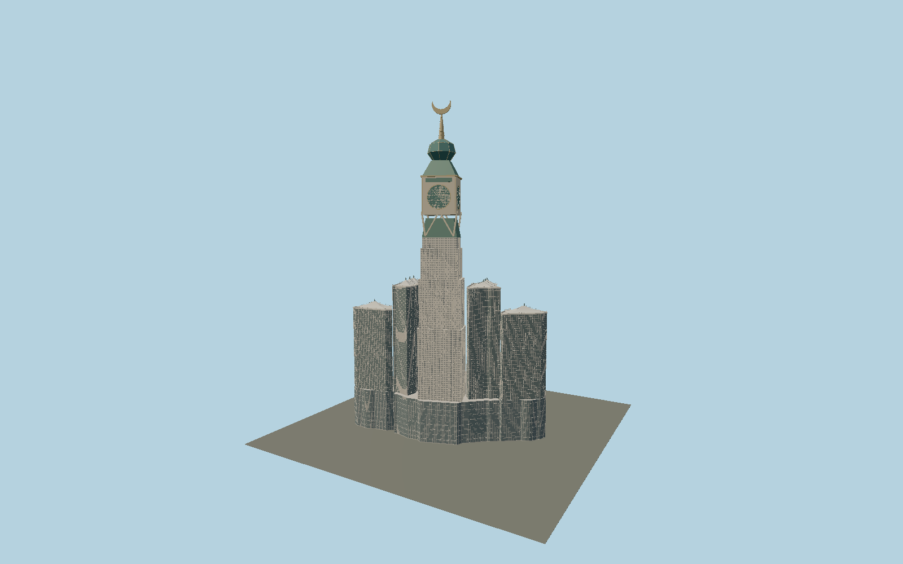

# Abraj Al Bait

The seven-tower complex includes a mapped stepped podium, warm stone hotel facades, six lower towers with tensioned roof tents and glass lanterns, plus the cardinal clock tower with four differently proportioned dials, V supports, a faceted glass jewel, gold spire and closed solid crescent.

## Evidence and reconstruction

Published dimensions and reconstructed details are separated in spec.json. Primary references:

- [Reference](https://www.sl-rasch.com/en/projects/the-makkah-royal-clock-tower/)
- [Reference](https://www.sl-rasch.com/en/projects/tower-tents/)
- [Reference](https://www.perrot-turmuhren.de/turmuhren-laeuteanlagen-sonderuhren-turmzieren-glockenspiele/besondere-uhren-spezialuhren/groesste-turmuhr-makkah-clock.html)
- [Reference](https://www.openstreetmap.org/way/958867174)
- [Reference](https://www.openstreetmap.org/relation/12896421)

No third-party geometry, photograph or bitmap texture is embedded. Shared surface graphs come from the central library; vertex tints carry model colors. Glazing uses PBR materials; transparent surfaces are declared per model.

## Model and axes

260,178 triangles; 618,688 vertices; 6 material groups; 25,398,552 bytes. Native bounds: -173.868, 0.000, -114.011 to 173.875, 601.000, 114.106. Source hash: `sha256:59969e64e806e43740f8944f12b72ad0ca2bac7108d1120aed8afc6ecd161a2c`.

{"up":"+Y","longitudinal":"+X along the mapped building long axis","front":"+Z","origin":"Mapped whole-complex frame; clock shaft offset to exact-QID building:part center, faces cardinal directions"}

The geographic proposal uses exact-QID OpenStreetMap evidence. Map-derived orientation and estimated architectural details require real-site visual review; preview eligibility is distinct from geographic/fidelity approval. Map attribution: © OpenStreetMap contributors, ODbL-1.0.

## Reproduce

Run `node packages/worldgen/scripts/generate-signature-towers.mjs --ids=N0142` (or add `--check`). The generator preserves manually edited masters by checking their baseline hashes. Import through the standard authored-model workflow with optimization disabled; then capture all QA cameras, including shared-surface views.

## Pending work

- Exterior geometry uses published overall dimensions and map evidence; panel subdivision, connection dimensions and local entrance details are reconstructed. Glazing uses opaque PBR with explicit geometry; no copied facade photograph is embedded.
- Clock numerals use original geometric strokes at the manufacturer-described approximate7 m height; exact typographic outlines remain reconstructed. Arabic calligraphy and fine Islamic mosaic motifs are omitted. Roof tents are reconstructed within mapped tower plans. OSM records279 m for the two taller side towers while an older architect roof description says up to250 m; mapped heights are retained. Conflicting601/607 m main-tower datums are documented;601 m is used.

This bundle contains source geometry, not a claim of maximum-fidelity completion. Hash-bound visual acceptance is recorded separately after capture inspection.
