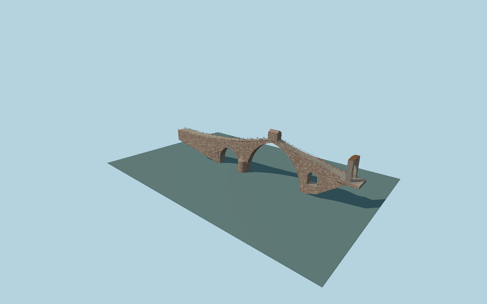

# Pont del Diable, Martorell

Unequal Gothic stone arches with double voussoirs, mixed red and pale Roman ashlar, V/U cutwaters, a stepped humpback walk and open summit shelter, terminating in the surviving Roman gateway with 2026 copper crown protection. Deck and roof envelopes derive from ICGC elevation data, CC BY 4.0.

## Evidence

- [Primary reference](https://patrimonicultural.diba.cat/element/pont-del-diable-0)
- [Primary reference](https://patrimonicultural.diba.cat/element/arc-roma-dacces-al-pont)
- [Primary reference](https://calaix.gencat.cat/bitstream/handle/10687/23978/qmem7104.pdf?isAllowed=y&sequence=194)
- [Primary reference](https://www.icac.cat/wp-content/uploads/2011/01/2012-Alvarez-Stone.pdf)
- [Primary reference](https://martorelldigital.cat/inaugurada-la-restauracio-de-larc-roma-del-pont-del-diable-de-martorell/)
- [Primary reference](https://www.icgc.cat/ca/Geoinformacio-i-mapes/Geoinformacio-en-linia-Geoserveis/WMS-i-WCS-Elevacions/WMS-Elevacions-territorial)
- [Primary reference](https://www.icgc.cat/ca/LICGC/Informacio-publica/Transparencia/Reutilitzacio-de-la-informacio)

Published dimensions and reconstruction assumptions are separated in spec.json. Source photos were consulted; no photos or third-party geometry are embedded. Map plan attribution: © OpenStreetMap contributors, ODbL-1.0.

## Source

369096 triangles; 30955476 bytes; 4 material groups. SHA256: sha256:f72226567cf184a03ac60d574b1aa65dfd3c4fbd9417d1fff02665d061445291.

Shared surfaces (stone_sandstone_raw, stone_limestone_raw, metal_painted, metal_copper) are loaded through the central library; any transparent materials use local PBR parameters. Axis and provisional vertical datum are in spec.json.

Regenerate with node packages/worldgen/scripts/generate-researched-bridges.mjs --ids=N0031; append --check to verify. Import and capture through the standard next-1000 scripts. Geometry validation does not substitute for current-frame visual review.

## Reconstruction limits

- ICGC samples constrain the main vertical envelope, but the occluded summit walkway, arch intrados, gateway depth and exact wall edges need survey confirmation. Host terrain and current water fit remain pending.
- Individual masonry courses, weathering, tread count, rail spacing, and2026 copper cap thickness are original proportional reconstructions.
- The sources distinguish36.4m clear span from a43m narrative span; reference datum for the reported21m height is unclear. Clear span controls the mesh.
- Partial buried masonry and foundation outlines are inferred; adjoining modern roads, railways, river terrain and vegetation are site context.
- Current maximum-fidelity acceptance remains pending measured profiles and close comparison with restoration drawings.
