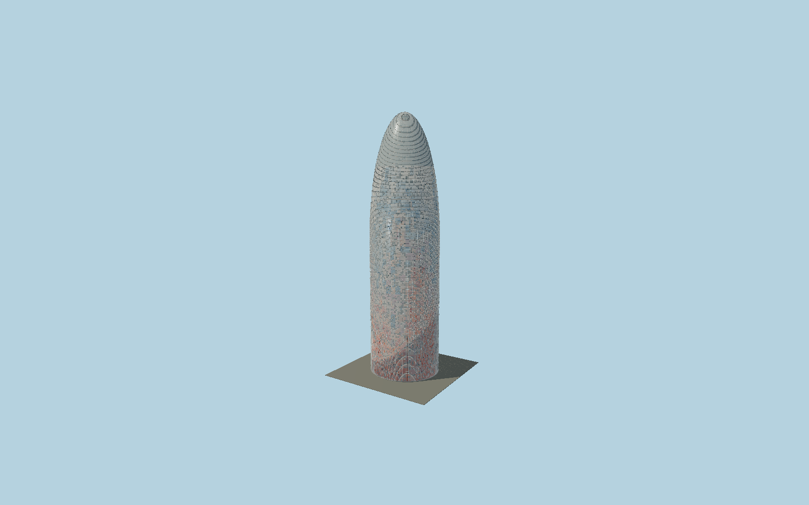

# Torre Glòries

Barcelona’s elliptical glazed tower with a curved crown, individually colored metal pixels,4,500 recessed window cells, separate tilted glass sunshades and a framed pale-glass dome.

## Evidence and reconstruction

Published dimensions and reconstructed details are separated in spec.json. Primary references:

- [Reference](https://www.jeannouvel.com/en/projects/tour-agbar/)
- [Reference](https://www.prepaintedmetal.eu/en/collection/torre-agbar)
- [Reference](https://www.pedelta.com/structural-review-of-the-dome-of-agbar-tower-p-45-en)
- [Reference](https://www.openstreetmap.org/way/44213122)

No third-party geometry, photograph or bitmap texture is embedded. Shared surface graphs come from the central library; vertex tints carry model colors. Glazing uses PBR materials; transparent surfaces are declared per model.

## Model and axes

142,044 triangles; 398,302 vertices; 5 material groups; 16,046,604 bytes. Native bounds: -20.005, 0.000, -18.555 to 20.093, 144.400, 18.555. Source hash: `sha256:73e27f0eb39b8aba789897e6c66cb7dfc1a1d8e4682805f15e8270bad2cb0165`.

{"up":"+Y","longitudinal":"+X along the mapped building long axis","front":"+Z","origin":"Ground-level center of exact-QID mapped footprint frame"}

The geographic proposal uses exact-QID OpenStreetMap evidence. Map-derived orientation and estimated architectural details require real-site visual review; preview eligibility is distinct from geographic/fidelity approval. Map attribution: © OpenStreetMap contributors, ODbL-1.0.

## Reproduce

Run `node packages/worldgen/scripts/generate-signature-towers.mjs --ids=N0173` (or add `--check`). The generator preserves manually edited masters by checking their baseline hashes. Import through the standard authored-model workflow with optimization disabled; then capture all QA cameras, including shared-surface views.

## Pending work

- Exterior geometry uses published overall dimensions and map evidence; panel subdivision, connection dimensions and local entrance details are reconstructed. Glazing uses opaque PBR with explicit geometry; no copied facade photograph is embedded.
- Individual color/window placement, intermediate dome curvature, glass angles and support schedules are reconstructed from architect and supplier references. The4,500 modeled window cells preserve the published quantity but are not a surveyed opening map. Night lighting, below-grade auditorium and external entrance pavilion are excluded.

This bundle contains source geometry, not a claim of maximum-fidelity completion. Hash-bound visual acceptance is recorded separately after capture inspection.
