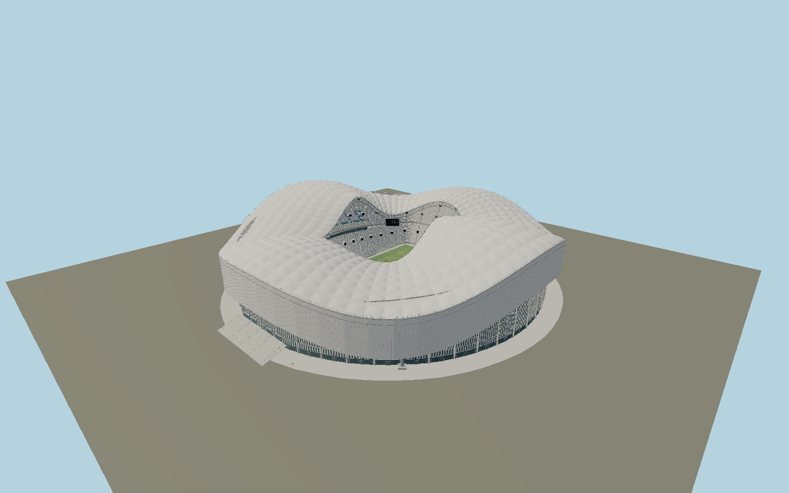

# Stade Vélodrome — N0693

The completed Marseille stadium has a billowing white four-lobed canopy and25m hanging skirt. True curved membrane bays cover the independent double-layer steel lattice, four heavy supports and bolted bases. White seats and blue MARSEILLE lettering, side hospitality bands, diagonal screens, floodlights, alternating facade fins, glazing, end steps and doors distinguish the existing stadium from a generic arena.

## Identity and evidence

Exact catalog identity **Q202150**. Source facts: `{"published":"SCAU identifies the completed2014,67000-seat stadium. Bouygues describes an independent steel roof on four support points. FHECOR publishes its executed structural lattice and connection photographs. The operator specifies the25m facade skirt, and UEFA describes the white undulating canopy.","reconstructed":"Exact roof/aperture and pitch outlines derive from OSM, with all four named stand plans. Relative roof lobe heights, membrane camber, structural member diameters, chair inventory and concourse/entry levels are reconstructed from primary completed photographs and engineering illustrations. OSM’s43m grandstand height supplies a scale cross-check, not a roof survey."}`. The source specification keeps published dimensions separate from reconstructed details.

- https://www.scau.com/fr/project/stade-velodrome
- https://fhecor.com/proyecto.php?id=310
- https://www.bouygues-construction.com/en/activities/sports-tourism-and-leisure/sport-tourism-leisure/stade-orange-velodrome
- https://www.cepacvelodrome.com/stade.html
- https://www.uefa.com/uefaeuro/history/news/0253-0d7f9e2fe7d3-50109c1f2a87-1000--stade-velodrome-in-marseille-inaugurated/
- https://www.openstreetmap.org/relation/12756313
- https://www.openstreetmap.org/way/466491650

Original authored geometry and shared procedural materials. Primary reference photographs and engineering drawings are evidence only; no source pixels or external mesh are embedded. Plan coordinates derive from OpenStreetMap contributors under ODbL1.0.

## Authored geometry and materials

1,291,404 triangles, 2,565,728 vertices, 6 surface groups; 107,866,632 source bytes. SHA-256: `sha256:930c995442d3b87cd1e25c91186c1285a0eae98e5a372fe902456ef49252f4cd`. Actual bounds: -130.782, -0.100, -136.489 to 129.799, 65.273, 137.840 m.

Shared canonical material graphs with metric UV repeats in extras.molenSurface; portable glTF PBR factors and vertex colors remain. Dark recesses/lantern panels retain local fallback materials. Shared references: `matgraph:molen.worldgen.material.membrane` (4 × 4 m), `matgraph:molen.worldgen.material.metal_painted` (2 × 2 m), `matgraph:molen.worldgen.material.concrete_plain` (2 × 2 m). Model-native axes: {"up":"+Y","front":"+Z","origin":"Mapped playing-field center; +Z north-northwest, +X west toward Jean Bouin. Y0 is the playing-field/close-apron reference plane."}.

## Placement proposal

The mapped pitch directs +Z north-northwest and the actual roof trace fixes the asymmetric envelope. The west Jean Bouin facade occupies+X; Ganay and the MARSEILLE seating motif lie east at-X. The asset includes the close apron, with neighboring Delort stadium and the surrounding commercial district excluded. Proposed anchor 5.3959079, 43.269837824999996 (longitude, latitude), heading -2.7534019589323964 radians. Elevation policy: **terrain-contact**. See qa.json for the geographic review status and scope; this placement proposal does not claim surveyed site accuracy. Native ground and pitch datums follow the individual geographic proposal; depressed bowls require their declared terrain cutout.

## Limitations and review

- Detailed completed exterior and visible football bowl. Exact member topology, seat inventory, membrane pretension and varying street grades remain architectural reconstruction. Enclosed hospitality/service rooms and temporary event installations are outside the model. Sponsor graphics are omitted from the permanent architectural shell.

Portable review uses a flat ground contact fixture.

Near/far fixtures are in `spec.qaCameras`. Float32 finite geometry, triangle degeneracy and winding are checked by the generator. The hash-bound qa.json and capture reports record the scope and status of rendering, shared-material, exterior-fidelity and geographic reviews.

Regenerate with `node packages/worldgen/scripts/generate-stadium-models.mjs --ids=N0693`; add `--check` for reproducibility. Editable component recipes are registered by the imports and study list in `packages/worldgen/scripts/generate-stadium-models.mjs`. The generator protects artist-edited master hashes and preserves import/capture/shared-capture/QA documents.
