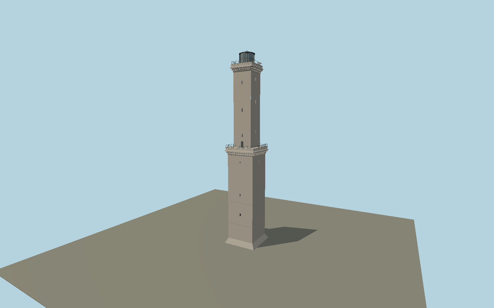

# Lighthouse of Genoa — N0642

Two tall square stone stages with deep layered corbel galleries, small staggered openings, painted Genoa cross and crown, rounded access buttress and metal-caged lantern.

## Identity and evidence

Exact catalog identity **Q776666**. Source facts: `{"heightMeters":77,"heightBasis":"Current operator and Genoa municipal museum, superseding cached 76 m.","coreWidthMeters":11,"coreBasis":"Exact-QID OSM relation is approximately 11.23 by 11.00 m; 11 m authored core.","currentFormYear":1543}`. The source specification keeps published dimensions separate from reconstructed details.

- https://www.lanternadigenova.com/storia/
- https://www.museidigenova.it/en/museum-lighthouse-la-lanterna
- https://www.lanternadigenova.com/wp-content/uploads/2022/10/1200x1047px_LANTERNA_TORRE_A.jpg
- https://www.openstreetmap.org/relation/19515124
- https://www.lanternadigenova.it/fondazione-labo/

Original geometry and shared procedural materials. Official photographs are research references only; no reference imagery or third-party mesh is embedded or redistributed.

## Authored geometry and materials

27,356 triangles, 51,928 vertices, 6 surface groups; 2,149,420 source bytes. SHA-256: `sha256:a5a2c31b03fd54919cca8213feb7476ca96b1b3ad934f3d340dfb4aa7385e057`. Actual bounds: -8.200, 0.000, -10.000 to 6.650, 77.000, 6.650 m.

Shared canonical material graphs with metric UV repeats in extras.molenSurface; portable glTF PBR factors and vertex colors remain. Dark recesses/lantern panels retain local fallback materials. Shared references: `matgraph:molen.worldgen.material.plaster_lime` (2 × 2 m), `matgraph:molen.worldgen.material.stone` (2 × 2 m), `matgraph:molen.worldgen.material.stone_ashlar` (2.4 × 1.5 m), `matgraph:molen.worldgen.material.metal_painted` (2 × 2 m), `matgraph:molen.worldgen.material.stone_granite` (2 × 2 m). Model-native axes: {"up":"+Y","front":"+Z","origin":"Authored main tower center at local base level; attached ensembles are offset from this origin."}.

## Placement proposal

Main square shaft centered on exact mapped core with parallel axes. Crest is authored on -Z, giving the north-facing facade identified explicitly by operator PHAROS Heritage; the rounded access buttress lies at the northwest base. Height is from local rock contact, not sea level. Proposed anchor 8.9046428, 44.4045519 (longitude, latitude), heading -0.218891149401 radians. Elevation policy: **terrain-contact**. This is a reviewable proposal, not a completed site-fit certification. Ordinary ground models use terrain contact; Kiipsaare requires an offshore water/base-height check.

## Limitations and review

- The modeled exterior follows the cited published facts and inspected photographs. Unpublished dimensions and local fittings are explicitly photo-proportioned; no claim of engineering survey accuracy is made.
- Portable PBR and shared metric surfaces are provided. Surface weathering, material color under local lighting and fine facade relief require close render review before maximum-detail acceptance.
- Stage allocation, paired arcaded corbel rows and painted crown/scroll-shield contours are reconstructed from current operator photographs. Adjacent fortification and visitor museum extend beyond this tower model. Stone weathering is represented by the shared physical material rather than photograph-specific stains.

Near/far fixtures are in `spec.qaCameras`. Float32 finite geometry, triangle degeneracy and winding are checked by the generator. Rendering, shared-material alignment, maximum-fidelity and geographic reviews remain pending until their hash-bound reports exist.

Regenerate with `node packages/worldgen/scripts/generate-lighthouse-models.mjs --ids=N0642`; add `--check` for reproducibility. Editable component recipes are in `packages/worldgen/scripts/lighthouse-models.mjs`. The generator protects artist-edited master hashes and preserves import/capture/shared-capture/QA documents.
