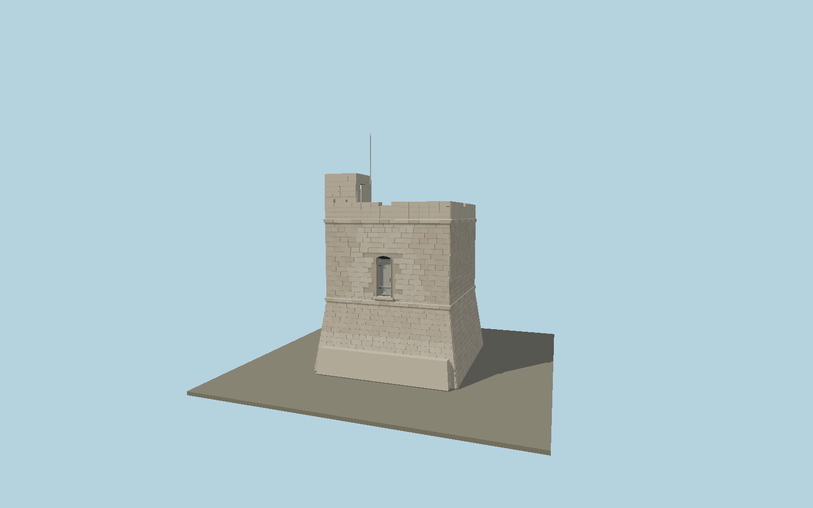

# Triq il-Wiesgħa Tower

Restored 1659 Maltese coastal watchtower with battered limestone plinth, two projecting stringcourses, elevated inland entry, seaward window, shallow roof embrasures and a corner stair shelter.

## Identity and geometry

Catalog N0599, [Q19726688](https://www.wikidata.org/wiki/Q19726688). The named OSM footprint measures approximately 8.50 × 8.43 m. The national inventory independently locates the tower and identifies the inland door, opposite sea window, roof embrasures and wall-contained stair. Original photographs by the custodian and Joseph Psaila establish the restored exterior and block courses. Vertical intervals, aperture dimensions and shelter depth are proportional photographic reconstructions tied to the mapped base, not a measured elevation survey. The complete body, roof and restored shelter are authored; temporary ladders and neighboring pillboxes are separate.

Mapped stone tower footprint center; Y=0 is the bottom of the masonry batter. Native +Z faces inland southwest; native -Z faces the sea northeast; +Y is up. The geographic proposal identifies its anchor and orientation evidence separately from remaining terrain and azimuth uncertainty.

Source facts and measured references are recorded in spec.json. References: [1](https://www.wirtartna.org/copy-19-of-history), [2](https://web.archive.org/web/20141221142426/http://www.culturalheritage.gov.mt/filebank/inventory/Knights%20Fortifications/1384.pdf), [3](https://commons.wikimedia.org/wiki/File:Triq_il-Wiesg%C4%A7a_Tower_1.jpg), [4](https://commons.wikimedia.org/wiki/File:Triq_il-Wiesg%C4%A7a_Tower_2.jpg), [5](https://www.openstreetmap.org/way/191444573). Reference pages and images are not redistributed.

## Original source and shared materials

Geometry is authored in `packages/worldgen/scripts/wiesgha-tower-model.mjs`. Shared material graphs with metric repeat UV0 and original vertex tints; GLB PBR fallback remains self-contained. No per-model texture duplication. No third-party mesh or photograph is embedded.

22,250 triangles; 44,484 vertices; 4 material groups; 1,826,752 source bytes. Source hash: `sha256:85eb59df2af1acc026b7e89cae50a6e5dbb575f6498e5f516db6b3365bb784f3`. Geometry validation checks finite Float32 coordinates, indices, triangle area and winding before export.

Regenerate with `node packages/worldgen/scripts/generate-heritage-towers.mjs N0599`; add `--check` for reproducibility. The generator refuses to overwrite a master whose hash differs from source.json. Import uses `--no-optimize` to preserve facade recesses.

## Remaining detail and review

- Current restored exterior is modeled. The internal rooms, spiral stair and neighboring World War II pillboxes are separate from this exterior asset.
- Individual masonry joints and repair tints are original reconstructions of the photographic pattern; they are not a stone-by-stone survey.
- Mapped plan is approximately 8.5 m square. No target-specific measured elevation was published in the consulted inventory; heights and small roof fittings are proportioned from primary photographs.
- Near/far visual QA, shared-material inspection and maximum-fidelity approval remain pending.

Named near/far cameras are included for lit visual review. A valid export is not maximum-fidelity certification.
