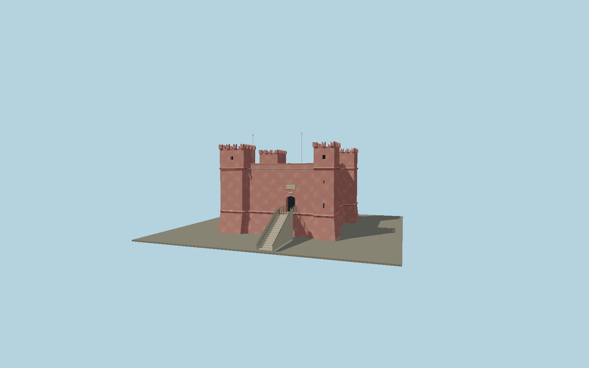

# St. Agatha’s Tower

Malta’s red watchtower, reconstructed with its four unequal projecting corner turrets, splayed base, rounded cordons, flat gun terrace, fishtail merlons, recessed loopholes, rear windows and elevated arched entrance reached by a limestone stair and timber bridge. Two restored roof cannons, drains and mast fittings complete the exterior.

## Identity and geometry

Catalog N0609, [Q1738896](https://www.wikidata.org/wiki/Q1738896). The national inventory and custodian describe the square bastioned plan, scarped walls, fishtail battlements and four corner turrets. The custodian records a two-foot roof parapet and roughly3 m turret rise. The source footprint preserves the roughly18 by18.6 m mapped exterior; custodian front/back and rooftop photos establish the 9.4 m reconstructed gun-platform level and 12.8 m battlement tip. Those overall heights are proportional estimates, not published survey dimensions. Current fixed wooden bridge, shallow-arched portal, stone stair, loop/slit pattern and restored cannon carriages follow the custodian’s detailed exterior images.

Center of the mapped tower footprint, Y=0 at the foot of its scarped base. Native +Z faces the mapped southeast entrance, +X is east-northeast along the entrance facade; +Y is up. The geographic proposal identifies its anchor and orientation evidence separately from remaining terrain and azimuth uncertainty.

Source facts and measured references are recorded in spec.json. References: [1](https://www.static.dinlarthelwa.org/heritage-sites/managed-heritage-sites/st-agathas-tower-the-red-tower-mellieha/), [2](https://schmalta.mt/wp-content/uploads/2023/08/DC-00033.pdf), [3](https://redtowermalta.wordpress.com/a-brief-tour/), [4](https://redtowermalta.wordpress.com/wp-content/uploads/2015/05/2-red.jpg), [5](https://redtowermalta.wordpress.com/wp-content/uploads/2015/05/cimg0178.jpg), [6](https://redtowermalta.wordpress.com/wp-content/uploads/2015/05/pano_20140821_125427.jpg), [7](https://www.fortmed.eu/2026downloadables/6465_Russo-Acierno_Vol_FORTMED_24.pdf), [8](https://www.openstreetmap.org/way/91447984). Reference pages and images are not redistributed.

## Original source and shared materials

Geometry is authored in `packages/worldgen/scripts/agatha-tower-model.mjs`. Shared material graphs with metric repeat UV0 and original vertex tints; GLB PBR fallback remains self-contained. No per-model texture duplication. No third-party mesh or photograph is embedded.

137,914 triangles; 410,850 vertices; 5 material groups; 16,038,012 source bytes. Source hash: `sha256:93a263f92465b84c7b1f71484b7c29c9c1e4da6cb22b0cb246abf5b02b27d8b5`. Geometry validation checks finite Float32 coordinates, indices, triangle area and winding before export.

Regenerate with `node packages/worldgen/scripts/generate-heritage-towers.mjs N0609`; add `--check` for reproducibility. The generator refuses to overwrite a master whose hash differs from source.json. Import uses `--no-optimize` to preserve facade recesses.

## Remaining detail and review

- Main elevation levels, stone step count and small fittings are proportional reconstructions from custodian photographs. The two-foot parapet, approximately3 m turret rise and mapped outline constrain scale; no unpublished surveyed heights are claimed.
- The red lime-plaster weathering is an original continuous tint pattern. Inscription plaques preserve location and line structure; historic lettering and heraldic detail are not invented. Cannon forms represent the two restored roof pieces; casting inscriptions and daily flags are omitted.
- The surrounding eighteenth-century dry-stone entrenchment, modern adjacent mast, interiors and movable visitor displays are outside this tower exterior asset. Sloping site terrain and the base of the entrance stair depend on the host’s terrain resolution.
- Near/far visual QA, shared-material inspection and maximum-fidelity approval remain pending.

Named near/far cameras are included for lit visual review. A valid export is not maximum-fidelity certification.
