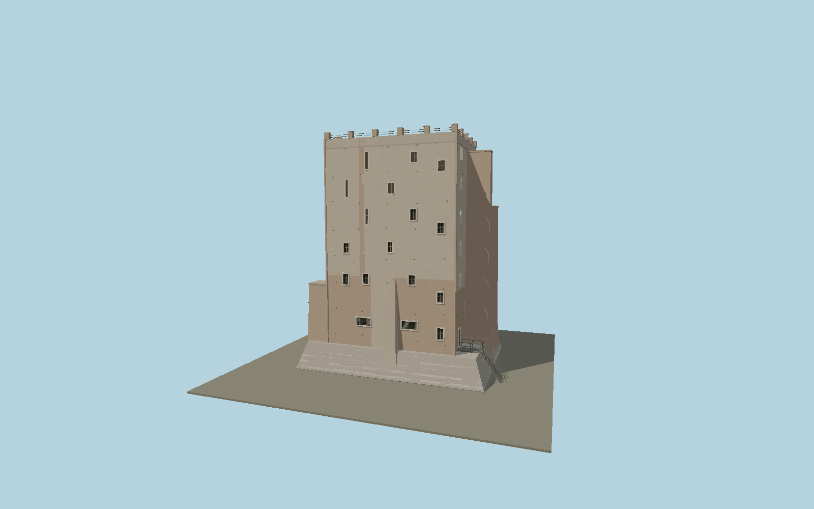

# Torre dei Conti

Dated pre-collapse exterior: restored irregular west windows, exposed Roman brick patches, three buttressed elevations, bichrome stone scarpa, putlog sockets, roof merlons and access bridge.

## Identity and geometry

Catalog N0584, [Q605721](https://www.wikidata.org/wiki/Q605721). The exact-identity mapped envelope supplies the base footprint; the heritage study reproduces measured plans and identifies the asymmetric restored western face and three buttressed sides. Their relative wall/rib positions are registered to that envelope. Elevations and individual window positions are photographic reconstructions within the documented 29 m surviving height, not a reconstruction of the lost 60 m medieval tower.

Mapped overall base envelope center; Y=0 at the exposed lower foundation contact. +Z is the restored southwest/west facade toward Via dei Fori Imperiali; +Y is up. The geographic proposal identifies its anchor and orientation evidence separately from remaining terrain and azimuth uncertainty.

Source facts and measured references are recorded in spec.json. References: [1](https://muripertutti.com/wp-content/uploads/2026/01/rsa108_porretta_torre_dei_conti_low.pdf), [2](https://sovraintendenzaroma.it/content/torre-dei-conti), [3](https://commons.wikimedia.org/wiki/File:Tor_dei_Conti_2013-2.jpg), [4](https://commons.wikimedia.org/wiki/File:Roma_-_Torre_dei_Conti_-_2024-09-18_15-32-43_001.JPG), [5](https://www.comune.roma.it/web/it/notizia/crollo-parte-torre-dei-conti.page), [6](https://www.vigilfuoco.it/media/notizie/torre-dei-conti-concluso-lintervento-dei-vigili-del-fuoco-il-monumento-torna-sicurezza), [7](https://www.openstreetmap.org/relation/1899644). Reference pages and images are not redistributed.

## Original source and shared materials

Geometry is authored in `packages/worldgen/scripts/torre-dei-conti-model.mjs`. Shared material graphs with metric repeat UV0 and original vertex tints; GLB PBR fallback remains self-contained. No per-model texture duplication. No third-party mesh or photograph is embedded.

22,086 triangles; 44,172 vertices; 8 material groups; 1,859,864 source bytes. Source hash: `sha256:1c80b8d39820c047ab65a02419b03beeff9275216a75a1ecb71b96fd6b1e9ebc`. Geometry validation checks finite Float32 coordinates, indices, triangle area and winding before export.

Regenerate with `node packages/worldgen/scripts/generate-heritage-towers.mjs N0584`; add `--check` for reproducibility. The generator refuses to overwrite a master whose hash differs from source.json. Import uses `--no-optimize` to preserve facade recesses.

## Remaining detail and review

- This is the pre-collapse exterior documented in the 2012 study and 2013/2024 photographs, not the damaged and stabilized 2026 state. Its explicit historical appearance policy must be honored.
- Measured plans determine wall and buttress arrangement; unmeasured vertical offsets, fine plaster-loss boundaries and putlog positions are photographic reconstructions. Unbuilt 1930s restoration proposals and lost medieval upper stories are excluded.
- Adjacent houses, trees and the wider archaeological excavation are separate features. No interior is included.
- Near/far visual QA, shared-material inspection and maximum-fidelity approval remain pending.

Named near/far cameras are included for lit visual review. A valid export is not maximum-fidelity certification.
